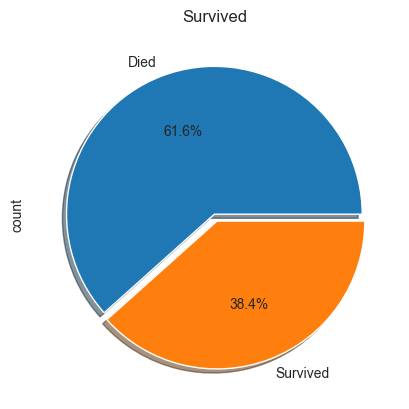
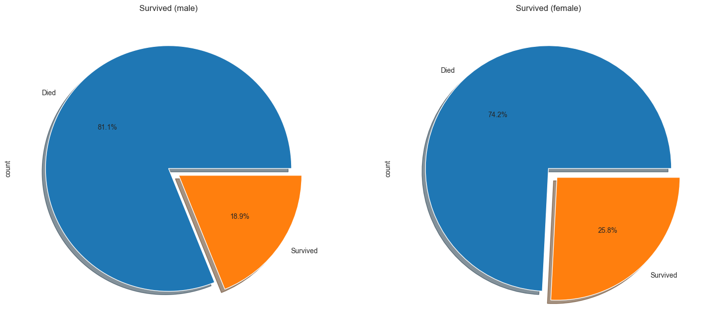
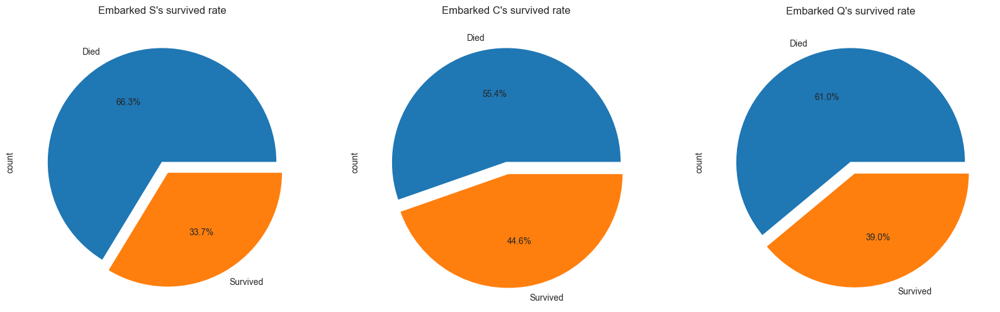
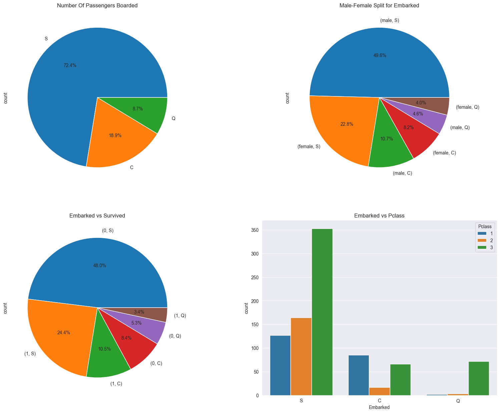
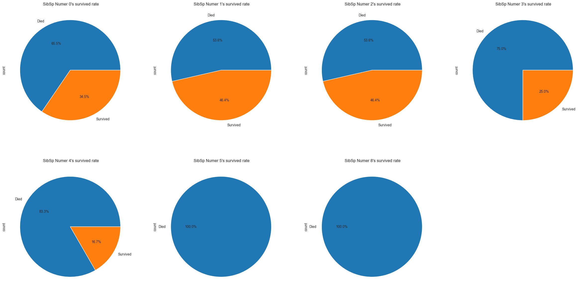
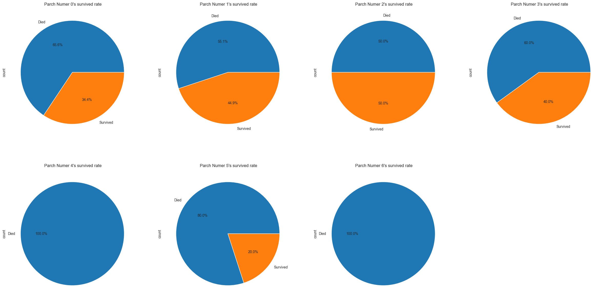

## 기본 설정
---


```python
import numpy as np # linear algebra
import pandas as pd # data processing, CSV file I/O (e.g. pd.read_csv)

# 데이터 가져오기 (TODO - Kaggle 에서는 /kaggle/input/titanic/... 으로 read_csv 해야 한다.)
train_df = pd.read_csv("train.csv")
test_df = pd.read_csv("test.csv")
```

데이터를 가져와서 데이터를 잘 가져왔는지 확인해본다.


```python
train_df.head()
```


<div>
<style scoped>
    .dataframe tbody tr th:only-of-type {
        vertical-align: middle;
    }

    .dataframe tbody tr th {
        vertical-align: top;
    }

    .dataframe thead th {
        text-align: right;
    }
</style>
<table border="1" class="dataframe">
  <thead>
    <tr style="text-align: right;">
      <th></th>
      <th>PassengerId</th>
      <th>Survived</th>
      <th>Pclass</th>
      <th>Name</th>
      <th>Sex</th>
      <th>Age</th>
      <th>SibSp</th>
      <th>Parch</th>
      <th>Ticket</th>
      <th>Fare</th>
      <th>Cabin</th>
      <th>Embarked</th>
    </tr>
  </thead>
  <tbody>
    <tr>
      <th>0</th>
      <td>1</td>
      <td>0</td>
      <td>3</td>
      <td>Braund, Mr. Owen Harris</td>
      <td>male</td>
      <td>22.0</td>
      <td>1</td>
      <td>0</td>
      <td>A/5 21171</td>
      <td>7.2500</td>
      <td>NaN</td>
      <td>S</td>
    </tr>
    <tr>
      <th>1</th>
      <td>2</td>
      <td>1</td>
      <td>1</td>
      <td>Cumings, Mrs. John Bradley (Florence Briggs Th...</td>
      <td>female</td>
      <td>38.0</td>
      <td>1</td>
      <td>0</td>
      <td>PC 17599</td>
      <td>71.2833</td>
      <td>C85</td>
      <td>C</td>
    </tr>
    <tr>
      <th>2</th>
      <td>3</td>
      <td>1</td>
      <td>3</td>
      <td>Heikkinen, Miss. Laina</td>
      <td>female</td>
      <td>26.0</td>
      <td>0</td>
      <td>0</td>
      <td>STON/O2. 3101282</td>
      <td>7.9250</td>
      <td>NaN</td>
      <td>S</td>
    </tr>
    <tr>
      <th>3</th>
      <td>4</td>
      <td>1</td>
      <td>1</td>
      <td>Futrelle, Mrs. Jacques Heath (Lily May Peel)</td>
      <td>female</td>
      <td>35.0</td>
      <td>1</td>
      <td>0</td>
      <td>113803</td>
      <td>53.1000</td>
      <td>C123</td>
      <td>S</td>
    </tr>
    <tr>
      <th>4</th>
      <td>5</td>
      <td>0</td>
      <td>3</td>
      <td>Allen, Mr. William Henry</td>
      <td>male</td>
      <td>35.0</td>
      <td>0</td>
      <td>0</td>
      <td>373450</td>
      <td>8.0500</td>
      <td>NaN</td>
      <td>S</td>
    </tr>
  </tbody>
</table>
</div>


```python
test_df.head()
```


<div>
<style scoped>
    .dataframe tbody tr th:only-of-type {
        vertical-align: middle;
    }

    .dataframe tbody tr th {
        vertical-align: top;
    }

    .dataframe thead th {
        text-align: right;
    }
</style>
<table border="1" class="dataframe">
  <thead>
    <tr style="text-align: right;">
      <th></th>
      <th>PassengerId</th>
      <th>Pclass</th>
      <th>Name</th>
      <th>Sex</th>
      <th>Age</th>
      <th>SibSp</th>
      <th>Parch</th>
      <th>Ticket</th>
      <th>Fare</th>
      <th>Cabin</th>
      <th>Embarked</th>
    </tr>
  </thead>
  <tbody>
    <tr>
      <th>0</th>
      <td>892</td>
      <td>3</td>
      <td>Kelly, Mr. James</td>
      <td>male</td>
      <td>34.5</td>
      <td>0</td>
      <td>0</td>
      <td>330911</td>
      <td>7.8292</td>
      <td>NaN</td>
      <td>Q</td>
    </tr>
    <tr>
      <th>1</th>
      <td>893</td>
      <td>3</td>
      <td>Wilkes, Mrs. James (Ellen Needs)</td>
      <td>female</td>
      <td>47.0</td>
      <td>1</td>
      <td>0</td>
      <td>363272</td>
      <td>7.0000</td>
      <td>NaN</td>
      <td>S</td>
    </tr>
    <tr>
      <th>2</th>
      <td>894</td>
      <td>2</td>
      <td>Myles, Mr. Thomas Francis</td>
      <td>male</td>
      <td>62.0</td>
      <td>0</td>
      <td>0</td>
      <td>240276</td>
      <td>9.6875</td>
      <td>NaN</td>
      <td>Q</td>
    </tr>
    <tr>
      <th>3</th>
      <td>895</td>
      <td>3</td>
      <td>Wirz, Mr. Albert</td>
      <td>male</td>
      <td>27.0</td>
      <td>0</td>
      <td>0</td>
      <td>315154</td>
      <td>8.6625</td>
      <td>NaN</td>
      <td>S</td>
    </tr>
    <tr>
      <th>4</th>
      <td>896</td>
      <td>3</td>
      <td>Hirvonen, Mrs. Alexander (Helga E Lindqvist)</td>
      <td>female</td>
      <td>22.0</td>
      <td>1</td>
      <td>1</td>
      <td>3101298</td>
      <td>12.2875</td>
      <td>NaN</td>
      <td>S</td>
    </tr>
  </tbody>
</table>
</div>


데이터를 잘 가져왔음을 확인할 수 있다.

## 데이터 살펴보기
---

데이터를 가져왔으니, 해당 데이터가 어떠한 구조를 가지고 있는지 확인해볼 필요가 있다.  
따라서 데이터의 구조를 `train_df` 훈련 셋을 통해 살펴본다.


```python
train_df.info()
```

    <class 'pandas.core.frame.DataFrame'>
    RangeIndex: 891 entries, 0 to 890
    Data columns (total 12 columns):
     #   Column       Non-Null Count  Dtype  
    ---  ------       --------------  -----  
     0   PassengerId  891 non-null    int64  
     1   Survived     891 non-null    int64  
     2   Pclass       891 non-null    int64  
     3   Name         891 non-null    object 
     4   Sex          891 non-null    object 
     5   Age          714 non-null    float64
     6   SibSp        891 non-null    int64  
     7   Parch        891 non-null    int64  
     8   Ticket       891 non-null    object 
     9   Fare         891 non-null    float64
     10  Cabin        204 non-null    object 
     11  Embarked     889 non-null    object 
    dtypes: float64(2), int64(5), object(5)
    memory usage: 83.7+ KB
    

훈련 셋을 통해 데이터의 구조를 살펴보면 다음과 같다.

* PassengerId : 승객 고유 번호  
* Survived: 생존 여부 (0 = No, 1 = Yes)
* pclass: 티켓 등급 (1 = 1st, 2 = 2nd, 3 = 3rd)
* Name : 이름
* Sex: 성별
* Age: 나이
* Sibsp: 함께 탑승한 형제자매, 배우자의 수
* Parch: 함께 탑승한 부모, 자식의 수
* Ticket: 티켓 번호
* Fare: 운임비
* Cabin: 객실 번호
* Embarked: 탑승 항구 (C = Cherbourg, Q = Queenstown, S = Southampton)

우리의 목표는 특정 특성들이 타이타닉의 생존자들에게 얼마나 영향을 미쳤는지이다.
따라서 특성들이 생존자들에게 어떠한 영향을 미쳤는지를 우선 알아볼 것이다.

### 데이터 시각화
---

각각의 특성들과 생존이 어떠한 관계를 가지고 있는지 확인하기 위해 데이터 시각화 작업을 거친다.  
각각 `Sex`, `Embarked`, `Pclass`등의 여러 특성들이 생존에 어떤 영향을 미쳤는지를 알아볼 것 이다.

* **생존율 확인**  
아래의 차트는 총 생존자의 비율을 확인하기 위한 차트이다.

* `plot.pie` 속성 정리
    * `explode` : 각 요소간에 벌어진 정도 표시
    * `labels` : 각 요소의 이름 표시
    * `autopct` : 요소의 표현 포멧 (여기서는 소수점 1째 자리까지 표현)
    * `shadow` : 그림자 display


```python
import matplotlib.pyplot as plt

labels = ["Died", "Survived"]
train_df['Survived'].value_counts().plot.pie(explode=[0,0.05], labels=labels,autopct='%1.1f%%',shadow=True)
plt.title('Survived')
plt.show()
```


    

    


해당 차트를 살펴보면 대략 60% 사람이 타이타닉호에서 죽었음을 알 수 있다.  
이어서, 생존자에 한하여, 어떤 특성이 생존자의 비율에 영향을 미쳤는지 알기 위해 여러 특성에 따른 생존 비율을 살펴볼 것이다.

* **남녀 별 생존 비율**  
남녀별 생존 비율은 `Sex` 특성이 생존에 어떠한 영향을 미쳤는지를 보인다.


```python
labels = ["Died", "Survived"]
f,ax=plt.subplots(1,2,figsize=(18,8))
train_df['Survived'][train_df['Sex']=='male'].value_counts().plot.pie(explode=[0,0.1], labels=labels,autopct='%1.1f%%',ax=ax[0],shadow=True)
train_df['Survived'][train_df['Sex']=='female'].value_counts().plot.pie(explode=[0,0.1],labels=labels, autopct='%1.1f%%',ax=ax[1],shadow=True)
ax[0].set_title('Survived (male)')
ax[1].set_title('Survived (female)')
plt.show()
```


    

    


해당 특성에 따라서 남성은 81.1%가 사망했고, 여성은 74.2% 가 사망했다.  
따라서 생존에는 여성의 성별이 더 의미를 가졌음을 확인할 수 있다.

* **객실 별 생존 비율**  
객실별 생존 비율은 `Pclass` 특성이 생존에 어떠한 영향을 미쳤는지를 보인다.


```python
pd.crosstab(train_df['Survived'],train_df['Pclass'],margins=True).style.background_gradient(cmap='summer_r')
```


<style type="text/css">
#T_5c177_row0_col0, #T_5c177_row1_col1, #T_5c177_row1_col2, #T_5c177_row1_col3 {
  background-color: #ffff66;
  color: #000000;
}
#T_5c177_row0_col1 {
  background-color: #e5f266;
  color: #000000;
}
#T_5c177_row0_col2 {
  background-color: #51a866;
  color: #f1f1f1;
}
#T_5c177_row0_col3 {
  background-color: #9fcf66;
  color: #000000;
}
#T_5c177_row1_col0 {
  background-color: #96cb66;
  color: #000000;
}
#T_5c177_row2_col0, #T_5c177_row2_col1, #T_5c177_row2_col2, #T_5c177_row2_col3 {
  background-color: #008066;
  color: #f1f1f1;
}
</style>
<table id="T_5c177">
  <thead>
    <tr>
      <th class="index_name level0" >Pclass</th>
      <th id="T_5c177_level0_col0" class="col_heading level0 col0" >1</th>
      <th id="T_5c177_level0_col1" class="col_heading level0 col1" >2</th>
      <th id="T_5c177_level0_col2" class="col_heading level0 col2" >3</th>
      <th id="T_5c177_level0_col3" class="col_heading level0 col3" >All</th>
    </tr>
    <tr>
      <th class="index_name level0" >Survived</th>
      <th class="blank col0" >&nbsp;</th>
      <th class="blank col1" >&nbsp;</th>
      <th class="blank col2" >&nbsp;</th>
      <th class="blank col3" >&nbsp;</th>
    </tr>
  </thead>
  <tbody>
    <tr>
      <th id="T_5c177_level0_row0" class="row_heading level0 row0" >0</th>
      <td id="T_5c177_row0_col0" class="data row0 col0" >80</td>
      <td id="T_5c177_row0_col1" class="data row0 col1" >97</td>
      <td id="T_5c177_row0_col2" class="data row0 col2" >372</td>
      <td id="T_5c177_row0_col3" class="data row0 col3" >549</td>
    </tr>
    <tr>
      <th id="T_5c177_level0_row1" class="row_heading level0 row1" >1</th>
      <td id="T_5c177_row1_col0" class="data row1 col0" >136</td>
      <td id="T_5c177_row1_col1" class="data row1 col1" >87</td>
      <td id="T_5c177_row1_col2" class="data row1 col2" >119</td>
      <td id="T_5c177_row1_col3" class="data row1 col3" >342</td>
    </tr>
    <tr>
      <th id="T_5c177_level0_row2" class="row_heading level0 row2" >All</th>
      <td id="T_5c177_row2_col0" class="data row2 col0" >216</td>
      <td id="T_5c177_row2_col1" class="data row2 col1" >184</td>
      <td id="T_5c177_row2_col2" class="data row2 col2" >491</td>
      <td id="T_5c177_row2_col3" class="data row2 col3" >891</td>
    </tr>
  </tbody>
</table>


해당 표를 통해 살펴보면,1등실에 탔던 사람이 가장 많이 살아남았음을 볼 수 있다.  
이를 성별 특성과 혼합하여 살펴 보도록 하겠다.


```python
pd.crosstab([train_df['Sex'],train_df['Survived']],train_df['Pclass'],margins=True).style.background_gradient(cmap='summer_r')
```


<style type="text/css">
#T_10b54_row0_col0, #T_10b54_row0_col1, #T_10b54_row0_col3, #T_10b54_row3_col2 {
  background-color: #ffff66;
  color: #000000;
}
#T_10b54_row0_col2, #T_10b54_row1_col2 {
  background-color: #f1f866;
  color: #000000;
}
#T_10b54_row1_col0 {
  background-color: #96cb66;
  color: #000000;
}
#T_10b54_row1_col1 {
  background-color: #a3d166;
  color: #000000;
}
#T_10b54_row1_col3 {
  background-color: #cfe766;
  color: #000000;
}
#T_10b54_row2_col0 {
  background-color: #a7d366;
  color: #000000;
}
#T_10b54_row2_col1, #T_10b54_row2_col3 {
  background-color: #85c266;
  color: #000000;
}
#T_10b54_row2_col2 {
  background-color: #6eb666;
  color: #f1f1f1;
}
#T_10b54_row3_col0 {
  background-color: #cde666;
  color: #000000;
}
#T_10b54_row3_col1 {
  background-color: #f0f866;
  color: #000000;
}
#T_10b54_row3_col3 {
  background-color: #f7fb66;
  color: #000000;
}
#T_10b54_row4_col0, #T_10b54_row4_col1, #T_10b54_row4_col2, #T_10b54_row4_col3 {
  background-color: #008066;
  color: #f1f1f1;
}
</style>
<table id="T_10b54">
  <thead>
    <tr>
      <th class="blank" >&nbsp;</th>
      <th class="index_name level0" >Pclass</th>
      <th id="T_10b54_level0_col0" class="col_heading level0 col0" >1</th>
      <th id="T_10b54_level0_col1" class="col_heading level0 col1" >2</th>
      <th id="T_10b54_level0_col2" class="col_heading level0 col2" >3</th>
      <th id="T_10b54_level0_col3" class="col_heading level0 col3" >All</th>
    </tr>
    <tr>
      <th class="index_name level0" >Sex</th>
      <th class="index_name level1" >Survived</th>
      <th class="blank col0" >&nbsp;</th>
      <th class="blank col1" >&nbsp;</th>
      <th class="blank col2" >&nbsp;</th>
      <th class="blank col3" >&nbsp;</th>
    </tr>
  </thead>
  <tbody>
    <tr>
      <th id="T_10b54_level0_row0" class="row_heading level0 row0" rowspan="2">female</th>
      <th id="T_10b54_level1_row0" class="row_heading level1 row0" >0</th>
      <td id="T_10b54_row0_col0" class="data row0 col0" >3</td>
      <td id="T_10b54_row0_col1" class="data row0 col1" >6</td>
      <td id="T_10b54_row0_col2" class="data row0 col2" >72</td>
      <td id="T_10b54_row0_col3" class="data row0 col3" >81</td>
    </tr>
    <tr>
      <th id="T_10b54_level1_row1" class="row_heading level1 row1" >1</th>
      <td id="T_10b54_row1_col0" class="data row1 col0" >91</td>
      <td id="T_10b54_row1_col1" class="data row1 col1" >70</td>
      <td id="T_10b54_row1_col2" class="data row1 col2" >72</td>
      <td id="T_10b54_row1_col3" class="data row1 col3" >233</td>
    </tr>
    <tr>
      <th id="T_10b54_level0_row2" class="row_heading level0 row2" rowspan="2">male</th>
      <th id="T_10b54_level1_row2" class="row_heading level1 row2" >0</th>
      <td id="T_10b54_row2_col0" class="data row2 col0" >77</td>
      <td id="T_10b54_row2_col1" class="data row2 col1" >91</td>
      <td id="T_10b54_row2_col2" class="data row2 col2" >300</td>
      <td id="T_10b54_row2_col3" class="data row2 col3" >468</td>
    </tr>
    <tr>
      <th id="T_10b54_level1_row3" class="row_heading level1 row3" >1</th>
      <td id="T_10b54_row3_col0" class="data row3 col0" >45</td>
      <td id="T_10b54_row3_col1" class="data row3 col1" >17</td>
      <td id="T_10b54_row3_col2" class="data row3 col2" >47</td>
      <td id="T_10b54_row3_col3" class="data row3 col3" >109</td>
    </tr>
    <tr>
      <th id="T_10b54_level0_row4" class="row_heading level0 row4" >All</th>
      <th id="T_10b54_level1_row4" class="row_heading level1 row4" ></th>
      <td id="T_10b54_row4_col0" class="data row4 col0" >216</td>
      <td id="T_10b54_row4_col1" class="data row4 col1" >184</td>
      <td id="T_10b54_row4_col2" class="data row4 col2" >491</td>
      <td id="T_10b54_row4_col3" class="data row4 col3" >891</td>
    </tr>
  </tbody>
</table>


객실과 남녀의 비중까지 살펴보면, 3등실의 남성이 가장 많이 죽고, 1등실 여성이 가장 많이 살아남았음을 볼 수 있다.

* **배를 탄 항구별 생존율**
    배를 탄 항구별 생존율은 `Embarked` 특성이 생존에 어떠한 영향을 미쳤는지 알아본다.


```python
f, ax = plt.subplots(1, 3, figsize=(20, 6))
labels = ['Died', 'Survived']
idx = 0
for embarked in train_df['Embarked'].dropna().unique():
    train_df['Survived'][train_df['Embarked'] == embarked].value_counts().plot.pie(explode=[0,0.1], labels=labels,autopct='%1.1f%%',ax=ax[idx])
    ax[idx].set_title(f"Embarked {embarked}'s survived rate")
    idx += 1

```


    

    


해당 결과를 살펴보면 S에 해당하는 `Embarked` 특성에서 가장 많은 사람들이 사망하였음을 확인할 수 있다.
이를 보다 자세히 살펴보기 위해, 각각 **승객별 탑승 항구 비율**, **각 항구 별 남녀 비율**, **남녀 및 항구 특성 결합 생존 비율**, **항구 특성 및 객실 등급 특성 결합 생존 비율** 을 살펴볼 것이다.


```python
import seaborn as sns

f, ax = plt.subplots(2, 2, figsize=(20,15))
train_df['Embarked'].value_counts().plot.pie(autopct='%1.1f%%',ax=ax[0,0])
ax[0,0].set_title('Number Of Passengers Boarded')
train_df.groupby('Sex')['Embarked'].value_counts().sort_values(ascending=False).plot.pie(autopct='%1.1f%%',ax=ax[0,1])
ax[0,1].set_title('Male-Female Split for Embarked')
train_df.groupby('Survived')['Embarked'].value_counts().sort_values(ascending=False).plot.pie(autopct='%1.1f%%', ax= ax[1,0])
ax[1,0].set_title('Embarked vs Survived')
sns.countplot(x='Embarked',hue='Pclass',data=train_df,ax=ax[1,1])
ax[1,1].set_title('Embarked vs Pclass')
plt.show()
```


    

    


해당 자료를 살펴보면, S에 해당하는 Southampton에서 72.4%의 가장 많은 사람이 탑승했음을 알 수 있고, 또한 생존율에서 봤을 때에도 24.4%로 가장 많이 사람이 살아 남았음을 알 수 있다.
동시에 Southampton에서 탑승한 성별의 비율을 살펴보면, 49.6% vs. 22.8%로 남성이 2배 넘게 많으므로, 가장 많이 사람이 죽은 비율인 48.0%를 차지함을 확인할 수 있다.

더 알아보면, Southampton에서 탑승한 승객들은 대부분 3등 객실을 차지하는 비율이 높다는 점도 볼 수 있다. 이는 객실의 등급이 낮울 수록 생존율이 낮다는 위의 객실 등급과 생존율 사이의 관계를 다시 한번 확인시켜 준다.

* **형제 자매와 아내와 탑승한 사람과의 생존율**
    여기서는 `SibSp` 특성과 생존율과의 관계를 알아본다.


```python
sorted_SibSp_idx = sorted(train_df['SibSp'].unique())

f, ax = plt.subplots(2, 4, figsize=(30, 15))
labels = ['Died', 'Survived']

ax[1][3].set_visible(False) # 마지막 subplot는 그림이 없으므로 보이지 않게 처리

yidx = 0
xidx = 0

for sibsp in list(sorted_SibSp_idx):
    if xidx == 4:
        xidx = 0
        yidx += 1
    train_df['Survived'][train_df['SibSp'] == sibsp].value_counts().plot.pie(labels=labels,
                                                                             autopct='%1.1f%%', ax=ax[yidx][xidx])
    ax[yidx][xidx].set_title(f" SibSp Numer {sibsp}'s survived rate")
    xidx += 1
```


    

    


해당 결과를 살펴보면 친족의 수가 많아질 수록 사망할 확률이 올라감을 확인할 수 있다.


```python
sorted_Parch_idx = sorted(train_df['Parch'].unique())
f, ax = plt.subplots(2, 4, figsize=(30, 15))
labels = ['Died', 'Survived']

ax[1][3].set_visible(False) # 마지막 subplot는 그림이 없으므로 보이지 않게 처리

yidx = 0
xidx = 0

for parch in list(sorted_Parch_idx):
    if xidx == 4:
        xidx = 0
        yidx += 1
    train_df['Survived'][train_df['Parch'] == parch].value_counts().plot.pie(labels=labels,
                                                                             autopct='%1.1f%%', ax=ax[yidx][xidx])
    ax[yidx][xidx].set_title(f" Parch Numer {parch}'s survived rate")
    xidx += 1
```


    

    


위의 결과와 유사하게, 직계 가족의 숫자가 많아질 수록 생존율이 대개 감소하는 모습을 보이고 있다.
여기 까지 살펴본 결과를 바탕으로 데이터 전처리 및 모델링 과정을 수행하도록 한다.

## 데이터 전처리
---

우리는 전처리 과정을 파이프라인으로 대체할 생각을 가지고 있으므로 전처리 과정 중에 크게 데이터를 조작하지는 않을 것이다.
기본적으로 영향력이 적거나, 크게 의미를 가지지 못할 데이터를 제거하거나, 어떻게 파이프라인을 구성할지를 살펴보게될 것이다.

아래의 코드는 `PassengerId` 열을 인덱스 열로 명시적으로 설정한다.


```python
train_df = train_df.set_index("PassengerId")
test_df = test_df.set_index("PassengerId")
```

이후, 데이터를 처리하기 위해 데이터의 특성을 살펴본다.


```python
train_df.info()
```

    <class 'pandas.core.frame.DataFrame'>
    Index: 891 entries, 1 to 891
    Data columns (total 11 columns):
     #   Column    Non-Null Count  Dtype  
    ---  ------    --------------  -----  
     0   Survived  891 non-null    int64  
     1   Pclass    891 non-null    int64  
     2   Name      891 non-null    object 
     3   Sex       891 non-null    object 
     4   Age       714 non-null    float64
     5   SibSp     891 non-null    int64  
     6   Parch     891 non-null    int64  
     7   Ticket    891 non-null    object 
     8   Fare      891 non-null    float64
     9   Cabin     204 non-null    object 
     10  Embarked  889 non-null    object 
    dtypes: float64(2), int64(4), object(5)
    memory usage: 83.5+ KB
    

데이터를 살펴보면, 일부 데이터가 `null`로 존재함을 알 수 있다.
`Age`, `Cabin` 및 `Embarked` 특성이 null(891개 미만의 null)값을 가지며, 특히 `Cabin`이(77%가 null) 많은 null값을 갖음을 확인할 수 있다. 따라서, 우리는 지금은 `Cabin`을 무시할 것이다.(`Cabin`은 객실 번호이므로, 생존율에 큰 영향을 미칠 것이라고 보기 어려움.)

 그 외에 `Age` 특성의 `null` 값은 약 19%이므로 이 값으로 수행할 작업을 결정해야 하며, `null` 값을 중위수 연령으로 대체하는 것이 합리적이라고 생각해 볼 수 있다.
 (이는 파이프 라인으로 구현되게 된다.)

또한 `Embarked` 특성의 경우 범주형 특성이므로, 차후 원- 핫 인코딩을 적용하면서, 최빈값으로 `null`값을 대체하게 될 것이다.

이외에 `Name` 이나, `Ticket` 특성의 경우, 생존율에 일부 영향력이 있을 수 있으나, 해당 수치를 모델링에 적합한 숫자로 변환이 까다롭고, 큰 영향을 미친다고 보기도 어려우므로
여기서는 해당 특성들은 무시한다.

지금까지 데이터를 어떻게 처리할 지 결정했으니, 이제부터는 전처리가 가능하도록 파이프라인을 구축한다.
우선 수치형 데이터를 처리할 파이프라인부터 구축한다.


```python
from sklearn.preprocessing import StandardScaler
from sklearn.pipeline import Pipeline
from sklearn.impute import SimpleImputer

num_pipeline = Pipeline([
        ("imputer", SimpleImputer(strategy="median")),
        ("scaler", StandardScaler())
    ])
```

해당 파이프라인은 수치형 데이터를 처리하기 위한 파이프라인으로 `SimpleImputer`과 `StandardScaler`를 통해 구축되었다.
각각의 파이프라인은 여기서 다음과 같은 역할을 가진다.
* `SimpleImputer` : `nan` 값을 중위값으로 변환.
* `StandardScaler` : 전체 데이터에 대해 표준화.

이제부터는 범주형 속성을 위한 파이프라인을 구축한다.


```python
from sklearn.preprocessing import OrdinalEncoder, OneHotEncoder

cat_pipeline = Pipeline([
        ("ordinal_encoder", OrdinalEncoder()),
        ("imputer", SimpleImputer(strategy="most_frequent")),
        ("cat_encoder", OneHotEncoder(sparse=False)),
    ])
```

범주형 파이프라인은 다음과 같은 역할을 한다.
* `SimpleImputer` : `nan`값으로 지정된 범주형 특성 데이터를 최빈값으로 변환
* `OneHotEncoder` : 범주형 특성을 One-Hot-Encoding 방식으로 수치형 데이터의 형태로 변환.

이후, 수치형 파이프라인과, 범주형 파이프라인을 결합한다.


```python
from sklearn.compose import ColumnTransformer

num_attribs = ["Age", "SibSp", "Parch", "Fare"]
cat_attribs = ["Pclass", "Sex", "Embarked"]

preprocess_pipeline = ColumnTransformer([
        ("num", num_pipeline, num_attribs),
        ("cat", cat_pipeline, cat_attribs),
    ])
```

파이프라인이 잘 동작하는지 확인한다.


```python
X_train = preprocess_pipeline.fit_transform(train_df)
X_train
```

    C:\Users\82109\Documents\2023 1학기 학습과정\머신러닝\assignment\venv\lib\site-packages\sklearn\preprocessing\_encoders.py:868: FutureWarning: `sparse` was renamed to `sparse_output` in version 1.2 and will be removed in 1.4. `sparse_output` is ignored unless you leave `sparse` to its default value.
      warnings.warn(
    


    array([[-0.56573646,  0.43279337, -0.47367361, ...,  0.        ,
             0.        ,  1.        ],
           [ 0.66386103,  0.43279337, -0.47367361, ...,  1.        ,
             0.        ,  0.        ],
           [-0.25833709, -0.4745452 , -0.47367361, ...,  0.        ,
             0.        ,  1.        ],
           ...,
           [-0.1046374 ,  0.43279337,  2.00893337, ...,  0.        ,
             0.        ,  1.        ],
           [-0.25833709, -0.4745452 , -0.47367361, ...,  1.        ,
             0.        ,  0.        ],
           [ 0.20276197, -0.4745452 , -0.47367361, ...,  0.        ,
             1.        ,  0.        ]])


레이블은 훈련 셋에서 분리 되어야하기에 미리 데이터를 받아놓는다.


```python
y_train = train_df["Survived"]
```

## 모델 훈련
---
모든 준비를 완료했으므로, 이제부터 모델을 적용하여 훈련을 시작한다.
예측 모델은 5가지 모델을 사용해 볼 것이다.
1. Logistic Regression
2. Support Vector Machine (SVM)
3. k-Nearest Neighbor (kNN)
4. Random Forest
5. Naive Bayes


```python
from sklearn.model_selection import cross_val_score
from sklearn.naive_bayes import GaussianNB
from sklearn.ensemble import RandomForestClassifier
from sklearn.neighbors import KNeighborsClassifier
from sklearn.svm import SVC
from sklearn.linear_model import LogisticRegression

X_test = preprocess_pipeline.transform(test_df)

# 1. Logistic Regression
log = LogisticRegression()
log.fit(X_train,y_train)
log_pred = log.predict(X_test)
scores = cross_val_score(log, X_train, y_train, cv=10)
print("Accuracy : ", scores.mean(), "%")
# 2. Support Vector Machine (SVM)
svm = SVC()
svm.fit(X_train,y_train)
svm_pred = svm.predict(X_test)
scores = cross_val_score(svm, X_train, y_train, cv=10)
print("Accuracy : ", scores.mean(), "%")
# 3. k-Nearest Neighbor (kNN)
knn_4 = KNeighborsClassifier(n_neighbors = 4)
knn_4.fit(X_train,y_train)
knn_pred_4 = knn_4.predict(X_test)
scores = cross_val_score(knn_4, X_train, y_train, cv=10)
print("Accuracy : ", scores.mean(), "%")
# 4. Random Forest
rf = RandomForestClassifier(n_estimators=100)
rf.fit(X_train,y_train)
rf_pred = rf.predict(X_test)
scores = cross_val_score(rf, X_train, y_train, cv=10)
print("Accuracy : ", scores.mean(), "%")
# 5. Naive Bayes
nb = GaussianNB()
nb.fit(X_train,y_train)
nb_pred = nb.predict(X_test)
scores = cross_val_score(nb, X_train, y_train, cv=10)
print("Accuracy : ", scores.mean(), "%")
```

    Accuracy :  0.7991260923845193 %
    Accuracy :  0.8249438202247191 %
    Accuracy :  0.8002746566791512 %
    Accuracy :  0.8115230961298376 %
    Accuracy :  0.7856803995006241 %
    

확인해보면, SVM 모델이 가장 정확도가 높고, 그 다음으로 랜덤 포레스트 모델의 정확도가 높게 나왔다.

## 마무리
---
이제 나온 결과를 Kaggle의 양식에 맞게 csv 파일로 만들어 업로드 한다.


```python
submission = pd.DataFrame({
    "PassengerId": test_df.index,
    "Survived": svm_pred
})

submission.to_csv('submission.csv', index=False)
```
