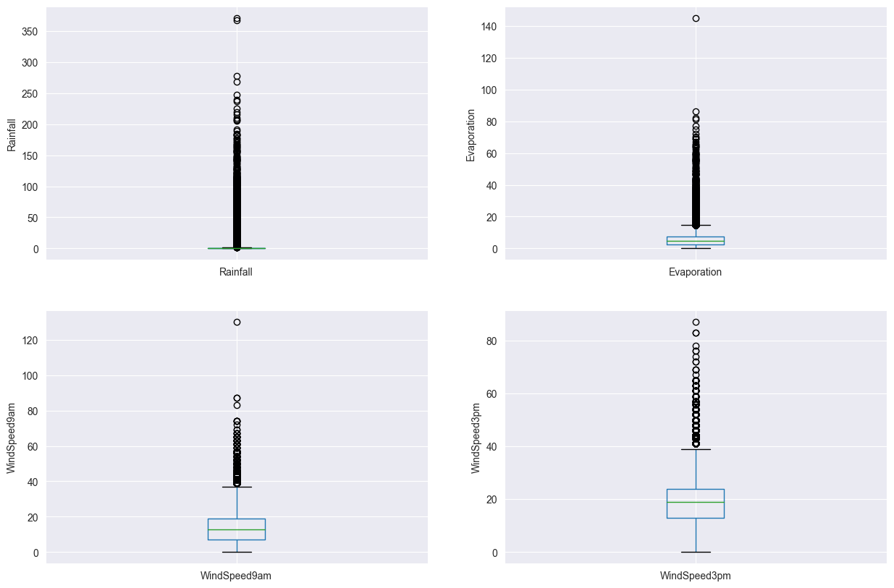
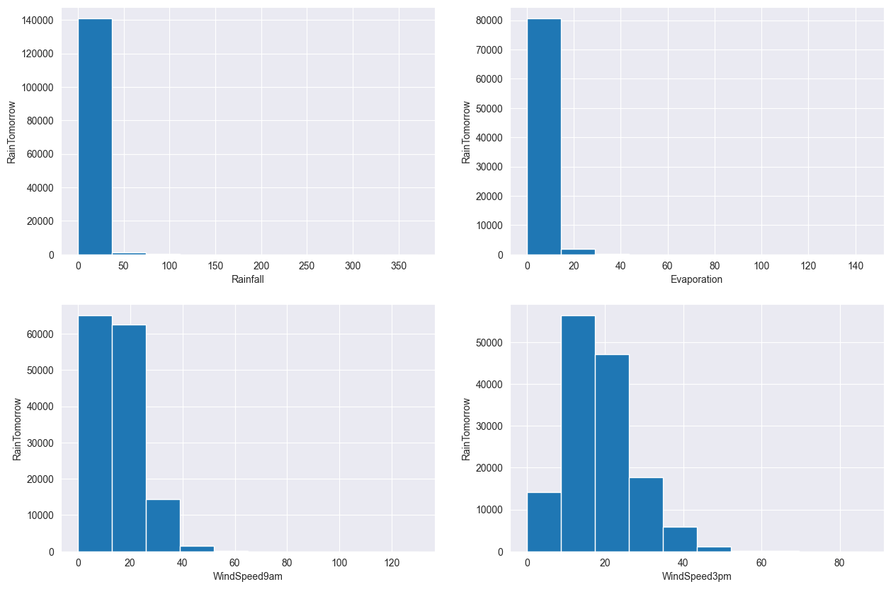
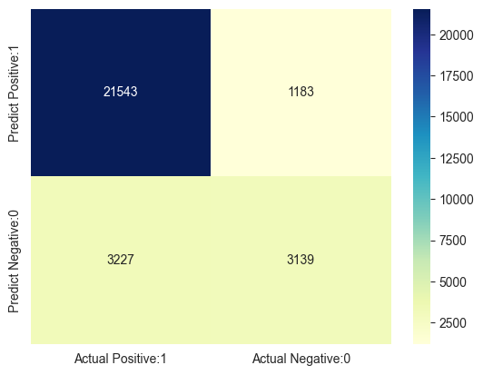
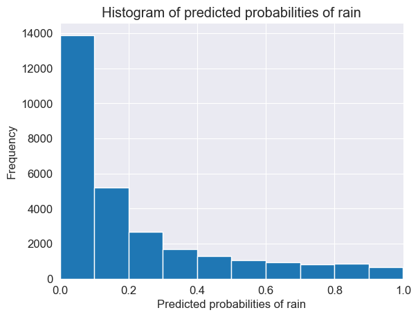
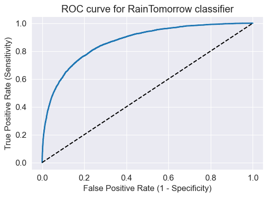

<a class="anchor" id="0"></a>
# **Logistic Regression Classifier Tutorial with Python**

이 커널에서는 `Python`과 `Scikit-Learn`을 사용한 로지스틱 회귀를 구현합니다. 해당 모델은 내일 호주에 비가 올지 안 올지를 예측하기 위해 로지스틱 회귀 분류기 모델이며, 로지스틱 회귀 분석을 사용하여 이항 분류 모형을 훈련합니다.

<a class="anchor" id="0.1"></a>
# **Table of Contents**

1.	[Logistic Regression 소개](#1)
2.	[Logistic Regression의 직관적 이해](#2)
3.	[Logistic Regression의 전제 조건](#3)
4.	[Logistic Regression의 유형](#4)
5.	[Import libraries](#5)
6.	[데이터 가져오기](#6)
7.	[데이터 탐색](#7)
8.	[특성 벡터 및 타켓 설정](#8)
9.	[훈련 셋 및 테스트 셋 분할](#9)
10.	[특성 조작](#10)
11.	[특성 scaling](#11)
12.	[모델 훈련](#12)
13.	[예측 결과](#13)
14.	[정확도 측정](#14)
15.	[Confusion matrix](#15)
16.	[Classification metrices](#16)
17.	[임계값 조정](#17)
18.	[ROC - AUC](#18)
19.	[k-Fold 교차 검증](#19)
20.	[GridSearch CV를 사용한 하이퍼 파라미터 최적화](#20)
21.	[결론](#21)
22. [References](#22)


# **1. Logistic Regression 소개** <a class="anchor" id="1"></a>

**로지스틱 회귀 분석 모델**은 새로운 분류 문제를 발견할 때 가장 먼저 고려되는 모델로서, 로짓 회귀 분석(**Logit Regression**)이라고도 불립니다. 해당 모델은 분류 문제를 해결하기 위해 사용되는 가장 단순하고 단순하며 다용도 분류 알고리즘 중 하나입니다. 이 모델은 개별 클래스 세트에 대한 관찰을 예측하는 데 사용되는 지도 학습 분류 알고리즘이며, 실제로 관측치를 다른 범주로 분류하는 데 사용합니다. 따라서 그 출력은 본질적으로 이산적입니다.

# **2. Logistic Regression의 직관적 이해** <a class="anchor" id="2"></a>

통계에서 로지스틱 회귀 모형은 주로 분류 목적으로 사용되는 널리 사용되는 모형입니다. 즉, 일련의 관측치가 주어지면 로지스틱 회귀 알고리즘은 이러한 관측치를 둘 이상의 이산 클래스로 분류하는 데 도움이 됩니다. 따라서 대상 변수는 본질적으로 이산적입니다.

로지스틱 회귀 알고리즘은 다음과 같이 작동합니다.

## **선형 방정식 구현**

로지스틱 회귀 분석 알고리즘은 독립 변수 또는 설명 변수를 사용하여 선형 방정식을 구현하여 반응 값을 예측합니다. 예를 들어, 우리는 공부한 시간과 시험에 합격할 확률의 예를 고려합니다. 여기서, 연구 시간은 설명 변수이며 x1로 표시됩니다. 시험에 합격할 확률은 반응 변수 또는 목표 변수이며 z로 표시됩니다.

설명변수(x1)와 반응변수(z)가 1개일 경우 선형방정식은 다음 방정식으로 수학적으로 주어집니다.

    z = β0 + β1x1    

여기서 계수 β0, β1은 모델의 파라미터입니다.


여러 개의 설명 변수가 있는 경우 위의 방정식은 다음과 같이 확장될 수 있습니다.

    z = β0 + β1x1+ β2x2+……..+ βnxn
    
여기서 계수 β0, β1, β2, βn은 모델의 파라미터입니다.

따라서 예측 응답 값은 위의 방정식으로 나타내며 z로 표시됩니다.

## **Sigmoid 함수**

z로 표시된 이 예측 반응 값은 0과 1 사이의 확률 값으로 변환됩니다. 예측값을 확률값에 매핑하기 위해 sigmoid 함수를 사용합니다. 이 S자형 함수는 모든 실제 값을 0과 1 사이의 확률 값에 매핑합니다.

머신 러닝에서 sigmoid 함수는 예측을 확률에 매핑하는 데 사용됩니다. sigmoid 함수는 S자 곡선을 가지고 있으며, 그것을 sigmoid 곡선이라고도 부르기도 합니다.

Sigmoid 함수는 로지스틱 함수의 특수한 경우입니다. 그것은 다음과 같은 수학식으로 주어집니다.

그래픽으로, 우리는 다음 그래프로 Sigmoid 함수를 나타낼 수 있습니다.

### Sigmoid 함수


## **결정 바운더리**

The sigmoid function returns a probability value between 0 and 1. This probability value is then mapped to a discrete class which is either “0” or “1”. In order to map this probability value to a discrete class (pass/fail, yes/no, true/false), we select a threshold value. This threshold value is called Decision boundary. Above this threshold value, we will map the probability values into class 1 and below which we will map values into class 0.

Sigmoid 함수는 0과 1 사이의 확률 값을 반환합니다. 그런 다음 이 확률 값은 "0" 또는 "1"인 이산 클래스에 매핑됩니다. 이 확률값을 이산 클래스(통과/실패, 예/아니오, 참/거짓)에 매핑하기 위해 임계값을 선택합니다. 이 임계값을 결정 바운더리라고 합니다. 이 임계값을 넘는다면 확률값을 클래스1로 매핑하고 이 값을 넘지 못하면 클래스0으로 매핑합니다.

수학적으로 다음과 같이 나타낼 수 있습니다.

p ≥ 0.5 => class = 1

p < 0.5 => class = 0 

일반적으로 결정 경계는 0.5로 설정됩니다. 따라서 확률값이 0.8(> 0.5)이면 이 관측치를 클래스 1에 매핑합니다. 마찬가지로 확률 값이 0.2(< 0.5)이면 이 관측치를 클래스 0에 매핑합니다. 이것은 아래 그래프에 나타나 있습니다.


## **Making predictions**

로지스틱 회귀 분석에서 sigmoid 함수와 결정 바운더리에 대해 알 수 있었습니다. 이제 우리는 sigmoid 함수와 결정 경계에 대한 지식을 예측 함수를 작성하기 위해 사용할 수 있습니다. 로지스틱 회귀 분석의 예측 함수는 관측치가 양수일 확률을 Yes 또는 True로 반환합니다. 이것을 결정 바운더리에 따르면 클래스 1이라고 하고, P(클래스 = 1)로 나타냅니다. 확률 인치가 1에 가까우면 관측치가 클래스 1에 속하고 그렇지 않으면 클래스 0에 속한다고 모형에 대해 더 확신할 수 있습니다.


# **3. Logistic Regression의 전제 조건** <a class="anchor" id="3"></a>

로지스틱 회귀 분석 모형에는 몇 가지 주요 가정이 필요합니다. 이것들은 다음과 같습니다.

1. 로지스틱 회귀 분석 모형에서는 종속 변수가 본질적으로 이항, 다항 또는 순서형이어야 합니다.

2. 관측치가 서로 독립적이어야 합니다.따라서 반복 측정에서 관측치를 얻으면 안 됩니다

3. 로지스틱 회귀 분석 알고리즘에서는 독립 변수 간에 다중 공선성이 거의 또는 전혀 필요하지 않습니다.즉, 독립 변수가 서로 너무 높은 상관 관계를 갖지 않아야 합니다

4. 로지스틱 회귀 분석 모형은 독립 변수와 log odds 의 선형성을 가정합니다.

5. 로지스틱 회귀 모형의 성공 여부는 표본 크기에 따라 달라집니다. 일반적으로 높은 정확도를 얻으려면 큰 표본 크기가 필요합니다.

# **4. Logistic Regression의 유형** <a class="anchor" id="4"></a>

로지스틱 회귀 분석 모형은 목표 변수 범주를 기준으로 세 그룹으로 분류할 수 있습니다.이들 3개의 그룹을 다음에 나타냅니다.

### 1. 이진 로지스틱 회귀

이항 로지스틱 회귀 분석에서 목표 변수에는 두 가지 범주가 있을 수 있습니다.범주의 일반적인 예로는 yes 또는 no, good 또는 bad, true 또는 false, spam 또는 no spam, pass 또는 fail 등이 있습니다.

### 2. 다항 로지스틱 회귀

다항 로지스틱 회귀 분석에서 목표 변수에 특정 순서가 없는 범주가 세 개 이상 있습니다. 그래서 세 가지 이상의 공칭 카테고리가 있습니다. 그 예들은 과일의 종류 - 사과, 망고, 오렌지, 바나나 - 를 포함합니다.


### 3. 순서형 로지스틱 회귀

순서형 로지스틱 회귀 분석에서 목표 변수에 세 개 이상의 순서형 범주가 있습니다. 따라서 카테고리와 관련된 본질적인 순서가 있습니다. 예를 들어, 학생의 성적은 저조, 평균, 양호, 우수 등으로 분류될 수 있습니다.


# **5. Import libraries** <a class="anchor" id="5"></a>


```python
# 분석에 도움을 줄 라이브러리들을 가져온다.

import numpy as np # linear algebra
import pandas as pd # data processing, CSV file I/O (e.g. pd.read_csv)
import matplotlib.pyplot as plt # data visualization
import seaborn as sns # statistical data visualization
%matplotlib inline

# Input data 파일은 "../input/" directory 내에 만드는 것을 허용한다.
# For example, running this (by clicking run or pressing Shift+Enter) will list all files under the input directory

import os
for dirname, _, filenames in os.walk('input/'):
    for filename in filenames:
        print(os.path.join(dirname, filename))

# Any results you write to the current directory are saved as output.

```

    input/weatherAUS.csv
    input/weatherAUS.csv.zip
    


```python
import warnings

warnings.filterwarnings('ignore')
```

# **6. 데이터 가져오기** <a class="anchor" id="6"></a>


```python
data = 'input/weatherAUS.csv'

df = pd.read_csv(data)
```

# **7. 데이터 탐색** <a class="anchor" id="7"></a>

이제 데이터의 구조를 파악하기 위해 데이터를 살펴봅니다.


```python
# 데이터의 차원 view

df.shape
```


    (145460, 23)


데이터 셋에는 142193개의 인스턴스와 24개의 변수가 있음을 알 수 있습니다


```python
# preview the dataset

df.head()
```


<div>
<style scoped>
    .dataframe tbody tr th:only-of-type {
        vertical-align: middle;
    }

    .dataframe tbody tr th {
        vertical-align: top;
    }

    .dataframe thead th {
        text-align: right;
    }
</style>
<table border="1" class="dataframe">
  <thead>
    <tr style="text-align: right;">
      <th></th>
      <th>Date</th>
      <th>Location</th>
      <th>MinTemp</th>
      <th>MaxTemp</th>
      <th>Rainfall</th>
      <th>Evaporation</th>
      <th>Sunshine</th>
      <th>WindGustDir</th>
      <th>WindGustSpeed</th>
      <th>WindDir9am</th>
      <th>...</th>
      <th>Humidity9am</th>
      <th>Humidity3pm</th>
      <th>Pressure9am</th>
      <th>Pressure3pm</th>
      <th>Cloud9am</th>
      <th>Cloud3pm</th>
      <th>Temp9am</th>
      <th>Temp3pm</th>
      <th>RainToday</th>
      <th>RainTomorrow</th>
    </tr>
  </thead>
  <tbody>
    <tr>
      <th>0</th>
      <td>2008-12-01</td>
      <td>Albury</td>
      <td>13.4</td>
      <td>22.9</td>
      <td>0.6</td>
      <td>NaN</td>
      <td>NaN</td>
      <td>W</td>
      <td>44.0</td>
      <td>W</td>
      <td>...</td>
      <td>71.0</td>
      <td>22.0</td>
      <td>1007.7</td>
      <td>1007.1</td>
      <td>8.0</td>
      <td>NaN</td>
      <td>16.9</td>
      <td>21.8</td>
      <td>No</td>
      <td>No</td>
    </tr>
    <tr>
      <th>1</th>
      <td>2008-12-02</td>
      <td>Albury</td>
      <td>7.4</td>
      <td>25.1</td>
      <td>0.0</td>
      <td>NaN</td>
      <td>NaN</td>
      <td>WNW</td>
      <td>44.0</td>
      <td>NNW</td>
      <td>...</td>
      <td>44.0</td>
      <td>25.0</td>
      <td>1010.6</td>
      <td>1007.8</td>
      <td>NaN</td>
      <td>NaN</td>
      <td>17.2</td>
      <td>24.3</td>
      <td>No</td>
      <td>No</td>
    </tr>
    <tr>
      <th>2</th>
      <td>2008-12-03</td>
      <td>Albury</td>
      <td>12.9</td>
      <td>25.7</td>
      <td>0.0</td>
      <td>NaN</td>
      <td>NaN</td>
      <td>WSW</td>
      <td>46.0</td>
      <td>W</td>
      <td>...</td>
      <td>38.0</td>
      <td>30.0</td>
      <td>1007.6</td>
      <td>1008.7</td>
      <td>NaN</td>
      <td>2.0</td>
      <td>21.0</td>
      <td>23.2</td>
      <td>No</td>
      <td>No</td>
    </tr>
    <tr>
      <th>3</th>
      <td>2008-12-04</td>
      <td>Albury</td>
      <td>9.2</td>
      <td>28.0</td>
      <td>0.0</td>
      <td>NaN</td>
      <td>NaN</td>
      <td>NE</td>
      <td>24.0</td>
      <td>SE</td>
      <td>...</td>
      <td>45.0</td>
      <td>16.0</td>
      <td>1017.6</td>
      <td>1012.8</td>
      <td>NaN</td>
      <td>NaN</td>
      <td>18.1</td>
      <td>26.5</td>
      <td>No</td>
      <td>No</td>
    </tr>
    <tr>
      <th>4</th>
      <td>2008-12-05</td>
      <td>Albury</td>
      <td>17.5</td>
      <td>32.3</td>
      <td>1.0</td>
      <td>NaN</td>
      <td>NaN</td>
      <td>W</td>
      <td>41.0</td>
      <td>ENE</td>
      <td>...</td>
      <td>82.0</td>
      <td>33.0</td>
      <td>1010.8</td>
      <td>1006.0</td>
      <td>7.0</td>
      <td>8.0</td>
      <td>17.8</td>
      <td>29.7</td>
      <td>No</td>
      <td>No</td>
    </tr>
  </tbody>
</table>
<p>5 rows × 23 columns</p>
</div>


```python
col_names = df.columns #열의 이름들만 보기 (24개의 특성 살펴보기)

col_names
```


    Index(['Date', 'Location', 'MinTemp', 'MaxTemp', 'Rainfall', 'Evaporation',
           'Sunshine', 'WindGustDir', 'WindGustSpeed', 'WindDir9am', 'WindDir3pm',
           'WindSpeed9am', 'WindSpeed3pm', 'Humidity9am', 'Humidity3pm',
           'Pressure9am', 'Pressure3pm', 'Cloud9am', 'Cloud3pm', 'Temp9am',
           'Temp3pm', 'RainToday', 'RainTomorrow'],
          dtype='object')


위의 결과는 각 특성 변수들의 이름을 살펴본 결과입니다.
아래에서는 해당 데이터 셋의 구성에 대해 살펴볼 것입니다.


```python
# 데이터 셋의 summary 보기

df.info()
```

    <class 'pandas.core.frame.DataFrame'>
    RangeIndex: 145460 entries, 0 to 145459
    Data columns (total 23 columns):
     #   Column         Non-Null Count   Dtype  
    ---  ------         --------------   -----  
     0   Date           145460 non-null  object 
     1   Location       145460 non-null  object 
     2   MinTemp        143975 non-null  float64
     3   MaxTemp        144199 non-null  float64
     4   Rainfall       142199 non-null  float64
     5   Evaporation    82670 non-null   float64
     6   Sunshine       75625 non-null   float64
     7   WindGustDir    135134 non-null  object 
     8   WindGustSpeed  135197 non-null  float64
     9   WindDir9am     134894 non-null  object 
     10  WindDir3pm     141232 non-null  object 
     11  WindSpeed9am   143693 non-null  float64
     12  WindSpeed3pm   142398 non-null  float64
     13  Humidity9am    142806 non-null  float64
     14  Humidity3pm    140953 non-null  float64
     15  Pressure9am    130395 non-null  float64
     16  Pressure3pm    130432 non-null  float64
     17  Cloud9am       89572 non-null   float64
     18  Cloud3pm       86102 non-null   float64
     19  Temp9am        143693 non-null  float64
     20  Temp3pm        141851 non-null  float64
     21  RainToday      142199 non-null  object 
     22  RainTomorrow   142193 non-null  object 
    dtypes: float64(16), object(7)
    memory usage: 25.5+ MB
    

### 변수 유형

이 단계에서는 데이터 집합을 범주형 변수와 숫자 변수로 구분합니다. 데이터 집합에는 범주형 변수와 숫자 변수가 혼합되어 있습니다. 범주형 변수에는 데이터 유형 개체가 있습니다.숫자 변수의 데이터 유형은 float64입니다.

먼저 범주형 변수를 찾습니다.


```python
# 범주형 특성 찾기

categorical = [var for var in df.columns if df[var].dtype=='O']
#문자형을 가지는 컬럼만 모으기

print('There are {} categorical variables\n'.format(len(categorical)))

print('The categorical variables are :', categorical)
```

    There are 7 categorical variables
    
    The categorical variables are : ['Date', 'Location', 'WindGustDir', 'WindDir9am', 'WindDir3pm', 'RainToday', 'RainTomorrow']
    


```python
# 범주형 특성 보이기

df[categorical].head()
```


<div>
<style scoped>
    .dataframe tbody tr th:only-of-type {
        vertical-align: middle;
    }

    .dataframe tbody tr th {
        vertical-align: top;
    }

    .dataframe thead th {
        text-align: right;
    }
</style>
<table border="1" class="dataframe">
  <thead>
    <tr style="text-align: right;">
      <th></th>
      <th>Date</th>
      <th>Location</th>
      <th>WindGustDir</th>
      <th>WindDir9am</th>
      <th>WindDir3pm</th>
      <th>RainToday</th>
      <th>RainTomorrow</th>
    </tr>
  </thead>
  <tbody>
    <tr>
      <th>0</th>
      <td>2008-12-01</td>
      <td>Albury</td>
      <td>W</td>
      <td>W</td>
      <td>WNW</td>
      <td>No</td>
      <td>No</td>
    </tr>
    <tr>
      <th>1</th>
      <td>2008-12-02</td>
      <td>Albury</td>
      <td>WNW</td>
      <td>NNW</td>
      <td>WSW</td>
      <td>No</td>
      <td>No</td>
    </tr>
    <tr>
      <th>2</th>
      <td>2008-12-03</td>
      <td>Albury</td>
      <td>WSW</td>
      <td>W</td>
      <td>WSW</td>
      <td>No</td>
      <td>No</td>
    </tr>
    <tr>
      <th>3</th>
      <td>2008-12-04</td>
      <td>Albury</td>
      <td>NE</td>
      <td>SE</td>
      <td>E</td>
      <td>No</td>
      <td>No</td>
    </tr>
    <tr>
      <th>4</th>
      <td>2008-12-05</td>
      <td>Albury</td>
      <td>W</td>
      <td>ENE</td>
      <td>NW</td>
      <td>No</td>
      <td>No</td>
    </tr>
  </tbody>
</table>
</div>


### 범주형 변수 요약


- 날짜 변수가 있습니다. 그것은 다음과 같이 나타납니다.`Date` column.


- 6개의 범주형 변수가 있습니다. 이것들은  `Location`, `WindGustDir`, `WindDir9am`, `WindDir3pm`, `RainToday`, `RainTomorrow`에 의해 주어집니다.


- 두 가지 이항 범주형 변수가 있습니다. `RainToday`,`RainTomorrow`


- `RainTomorrow` 는 타겟 변수입니다.

## 범주형 변수 내의 문제 탐색

먼저 범주형 변수를 살펴보겠습니다.


### 범주형 변수의 결측값


```python
# 범주형 특성의 결측값 확인

df[categorical].isnull().sum()
```


    Date                0
    Location            0
    WindGustDir     10326
    WindDir9am      10566
    WindDir3pm       4228
    RainToday        3261
    RainTomorrow     3267
    dtype: int64


```python
# 범주형 특성이 갖는 결측값의 정도 print

cat1 = [var for var in categorical if df[var].isnull().sum()!=0]

print(df[cat1].isnull().sum())
```

    WindGustDir     10326
    WindDir9am      10566
    WindDir3pm       4228
    RainToday        3261
    RainTomorrow     3267
    dtype: int64
    

데이터 집합에는 결측값을 포함하는 범주형 변수가  `WindGustDir`, `WindDir9am`, `WindDir3pm`,`RainToday` 4개밖에 없다는 것을 알 수 있습니다.


### 범주형 변수의 등장 빈도 카운트


이제 범주형 변수의 등장 빈도 카운트를 확인해 보겠습니다.


```python
# 번주형 특성의 빈도 확인

for var in categorical: 
    
    print(df[var].value_counts())
```

    Date
    2013-11-12    49
    2014-09-01    49
    2014-08-23    49
    2014-08-24    49
    2014-08-25    49
                  ..
    2007-11-29     1
    2007-11-28     1
    2007-11-27     1
    2007-11-26     1
    2008-01-31     1
    Name: count, Length: 3436, dtype: int64
    Location
    Canberra            3436
    Sydney              3344
    Darwin              3193
    Melbourne           3193
    Brisbane            3193
    Adelaide            3193
    Perth               3193
    Hobart              3193
    Albany              3040
    MountGambier        3040
    Ballarat            3040
    Townsville          3040
    GoldCoast           3040
    Cairns              3040
    Launceston          3040
    AliceSprings        3040
    Bendigo             3040
    Albury              3040
    MountGinini         3040
    Wollongong          3040
    Newcastle           3039
    Tuggeranong         3039
    Penrith             3039
    Woomera             3009
    Nuriootpa           3009
    Cobar               3009
    CoffsHarbour        3009
    Moree               3009
    Sale                3009
    PerthAirport        3009
    PearceRAAF          3009
    Witchcliffe         3009
    BadgerysCreek       3009
    Mildura             3009
    NorfolkIsland       3009
    MelbourneAirport    3009
    Richmond            3009
    SydneyAirport       3009
    WaggaWagga          3009
    Williamtown         3009
    Dartmoor            3009
    Watsonia            3009
    Portland            3009
    Walpole             3006
    NorahHead           3004
    SalmonGums          3001
    Katherine           1578
    Nhil                1578
    Uluru               1578
    Name: count, dtype: int64
    WindGustDir
    W      9915
    SE     9418
    N      9313
    SSE    9216
    E      9181
    S      9168
    WSW    9069
    SW     8967
    SSW    8736
    WNW    8252
    NW     8122
    ENE    8104
    ESE    7372
    NE     7133
    NNW    6620
    NNE    6548
    Name: count, dtype: int64
    WindDir9am
    N      11758
    SE      9287
    E       9176
    SSE     9112
    NW      8749
    S       8659
    W       8459
    SW      8423
    NNE     8129
    NNW     7980
    ENE     7836
    NE      7671
    ESE     7630
    SSW     7587
    WNW     7414
    WSW     7024
    Name: count, dtype: int64
    WindDir3pm
    SE     10838
    W      10110
    S       9926
    WSW     9518
    SSE     9399
    SW      9354
    N       8890
    WNW     8874
    NW      8610
    ESE     8505
    E       8472
    NE      8263
    SSW     8156
    NNW     7870
    ENE     7857
    NNE     6590
    Name: count, dtype: int64
    RainToday
    No     110319
    Yes     31880
    Name: count, dtype: int64
    RainTomorrow
    No     110316
    Yes     31877
    Name: count, dtype: int64
    


```python
# 범주형 특성의 빈도 확인 (스케일 낮춰서)

for var in categorical:

    print(df[var].value_counts()/np.float64(len(df)))
```

    Date
    2013-11-12    0.000337
    2014-09-01    0.000337
    2014-08-23    0.000337
    2014-08-24    0.000337
    2014-08-25    0.000337
                    ...   
    2007-11-29    0.000007
    2007-11-28    0.000007
    2007-11-27    0.000007
    2007-11-26    0.000007
    2008-01-31    0.000007
    Name: count, Length: 3436, dtype: float64
    Location
    Canberra            0.023622
    Sydney              0.022989
    Darwin              0.021951
    Melbourne           0.021951
    Brisbane            0.021951
    Adelaide            0.021951
    Perth               0.021951
    Hobart              0.021951
    Albany              0.020899
    MountGambier        0.020899
    Ballarat            0.020899
    Townsville          0.020899
    GoldCoast           0.020899
    Cairns              0.020899
    Launceston          0.020899
    AliceSprings        0.020899
    Bendigo             0.020899
    Albury              0.020899
    MountGinini         0.020899
    Wollongong          0.020899
    Newcastle           0.020892
    Tuggeranong         0.020892
    Penrith             0.020892
    Woomera             0.020686
    Nuriootpa           0.020686
    Cobar               0.020686
    CoffsHarbour        0.020686
    Moree               0.020686
    Sale                0.020686
    PerthAirport        0.020686
    PearceRAAF          0.020686
    Witchcliffe         0.020686
    BadgerysCreek       0.020686
    Mildura             0.020686
    NorfolkIsland       0.020686
    MelbourneAirport    0.020686
    Richmond            0.020686
    SydneyAirport       0.020686
    WaggaWagga          0.020686
    Williamtown         0.020686
    Dartmoor            0.020686
    Watsonia            0.020686
    Portland            0.020686
    Walpole             0.020665
    NorahHead           0.020652
    SalmonGums          0.020631
    Katherine           0.010848
    Nhil                0.010848
    Uluru               0.010848
    Name: count, dtype: float64
    WindGustDir
    W      0.068163
    SE     0.064746
    N      0.064024
    SSE    0.063358
    E      0.063117
    S      0.063028
    WSW    0.062347
    SW     0.061646
    SSW    0.060058
    WNW    0.056730
    NW     0.055837
    ENE    0.055713
    ESE    0.050681
    NE     0.049038
    NNW    0.045511
    NNE    0.045016
    Name: count, dtype: float64
    WindDir9am
    N      0.080833
    SE     0.063846
    E      0.063083
    SSE    0.062643
    NW     0.060147
    S      0.059528
    W      0.058153
    SW     0.057906
    NNE    0.055885
    NNW    0.054860
    ENE    0.053870
    NE     0.052736
    ESE    0.052454
    SSW    0.052159
    WNW    0.050969
    WSW    0.048288
    Name: count, dtype: float64
    WindDir3pm
    SE     0.074508
    W      0.069504
    S      0.068239
    WSW    0.065434
    SSE    0.064616
    SW     0.064306
    N      0.061116
    WNW    0.061006
    NW     0.059192
    ESE    0.058470
    E      0.058243
    NE     0.056806
    SSW    0.056070
    NNW    0.054104
    ENE    0.054015
    NNE    0.045305
    Name: count, dtype: float64
    RainToday
    No     0.758415
    Yes    0.219167
    Name: count, dtype: float64
    RainTomorrow
    No     0.758394
    Yes    0.219146
    Name: count, dtype: float64
    

### 레이블 수: 카디널리티

범주형 변수 내의 레이블 수를 **카디널리티**(**cardinality**)라고 합니다.변수 내의 레이블 수가 많은 것을 **하이 카디널리티**(**high cardinality**)라고 합니다. 높은 카디널리티는 기계 학습 모델에 심각한 문제를 일으킬 수 있습니다. 그래서 높은 카디널리티를 확인하겠습니다.


```python
# 범주형 특성 카디널리티 확인

for var in categorical:
    
    print(var, ' contains ', len(df[var].unique()), ' labels')
```

    Date  contains  3436  labels
    Location  contains  49  labels
    WindGustDir  contains  17  labels
    WindDir9am  contains  17  labels
    WindDir3pm  contains  17  labels
    RainToday  contains  3  labels
    RainTomorrow  contains  3  labels
    

`Date` 전처리가 필요한 변수임을 확인 할 수 있었습니다. 다음 섹션에서 전처리를 하겠습니다

다른 모든 변수는 비교적 적은 수의 변수를 포함합니다.

### 데이터 변수의 특성 엔지니어링


```python
df['Date'].dtypes
```


    dtype('O')


`Date`의 데이터 타입은 객체입니다. 객체로 현재 코드화되어 있는 날짜를 datetime 형식으로 해석합니다.


```python
# 문자열 타입의 Data를 datetime으로 형변환

df['Date'] = pd.to_datetime(df['Date'])
```


```python
# 데이터 셋에 년자만으로 이루어진 목록 추가

df['Year'] = df['Date'].dt.year

df['Year'].head()
```


    0    2008
    1    2008
    2    2008
    3    2008
    4    2008
    Name: Year, dtype: int32


```python
# 데이터 셋에 월자만으로 이루어진 목록 추가

df['Month'] = df['Date'].dt.month

df['Month'].head()
```


    0    12
    1    12
    2    12
    3    12
    4    12
    Name: Month, dtype: int32


```python
# 데이터 셋에 일자만으로 이루어진 목록 추가

df['Day'] = df['Date'].dt.day

df['Day'].head()
```


    0    1
    1    2
    2    3
    3    4
    4    5
    Name: Day, dtype: int32


```python
# 데이터 셋 정보 조회
df.info()
```

    <class 'pandas.core.frame.DataFrame'>
    RangeIndex: 145460 entries, 0 to 145459
    Data columns (total 26 columns):
     #   Column         Non-Null Count   Dtype         
    ---  ------         --------------   -----         
     0   Date           145460 non-null  datetime64[ns]
     1   Location       145460 non-null  object        
     2   MinTemp        143975 non-null  float64       
     3   MaxTemp        144199 non-null  float64       
     4   Rainfall       142199 non-null  float64       
     5   Evaporation    82670 non-null   float64       
     6   Sunshine       75625 non-null   float64       
     7   WindGustDir    135134 non-null  object        
     8   WindGustSpeed  135197 non-null  float64       
     9   WindDir9am     134894 non-null  object        
     10  WindDir3pm     141232 non-null  object        
     11  WindSpeed9am   143693 non-null  float64       
     12  WindSpeed3pm   142398 non-null  float64       
     13  Humidity9am    142806 non-null  float64       
     14  Humidity3pm    140953 non-null  float64       
     15  Pressure9am    130395 non-null  float64       
     16  Pressure3pm    130432 non-null  float64       
     17  Cloud9am       89572 non-null   float64       
     18  Cloud3pm       86102 non-null   float64       
     19  Temp9am        143693 non-null  float64       
     20  Temp3pm        141851 non-null  float64       
     21  RainToday      142199 non-null  object        
     22  RainTomorrow   142193 non-null  object        
     23  Year           145460 non-null  int32         
     24  Month          145460 non-null  int32         
     25  Day            145460 non-null  int32         
    dtypes: datetime64[ns](1), float64(16), int32(3), object(6)
    memory usage: 27.2+ MB
    

여기서 `Date`로 부터 파생된 3개의 추가 컬럼이 생성되어 있는 것을 알 수 있습니다. 이제 원본 `Date`는 제가하겠습니다.


```python
# drop Date variable

df.drop('Date', axis=1, inplace = True)
```


```python
# preview the dataset again

df.head()
```


<div>
<style scoped>
    .dataframe tbody tr th:only-of-type {
        vertical-align: middle;
    }

    .dataframe tbody tr th {
        vertical-align: top;
    }

    .dataframe thead th {
        text-align: right;
    }
</style>
<table border="1" class="dataframe">
  <thead>
    <tr style="text-align: right;">
      <th></th>
      <th>Location</th>
      <th>MinTemp</th>
      <th>MaxTemp</th>
      <th>Rainfall</th>
      <th>Evaporation</th>
      <th>Sunshine</th>
      <th>WindGustDir</th>
      <th>WindGustSpeed</th>
      <th>WindDir9am</th>
      <th>WindDir3pm</th>
      <th>...</th>
      <th>Pressure3pm</th>
      <th>Cloud9am</th>
      <th>Cloud3pm</th>
      <th>Temp9am</th>
      <th>Temp3pm</th>
      <th>RainToday</th>
      <th>RainTomorrow</th>
      <th>Year</th>
      <th>Month</th>
      <th>Day</th>
    </tr>
  </thead>
  <tbody>
    <tr>
      <th>0</th>
      <td>Albury</td>
      <td>13.4</td>
      <td>22.9</td>
      <td>0.6</td>
      <td>NaN</td>
      <td>NaN</td>
      <td>W</td>
      <td>44.0</td>
      <td>W</td>
      <td>WNW</td>
      <td>...</td>
      <td>1007.1</td>
      <td>8.0</td>
      <td>NaN</td>
      <td>16.9</td>
      <td>21.8</td>
      <td>No</td>
      <td>No</td>
      <td>2008</td>
      <td>12</td>
      <td>1</td>
    </tr>
    <tr>
      <th>1</th>
      <td>Albury</td>
      <td>7.4</td>
      <td>25.1</td>
      <td>0.0</td>
      <td>NaN</td>
      <td>NaN</td>
      <td>WNW</td>
      <td>44.0</td>
      <td>NNW</td>
      <td>WSW</td>
      <td>...</td>
      <td>1007.8</td>
      <td>NaN</td>
      <td>NaN</td>
      <td>17.2</td>
      <td>24.3</td>
      <td>No</td>
      <td>No</td>
      <td>2008</td>
      <td>12</td>
      <td>2</td>
    </tr>
    <tr>
      <th>2</th>
      <td>Albury</td>
      <td>12.9</td>
      <td>25.7</td>
      <td>0.0</td>
      <td>NaN</td>
      <td>NaN</td>
      <td>WSW</td>
      <td>46.0</td>
      <td>W</td>
      <td>WSW</td>
      <td>...</td>
      <td>1008.7</td>
      <td>NaN</td>
      <td>2.0</td>
      <td>21.0</td>
      <td>23.2</td>
      <td>No</td>
      <td>No</td>
      <td>2008</td>
      <td>12</td>
      <td>3</td>
    </tr>
    <tr>
      <th>3</th>
      <td>Albury</td>
      <td>9.2</td>
      <td>28.0</td>
      <td>0.0</td>
      <td>NaN</td>
      <td>NaN</td>
      <td>NE</td>
      <td>24.0</td>
      <td>SE</td>
      <td>E</td>
      <td>...</td>
      <td>1012.8</td>
      <td>NaN</td>
      <td>NaN</td>
      <td>18.1</td>
      <td>26.5</td>
      <td>No</td>
      <td>No</td>
      <td>2008</td>
      <td>12</td>
      <td>4</td>
    </tr>
    <tr>
      <th>4</th>
      <td>Albury</td>
      <td>17.5</td>
      <td>32.3</td>
      <td>1.0</td>
      <td>NaN</td>
      <td>NaN</td>
      <td>W</td>
      <td>41.0</td>
      <td>ENE</td>
      <td>NW</td>
      <td>...</td>
      <td>1006.0</td>
      <td>7.0</td>
      <td>8.0</td>
      <td>17.8</td>
      <td>29.7</td>
      <td>No</td>
      <td>No</td>
      <td>2008</td>
      <td>12</td>
      <td>5</td>
    </tr>
  </tbody>
</table>
<p>5 rows × 25 columns</p>
</div>


이제, 우리는 `Date`변수가 데이터 집합에서 제거되었음을 볼 수 있습니다.

### 범주형 특성 탐색


그럼 이번에는 범주형 특성을 하나씩 살펴보겠습니다.


```python
# 범주형 특성 찾기

categorical = [var for var in df.columns if df[var].dtype=='O']

print('There are {} categorical variables\n'.format(len(categorical)))

print('The categorical variables are :', categorical)
```

    There are 6 categorical variables
    
    The categorical variables are : ['Location', 'WindGustDir', 'WindDir9am', 'WindDir3pm', 'RainToday', 'RainTomorrow']
    

데이터 집합에는 6개의 범주형 변수가 있습니다. `Date` 변수가 제거되었습니다. 먼저 범주형 변수의 결측값을 확인합니다.


```python
# 범주형 특성의 걸측치 확인

df[categorical].isnull().sum()
```


    Location            0
    WindGustDir     10326
    WindDir9am      10566
    WindDir3pm       4228
    RainToday        3261
    RainTomorrow     3267
    dtype: int64


`WindGustDir`, `WindDir9am`, `WindDir3pm`, `RainToday` 변수에 결측값이 포함되어 있음을 알 수 있습니다. 저는 이 변수들을 하나씩 살펴보도록 하겠습니다.

### `Location` 특성 탐색


```python
# Location 특성의 레이블 수 print

print('Location contains', len(df.Location.unique()), 'labels')
```

    Location contains 49 labels
    


```python
# location 특성의 레이블 확인

df.Location.unique()
```


    array(['Albury', 'BadgerysCreek', 'Cobar', 'CoffsHarbour', 'Moree',
           'Newcastle', 'NorahHead', 'NorfolkIsland', 'Penrith', 'Richmond',
           'Sydney', 'SydneyAirport', 'WaggaWagga', 'Williamtown',
           'Wollongong', 'Canberra', 'Tuggeranong', 'MountGinini', 'Ballarat',
           'Bendigo', 'Sale', 'MelbourneAirport', 'Melbourne', 'Mildura',
           'Nhil', 'Portland', 'Watsonia', 'Dartmoor', 'Brisbane', 'Cairns',
           'GoldCoast', 'Townsville', 'Adelaide', 'MountGambier', 'Nuriootpa',
           'Woomera', 'Albany', 'Witchcliffe', 'PearceRAAF', 'PerthAirport',
           'Perth', 'SalmonGums', 'Walpole', 'Hobart', 'Launceston',
           'AliceSprings', 'Darwin', 'Katherine', 'Uluru'], dtype=object)


```python
# 특성 값의 등장 빈도 확인

df.Location.value_counts()
```


    Location
    Canberra            3436
    Sydney              3344
    Darwin              3193
    Melbourne           3193
    Brisbane            3193
    Adelaide            3193
    Perth               3193
    Hobart              3193
    Albany              3040
    MountGambier        3040
    Ballarat            3040
    Townsville          3040
    GoldCoast           3040
    Cairns              3040
    Launceston          3040
    AliceSprings        3040
    Bendigo             3040
    Albury              3040
    MountGinini         3040
    Wollongong          3040
    Newcastle           3039
    Tuggeranong         3039
    Penrith             3039
    Woomera             3009
    Nuriootpa           3009
    Cobar               3009
    CoffsHarbour        3009
    Moree               3009
    Sale                3009
    PerthAirport        3009
    PearceRAAF          3009
    Witchcliffe         3009
    BadgerysCreek       3009
    Mildura             3009
    NorfolkIsland       3009
    MelbourneAirport    3009
    Richmond            3009
    SydneyAirport       3009
    WaggaWagga          3009
    Williamtown         3009
    Dartmoor            3009
    Watsonia            3009
    Portland            3009
    Walpole             3006
    NorahHead           3004
    SalmonGums          3001
    Katherine           1578
    Nhil                1578
    Uluru               1578
    Name: count, dtype: int64


```python
# Location 변수의 One Hot Encoding
# 그 후, k-1 dummy variables 가져오기
# preview the dataset

pd.get_dummies(df.Location, drop_first=True).head()
```


<div>
<style scoped>
    .dataframe tbody tr th:only-of-type {
        vertical-align: middle;
    }

    .dataframe tbody tr th {
        vertical-align: top;
    }

    .dataframe thead th {
        text-align: right;
    }
</style>
<table border="1" class="dataframe">
  <thead>
    <tr style="text-align: right;">
      <th></th>
      <th>Albany</th>
      <th>Albury</th>
      <th>AliceSprings</th>
      <th>BadgerysCreek</th>
      <th>Ballarat</th>
      <th>Bendigo</th>
      <th>Brisbane</th>
      <th>Cairns</th>
      <th>Canberra</th>
      <th>Cobar</th>
      <th>...</th>
      <th>Townsville</th>
      <th>Tuggeranong</th>
      <th>Uluru</th>
      <th>WaggaWagga</th>
      <th>Walpole</th>
      <th>Watsonia</th>
      <th>Williamtown</th>
      <th>Witchcliffe</th>
      <th>Wollongong</th>
      <th>Woomera</th>
    </tr>
  </thead>
  <tbody>
    <tr>
      <th>0</th>
      <td>False</td>
      <td>True</td>
      <td>False</td>
      <td>False</td>
      <td>False</td>
      <td>False</td>
      <td>False</td>
      <td>False</td>
      <td>False</td>
      <td>False</td>
      <td>...</td>
      <td>False</td>
      <td>False</td>
      <td>False</td>
      <td>False</td>
      <td>False</td>
      <td>False</td>
      <td>False</td>
      <td>False</td>
      <td>False</td>
      <td>False</td>
    </tr>
    <tr>
      <th>1</th>
      <td>False</td>
      <td>True</td>
      <td>False</td>
      <td>False</td>
      <td>False</td>
      <td>False</td>
      <td>False</td>
      <td>False</td>
      <td>False</td>
      <td>False</td>
      <td>...</td>
      <td>False</td>
      <td>False</td>
      <td>False</td>
      <td>False</td>
      <td>False</td>
      <td>False</td>
      <td>False</td>
      <td>False</td>
      <td>False</td>
      <td>False</td>
    </tr>
    <tr>
      <th>2</th>
      <td>False</td>
      <td>True</td>
      <td>False</td>
      <td>False</td>
      <td>False</td>
      <td>False</td>
      <td>False</td>
      <td>False</td>
      <td>False</td>
      <td>False</td>
      <td>...</td>
      <td>False</td>
      <td>False</td>
      <td>False</td>
      <td>False</td>
      <td>False</td>
      <td>False</td>
      <td>False</td>
      <td>False</td>
      <td>False</td>
      <td>False</td>
    </tr>
    <tr>
      <th>3</th>
      <td>False</td>
      <td>True</td>
      <td>False</td>
      <td>False</td>
      <td>False</td>
      <td>False</td>
      <td>False</td>
      <td>False</td>
      <td>False</td>
      <td>False</td>
      <td>...</td>
      <td>False</td>
      <td>False</td>
      <td>False</td>
      <td>False</td>
      <td>False</td>
      <td>False</td>
      <td>False</td>
      <td>False</td>
      <td>False</td>
      <td>False</td>
    </tr>
    <tr>
      <th>4</th>
      <td>False</td>
      <td>True</td>
      <td>False</td>
      <td>False</td>
      <td>False</td>
      <td>False</td>
      <td>False</td>
      <td>False</td>
      <td>False</td>
      <td>False</td>
      <td>...</td>
      <td>False</td>
      <td>False</td>
      <td>False</td>
      <td>False</td>
      <td>False</td>
      <td>False</td>
      <td>False</td>
      <td>False</td>
      <td>False</td>
      <td>False</td>
    </tr>
  </tbody>
</table>
<p>5 rows × 48 columns</p>
</div>


### `WindGustDir` 특성 탐색


```python
# WindGustDir 특성의 레이블 수 출력

print('WindGustDir contains', len(df['WindGustDir'].unique()), 'labels')
```

    WindGustDir contains 17 labels
    


```python
# WindGustDir 의 레이블 확인

df['WindGustDir'].unique()
```


    array(['W', 'WNW', 'WSW', 'NE', 'NNW', 'N', 'NNE', 'SW', nan, 'ENE',
           'SSE', 'S', 'NW', 'SE', 'ESE', 'E', 'SSW'], dtype=object)


```python
# WindGustDir 특성의 값의 등장 빈도 확인

df.WindGustDir.value_counts()
```


    WindGustDir
    W      9915
    SE     9418
    N      9313
    SSE    9216
    E      9181
    S      9168
    WSW    9069
    SW     8967
    SSW    8736
    WNW    8252
    NW     8122
    ENE    8104
    ESE    7372
    NE     7133
    NNW    6620
    NNE    6548
    Name: count, dtype: int64


```python
# WindGustDir 특성의 One Hot Encoding
# 그 후 k-1 dummy variables 얻기
# 결측치를 고려하여 dummy variables를 추가적으로 만든다.
# preview the dataset

pd.get_dummies(df.WindGustDir, drop_first=True, dummy_na=True).head()
```


<div>
<style scoped>
    .dataframe tbody tr th:only-of-type {
        vertical-align: middle;
    }

    .dataframe tbody tr th {
        vertical-align: top;
    }

    .dataframe thead th {
        text-align: right;
    }
</style>
<table border="1" class="dataframe">
  <thead>
    <tr style="text-align: right;">
      <th></th>
      <th>ENE</th>
      <th>ESE</th>
      <th>N</th>
      <th>NE</th>
      <th>NNE</th>
      <th>NNW</th>
      <th>NW</th>
      <th>S</th>
      <th>SE</th>
      <th>SSE</th>
      <th>SSW</th>
      <th>SW</th>
      <th>W</th>
      <th>WNW</th>
      <th>WSW</th>
      <th>NaN</th>
    </tr>
  </thead>
  <tbody>
    <tr>
      <th>0</th>
      <td>False</td>
      <td>False</td>
      <td>False</td>
      <td>False</td>
      <td>False</td>
      <td>False</td>
      <td>False</td>
      <td>False</td>
      <td>False</td>
      <td>False</td>
      <td>False</td>
      <td>False</td>
      <td>True</td>
      <td>False</td>
      <td>False</td>
      <td>False</td>
    </tr>
    <tr>
      <th>1</th>
      <td>False</td>
      <td>False</td>
      <td>False</td>
      <td>False</td>
      <td>False</td>
      <td>False</td>
      <td>False</td>
      <td>False</td>
      <td>False</td>
      <td>False</td>
      <td>False</td>
      <td>False</td>
      <td>False</td>
      <td>True</td>
      <td>False</td>
      <td>False</td>
    </tr>
    <tr>
      <th>2</th>
      <td>False</td>
      <td>False</td>
      <td>False</td>
      <td>False</td>
      <td>False</td>
      <td>False</td>
      <td>False</td>
      <td>False</td>
      <td>False</td>
      <td>False</td>
      <td>False</td>
      <td>False</td>
      <td>False</td>
      <td>False</td>
      <td>True</td>
      <td>False</td>
    </tr>
    <tr>
      <th>3</th>
      <td>False</td>
      <td>False</td>
      <td>False</td>
      <td>True</td>
      <td>False</td>
      <td>False</td>
      <td>False</td>
      <td>False</td>
      <td>False</td>
      <td>False</td>
      <td>False</td>
      <td>False</td>
      <td>False</td>
      <td>False</td>
      <td>False</td>
      <td>False</td>
    </tr>
    <tr>
      <th>4</th>
      <td>False</td>
      <td>False</td>
      <td>False</td>
      <td>False</td>
      <td>False</td>
      <td>False</td>
      <td>False</td>
      <td>False</td>
      <td>False</td>
      <td>False</td>
      <td>False</td>
      <td>False</td>
      <td>True</td>
      <td>False</td>
      <td>False</td>
      <td>False</td>
    </tr>
  </tbody>
</table>
</div>


```python
# 각 열의 boolean값의 합산을 통해
# 각 범주형 특성에 얼마나 많은 관측 값이 있는지 확인

pd.get_dummies(df.WindGustDir, drop_first=True, dummy_na=True).sum(axis=0)
```


    ENE     8104
    ESE     7372
    N       9313
    NE      7133
    NNE     6548
    NNW     6620
    NW      8122
    S       9168
    SE      9418
    SSE     9216
    SSW     8736
    SW      8967
    W       9915
    WNW     8252
    WSW     9069
    NaN    10326
    dtype: int64


`WindGustDir` 변수에는 10326개의 결측 값이 있습니다.

### `WindDir9am` 특성 탐색


```python
# WindDir9am 특성의 레이블 수 확인

print('WindDir9am contains', len(df['WindDir9am'].unique()), 'labels')
```

    WindDir9am contains 17 labels
    


```python
# WindDir9am 특성의 레이블 확인

df['WindDir9am'].unique()
```


    array(['W', 'NNW', 'SE', 'ENE', 'SW', 'SSE', 'S', 'NE', nan, 'SSW', 'N',
           'WSW', 'ESE', 'E', 'NW', 'WNW', 'NNE'], dtype=object)


```python
# 특성 치의 등장 빈도 확인

df['WindDir9am'].value_counts()
```


    WindDir9am
    N      11758
    SE      9287
    E       9176
    SSE     9112
    NW      8749
    S       8659
    W       8459
    SW      8423
    NNE     8129
    NNW     7980
    ENE     7836
    NE      7671
    ESE     7630
    SSW     7587
    WNW     7414
    WSW     7024
    Name: count, dtype: int64


```python
# WindDir9am 특성의 One Hot Encoding
# 그 후 k-1 dummy variables를 얻는다.
# 결측치를 고려하여 dummp variables를 생성한다.
# preview the dataset

pd.get_dummies(df.WindDir9am, drop_first=True, dummy_na=True).head()
```


<div>
<style scoped>
    .dataframe tbody tr th:only-of-type {
        vertical-align: middle;
    }

    .dataframe tbody tr th {
        vertical-align: top;
    }

    .dataframe thead th {
        text-align: right;
    }
</style>
<table border="1" class="dataframe">
  <thead>
    <tr style="text-align: right;">
      <th></th>
      <th>ENE</th>
      <th>ESE</th>
      <th>N</th>
      <th>NE</th>
      <th>NNE</th>
      <th>NNW</th>
      <th>NW</th>
      <th>S</th>
      <th>SE</th>
      <th>SSE</th>
      <th>SSW</th>
      <th>SW</th>
      <th>W</th>
      <th>WNW</th>
      <th>WSW</th>
      <th>NaN</th>
    </tr>
  </thead>
  <tbody>
    <tr>
      <th>0</th>
      <td>False</td>
      <td>False</td>
      <td>False</td>
      <td>False</td>
      <td>False</td>
      <td>False</td>
      <td>False</td>
      <td>False</td>
      <td>False</td>
      <td>False</td>
      <td>False</td>
      <td>False</td>
      <td>True</td>
      <td>False</td>
      <td>False</td>
      <td>False</td>
    </tr>
    <tr>
      <th>1</th>
      <td>False</td>
      <td>False</td>
      <td>False</td>
      <td>False</td>
      <td>False</td>
      <td>True</td>
      <td>False</td>
      <td>False</td>
      <td>False</td>
      <td>False</td>
      <td>False</td>
      <td>False</td>
      <td>False</td>
      <td>False</td>
      <td>False</td>
      <td>False</td>
    </tr>
    <tr>
      <th>2</th>
      <td>False</td>
      <td>False</td>
      <td>False</td>
      <td>False</td>
      <td>False</td>
      <td>False</td>
      <td>False</td>
      <td>False</td>
      <td>False</td>
      <td>False</td>
      <td>False</td>
      <td>False</td>
      <td>True</td>
      <td>False</td>
      <td>False</td>
      <td>False</td>
    </tr>
    <tr>
      <th>3</th>
      <td>False</td>
      <td>False</td>
      <td>False</td>
      <td>False</td>
      <td>False</td>
      <td>False</td>
      <td>False</td>
      <td>False</td>
      <td>True</td>
      <td>False</td>
      <td>False</td>
      <td>False</td>
      <td>False</td>
      <td>False</td>
      <td>False</td>
      <td>False</td>
    </tr>
    <tr>
      <th>4</th>
      <td>True</td>
      <td>False</td>
      <td>False</td>
      <td>False</td>
      <td>False</td>
      <td>False</td>
      <td>False</td>
      <td>False</td>
      <td>False</td>
      <td>False</td>
      <td>False</td>
      <td>False</td>
      <td>False</td>
      <td>False</td>
      <td>False</td>
      <td>False</td>
    </tr>
  </tbody>
</table>
</div>


```python
# 각 열의 boolean값의 합산을 통해
# 각 범주형 특성에 얼마나 많은 관측 값이 있는지 확인

pd.get_dummies(df.WindDir9am, drop_first=True, dummy_na=True).sum(axis=0)
```


    ENE     7836
    ESE     7630
    N      11758
    NE      7671
    NNE     8129
    NNW     7980
    NW      8749
    S       8659
    SE      9287
    SSE     9112
    SSW     7587
    SW      8423
    W       8459
    WNW     7414
    WSW     7024
    NaN    10566
    dtype: int64


`WindDir9am` 변수의 결측치는 10566개임을 확인할 수 있습니다.

### `WindDir3pm` 특성 탐색


```python
# WindDir3pm 특성의 레이블 수 확인

print('WindDir3pm contains', len(df['WindDir3pm'].unique()), 'labels')
```

    WindDir3pm contains 17 labels
    


```python
# WindDir3pm 특성의 레이블 확인

df['WindDir3pm'].unique()
```


    array(['WNW', 'WSW', 'E', 'NW', 'W', 'SSE', 'ESE', 'ENE', 'NNW', 'SSW',
           'SW', 'SE', 'N', 'S', 'NNE', nan, 'NE'], dtype=object)


```python
# WindDir3pm 특성 치의 등장 빈도 확인

df['WindDir3pm'].value_counts()
```


    WindDir3pm
    SE     10838
    W      10110
    S       9926
    WSW     9518
    SSE     9399
    SW      9354
    N       8890
    WNW     8874
    NW      8610
    ESE     8505
    E       8472
    NE      8263
    SSW     8156
    NNW     7870
    ENE     7857
    NNE     6590
    Name: count, dtype: int64


```python
# WindDir3pm 의 One Hot Encoding 후 k-1 dummy variables 얻기
# (결측치 값을 고려하여 dummy variables 를 구현)
# preview the dataset

pd.get_dummies(df.WindDir3pm, drop_first=True, dummy_na=True).head()
```


<div>
<style scoped>
    .dataframe tbody tr th:only-of-type {
        vertical-align: middle;
    }

    .dataframe tbody tr th {
        vertical-align: top;
    }

    .dataframe thead th {
        text-align: right;
    }
</style>
<table border="1" class="dataframe">
  <thead>
    <tr style="text-align: right;">
      <th></th>
      <th>ENE</th>
      <th>ESE</th>
      <th>N</th>
      <th>NE</th>
      <th>NNE</th>
      <th>NNW</th>
      <th>NW</th>
      <th>S</th>
      <th>SE</th>
      <th>SSE</th>
      <th>SSW</th>
      <th>SW</th>
      <th>W</th>
      <th>WNW</th>
      <th>WSW</th>
      <th>NaN</th>
    </tr>
  </thead>
  <tbody>
    <tr>
      <th>0</th>
      <td>False</td>
      <td>False</td>
      <td>False</td>
      <td>False</td>
      <td>False</td>
      <td>False</td>
      <td>False</td>
      <td>False</td>
      <td>False</td>
      <td>False</td>
      <td>False</td>
      <td>False</td>
      <td>False</td>
      <td>True</td>
      <td>False</td>
      <td>False</td>
    </tr>
    <tr>
      <th>1</th>
      <td>False</td>
      <td>False</td>
      <td>False</td>
      <td>False</td>
      <td>False</td>
      <td>False</td>
      <td>False</td>
      <td>False</td>
      <td>False</td>
      <td>False</td>
      <td>False</td>
      <td>False</td>
      <td>False</td>
      <td>False</td>
      <td>True</td>
      <td>False</td>
    </tr>
    <tr>
      <th>2</th>
      <td>False</td>
      <td>False</td>
      <td>False</td>
      <td>False</td>
      <td>False</td>
      <td>False</td>
      <td>False</td>
      <td>False</td>
      <td>False</td>
      <td>False</td>
      <td>False</td>
      <td>False</td>
      <td>False</td>
      <td>False</td>
      <td>True</td>
      <td>False</td>
    </tr>
    <tr>
      <th>3</th>
      <td>False</td>
      <td>False</td>
      <td>False</td>
      <td>False</td>
      <td>False</td>
      <td>False</td>
      <td>False</td>
      <td>False</td>
      <td>False</td>
      <td>False</td>
      <td>False</td>
      <td>False</td>
      <td>False</td>
      <td>False</td>
      <td>False</td>
      <td>False</td>
    </tr>
    <tr>
      <th>4</th>
      <td>False</td>
      <td>False</td>
      <td>False</td>
      <td>False</td>
      <td>False</td>
      <td>False</td>
      <td>True</td>
      <td>False</td>
      <td>False</td>
      <td>False</td>
      <td>False</td>
      <td>False</td>
      <td>False</td>
      <td>False</td>
      <td>False</td>
      <td>False</td>
    </tr>
  </tbody>
</table>
</div>


```python
# 각 열의 boolean값의 합산을 통해
# 각 범주형 특성에 얼마나 많은 관측 값이 있는지 확인

pd.get_dummies(df.WindDir3pm, drop_first=True, dummy_na=True).sum(axis=0)
```


    ENE     7857
    ESE     8505
    N       8890
    NE      8263
    NNE     6590
    NNW     7870
    NW      8610
    S       9926
    SE     10838
    SSE     9399
    SSW     8156
    SW      9354
    W      10110
    WNW     8874
    WSW     9518
    NaN     4228
    dtype: int64


`WindDir3pm` 특성에는 4228개의 결측치가 있습니다

### `RainToday` 특성 탐색


```python
# 기존과 동일한 과정의 반복이므로 설명 생략
print('RainToday contains', len(df['RainToday'].unique()), 'labels')
```

    RainToday contains 3 labels
    


```python
df['RainToday'].unique()
```


    array(['No', 'Yes', nan], dtype=object)


```python
df.RainToday.value_counts()
```


    RainToday
    No     110319
    Yes     31880
    Name: count, dtype: int64


```python
pd.get_dummies(df.RainToday, drop_first=True, dummy_na=True).head()
```


<div>
<style scoped>
    .dataframe tbody tr th:only-of-type {
        vertical-align: middle;
    }

    .dataframe tbody tr th {
        vertical-align: top;
    }

    .dataframe thead th {
        text-align: right;
    }
</style>
<table border="1" class="dataframe">
  <thead>
    <tr style="text-align: right;">
      <th></th>
      <th>Yes</th>
      <th>NaN</th>
    </tr>
  </thead>
  <tbody>
    <tr>
      <th>0</th>
      <td>False</td>
      <td>False</td>
    </tr>
    <tr>
      <th>1</th>
      <td>False</td>
      <td>False</td>
    </tr>
    <tr>
      <th>2</th>
      <td>False</td>
      <td>False</td>
    </tr>
    <tr>
      <th>3</th>
      <td>False</td>
      <td>False</td>
    </tr>
    <tr>
      <th>4</th>
      <td>False</td>
      <td>False</td>
    </tr>
  </tbody>
</table>
</div>


```python
pd.get_dummies(df.RainToday, drop_first=True, dummy_na=True).sum(axis=0)
```


    Yes    31880
    NaN     3261
    dtype: int64


`RainToday` 특성은 3261개의 결측치를 가짐을 확인 할 수 있습니다.

### 수치형 특성 탐색


```python
# 수치형 특성 찾기
numerical = [var for var in df.columns if df[var].dtype!='O']

print('There are {} numerical variables\n'.format(len(numerical)))

print('The numerical variables are :', numerical)
```

    There are 19 numerical variables
    
    The numerical variables are : ['MinTemp', 'MaxTemp', 'Rainfall', 'Evaporation', 'Sunshine', 'WindGustSpeed', 'WindSpeed9am', 'WindSpeed3pm', 'Humidity9am', 'Humidity3pm', 'Pressure9am', 'Pressure3pm', 'Cloud9am', 'Cloud3pm', 'Temp9am', 'Temp3pm', 'Year', 'Month', 'Day']
    


```python
# 수치형 특성 view

df[numerical].head()
```


<div>
<style scoped>
    .dataframe tbody tr th:only-of-type {
        vertical-align: middle;
    }

    .dataframe tbody tr th {
        vertical-align: top;
    }

    .dataframe thead th {
        text-align: right;
    }
</style>
<table border="1" class="dataframe">
  <thead>
    <tr style="text-align: right;">
      <th></th>
      <th>MinTemp</th>
      <th>MaxTemp</th>
      <th>Rainfall</th>
      <th>Evaporation</th>
      <th>Sunshine</th>
      <th>WindGustSpeed</th>
      <th>WindSpeed9am</th>
      <th>WindSpeed3pm</th>
      <th>Humidity9am</th>
      <th>Humidity3pm</th>
      <th>Pressure9am</th>
      <th>Pressure3pm</th>
      <th>Cloud9am</th>
      <th>Cloud3pm</th>
      <th>Temp9am</th>
      <th>Temp3pm</th>
      <th>Year</th>
      <th>Month</th>
      <th>Day</th>
    </tr>
  </thead>
  <tbody>
    <tr>
      <th>0</th>
      <td>13.4</td>
      <td>22.9</td>
      <td>0.6</td>
      <td>NaN</td>
      <td>NaN</td>
      <td>44.0</td>
      <td>20.0</td>
      <td>24.0</td>
      <td>71.0</td>
      <td>22.0</td>
      <td>1007.7</td>
      <td>1007.1</td>
      <td>8.0</td>
      <td>NaN</td>
      <td>16.9</td>
      <td>21.8</td>
      <td>2008</td>
      <td>12</td>
      <td>1</td>
    </tr>
    <tr>
      <th>1</th>
      <td>7.4</td>
      <td>25.1</td>
      <td>0.0</td>
      <td>NaN</td>
      <td>NaN</td>
      <td>44.0</td>
      <td>4.0</td>
      <td>22.0</td>
      <td>44.0</td>
      <td>25.0</td>
      <td>1010.6</td>
      <td>1007.8</td>
      <td>NaN</td>
      <td>NaN</td>
      <td>17.2</td>
      <td>24.3</td>
      <td>2008</td>
      <td>12</td>
      <td>2</td>
    </tr>
    <tr>
      <th>2</th>
      <td>12.9</td>
      <td>25.7</td>
      <td>0.0</td>
      <td>NaN</td>
      <td>NaN</td>
      <td>46.0</td>
      <td>19.0</td>
      <td>26.0</td>
      <td>38.0</td>
      <td>30.0</td>
      <td>1007.6</td>
      <td>1008.7</td>
      <td>NaN</td>
      <td>2.0</td>
      <td>21.0</td>
      <td>23.2</td>
      <td>2008</td>
      <td>12</td>
      <td>3</td>
    </tr>
    <tr>
      <th>3</th>
      <td>9.2</td>
      <td>28.0</td>
      <td>0.0</td>
      <td>NaN</td>
      <td>NaN</td>
      <td>24.0</td>
      <td>11.0</td>
      <td>9.0</td>
      <td>45.0</td>
      <td>16.0</td>
      <td>1017.6</td>
      <td>1012.8</td>
      <td>NaN</td>
      <td>NaN</td>
      <td>18.1</td>
      <td>26.5</td>
      <td>2008</td>
      <td>12</td>
      <td>4</td>
    </tr>
    <tr>
      <th>4</th>
      <td>17.5</td>
      <td>32.3</td>
      <td>1.0</td>
      <td>NaN</td>
      <td>NaN</td>
      <td>41.0</td>
      <td>7.0</td>
      <td>20.0</td>
      <td>82.0</td>
      <td>33.0</td>
      <td>1010.8</td>
      <td>1006.0</td>
      <td>7.0</td>
      <td>8.0</td>
      <td>17.8</td>
      <td>29.7</td>
      <td>2008</td>
      <td>12</td>
      <td>5</td>
    </tr>
  </tbody>
</table>
</div>


### 수치형 특성 정리


- 수치형 특성은 16개 입니다.


- `MinTemp`, `MaxTemp`, `Rainfall`, `Evaporation`, `Sunshine`, `WindGustSpeed`, `WindSpeed9am`, `WindSpeed3pm`, `Humidity9am`, `Humidity3pm`, `Pressure9am`, `Pressure3pm`, `Cloud9am`, `Cloud3pm`, `Temp9am`, `Temp3pm`의 특성으로 나타납니다.


- 모든 수치형 특성은 연속형입니다.

## 수치형 변수 내의 문제 탐색

이번에는 수치형 변수를 살펴보겠습니다.


### 수치형 변수의 결측값


```python
# 결측치 확인

df[numerical].isnull().sum()
```


    MinTemp           1485
    MaxTemp           1261
    Rainfall          3261
    Evaporation      62790
    Sunshine         69835
    WindGustSpeed    10263
    WindSpeed9am      1767
    WindSpeed3pm      3062
    Humidity9am       2654
    Humidity3pm       4507
    Pressure9am      15065
    Pressure3pm      15028
    Cloud9am         55888
    Cloud3pm         59358
    Temp9am           1767
    Temp3pm           3609
    Year                 0
    Month                0
    Day                  0
    dtype: int64


16개의 수치형 변수 모두에 결측값이 포함되어 있음을 알 수 있습니다.

### 수치형 변수의 특이치


```python
# 수치형 변수 특성 데이터 셋 살펴보기

print(round(df[numerical].describe()),2)
```

            MinTemp   MaxTemp  Rainfall  Evaporation  Sunshine  WindGustSpeed   
    count  143975.0  144199.0  142199.0      82670.0   75625.0       135197.0  \
    mean       12.0      23.0       2.0          5.0       8.0           40.0   
    std         6.0       7.0       8.0          4.0       4.0           14.0   
    min        -8.0      -5.0       0.0          0.0       0.0            6.0   
    25%         8.0      18.0       0.0          3.0       5.0           31.0   
    50%        12.0      23.0       0.0          5.0       8.0           39.0   
    75%        17.0      28.0       1.0          7.0      11.0           48.0   
    max        34.0      48.0     371.0        145.0      14.0          135.0   
    
           WindSpeed9am  WindSpeed3pm  Humidity9am  Humidity3pm  Pressure9am   
    count      143693.0      142398.0     142806.0     140953.0     130395.0  \
    mean           14.0          19.0         69.0         52.0       1018.0   
    std             9.0           9.0         19.0         21.0          7.0   
    min             0.0           0.0          0.0          0.0        980.0   
    25%             7.0          13.0         57.0         37.0       1013.0   
    50%            13.0          19.0         70.0         52.0       1018.0   
    75%            19.0          24.0         83.0         66.0       1022.0   
    max           130.0          87.0        100.0        100.0       1041.0   
    
           Pressure3pm  Cloud9am  Cloud3pm   Temp9am   Temp3pm      Year   
    count     130432.0   89572.0   86102.0  143693.0  141851.0  145460.0  \
    mean        1015.0       4.0       5.0      17.0      22.0    2013.0   
    std            7.0       3.0       3.0       6.0       7.0       3.0   
    min          977.0       0.0       0.0      -7.0      -5.0    2007.0   
    25%         1010.0       1.0       2.0      12.0      17.0    2011.0   
    50%         1015.0       5.0       5.0      17.0      21.0    2013.0   
    75%         1020.0       7.0       7.0      22.0      26.0    2015.0   
    max         1040.0       9.0       9.0      40.0      47.0    2017.0   
    
              Month       Day  
    count  145460.0  145460.0  
    mean        6.0      16.0  
    std         3.0       9.0  
    min         1.0       1.0  
    25%         3.0       8.0  
    50%         6.0      16.0  
    75%         9.0      23.0  
    max        12.0      31.0   2
    

On closer inspection, we can see that the  columns may contain outliers.

좀 더 자세히 조사하면`Rainfall`, `Evaporation`, `WindSpeed9am`,`WindSpeed3pm`열에 특이치가 포함될 수 있습니다.

위의 변수에서 특이치를 시각화하기 위해 box plots을 그릴 것입니다.


```python
plt.figure(figsize=(15,10))


plt.subplot(2, 2, 1)
fig = df.boxplot(column='Rainfall')
fig.set_title('')
fig.set_ylabel('Rainfall')


plt.subplot(2, 2, 2)
fig = df.boxplot(column='Evaporation')
fig.set_title('')
fig.set_ylabel('Evaporation')


plt.subplot(2, 2, 3)
fig = df.boxplot(column='WindSpeed9am')
fig.set_title('')
fig.set_ylabel('WindSpeed9am')


plt.subplot(2, 2, 4)
fig = df.boxplot(column='WindSpeed3pm')
fig.set_title('')
fig.set_ylabel('WindSpeed3pm')
```


    Text(0, 0.5, 'WindSpeed3pm')


    

    


위의 box plots을 보면 이러한 변수에 특이치가 많이 있음을 확인할 수 있습니다.

### 변수 분포 확인

이제 히스토그램을 표시하여 분포가 정규 분포인지 치우쳐 있는지 확인합니다. 변수가 정규 분포를 따른다면 `Extreme Value Analysis` 로 하고,그렇지 않으면 IQR(Interquantile range)을 찾을 것입니다.


```python
# 히스토그램이 정규화하는지 확인

plt.figure(figsize=(15,10))


plt.subplot(2, 2, 1)
fig = df.Rainfall.hist(bins=10)
fig.set_xlabel('Rainfall')
fig.set_ylabel('RainTomorrow')


plt.subplot(2, 2, 2)
fig = df.Evaporation.hist(bins=10)
fig.set_xlabel('Evaporation')
fig.set_ylabel('RainTomorrow')


plt.subplot(2, 2, 3)
fig = df.WindSpeed9am.hist(bins=10)
fig.set_xlabel('WindSpeed9am')
fig.set_ylabel('RainTomorrow')


plt.subplot(2, 2, 4)
fig = df.WindSpeed3pm.hist(bins=10)
fig.set_xlabel('WindSpeed3pm')
fig.set_ylabel('RainTomorrow')
```


    Text(0, 0.5, 'RainTomorrow')


    

    


4개의 변수가 모두 치우쳐 있는 것을 알 수 있습니다. 그래서, 저는 특이치를 찾기 위해 양자간 범위를 사용할 것입니다.


```python
# Rainfall 변수의 특이치 찾기

IQR = df.Rainfall.quantile(0.75) - df.Rainfall.quantile(0.25)
Lower_fence = df.Rainfall.quantile(0.25) - (IQR * 3)
Upper_fence = df.Rainfall.quantile(0.75) + (IQR * 3)
print('Rainfall outliers are values < {lowerboundary} or > {upperboundary}'.format(lowerboundary=Lower_fence, upperboundary=Upper_fence))

```

    Rainfall outliers are values < -2.4000000000000004 or > 3.2
    

`Rainfall`에서 최소값과 최대값은 0.0과 371.0입니다. 따라서 특이치는 3.2보다 큰 값입니다.


```python
# Evaporation 특성의 특이치 찾기

IQR = df.Evaporation.quantile(0.75) - df.Evaporation.quantile(0.25)
Lower_fence = df.Evaporation.quantile(0.25) - (IQR * 3)
Upper_fence = df.Evaporation.quantile(0.75) + (IQR * 3)
print('Evaporation outliers are values < {lowerboundary} or > {upperboundary}'.format(lowerboundary=Lower_fence, upperboundary=Upper_fence))

```

    Evaporation outliers are values < -11.800000000000002 or > 21.800000000000004
    

`Evaporation`으. 최소값과 최대값은 0.0과 145.0입니다. 따라서 특이치는 21.8보다 큰 값입니다.


```python
# WindSpeed9am 특성의 특이치 찾기

IQR = df.WindSpeed9am.quantile(0.75) - df.WindSpeed9am.quantile(0.25)
Lower_fence = df.WindSpeed9am.quantile(0.25) - (IQR * 3)
Upper_fence = df.WindSpeed9am.quantile(0.75) + (IQR * 3)
print('WindSpeed9am outliers are values < {lowerboundary} or > {upperboundary}'.format(lowerboundary=Lower_fence, upperboundary=Upper_fence))

```

    WindSpeed9am outliers are values < -29.0 or > 55.0
    

`WindSpeed9am`의 최소값과 최대값은 0.0과 130.0입니다. 따라서 특이치는 55.0보다 큰 값입니다.


```python
# WindSpeed3pm 특성의 특이치 찾기

IQR = df.WindSpeed3pm.quantile(0.75) - df.WindSpeed3pm.quantile(0.25)
Lower_fence = df.WindSpeed3pm.quantile(0.25) - (IQR * 3)
Upper_fence = df.WindSpeed3pm.quantile(0.75) + (IQR * 3)
print('WindSpeed3pm outliers are values < {lowerboundary} or > {upperboundary}'.format(lowerboundary=Lower_fence, upperboundary=Upper_fence))

```

    WindSpeed3pm outliers are values < -20.0 or > 57.0
    

`WindSpeed3pm`의 최소값과 최대값은 0.0과 87.0입니다. 따라서 특이치는 57.0보다 큰 값입니다.

# **8. 특성 벡터 및 타켓 설정** <a class="anchor" id="8"></a>


```python
X = df.drop(['RainTomorrow'], axis=1)

y = df['RainTomorrow']
```

# **9. 훈련 셋 및 테스트 셋 분할** <a class="anchor" id="9"></a>


```python
# 훈련 셋 및 테스트 셋 분할

from sklearn.model_selection import train_test_split

X_train, X_test, y_train, y_test = train_test_split(X, y, test_size = 0.2, random_state = 0)

```


```python
# 테스트 셋 및 훈련 셋의 모양 확인

X_train.shape, X_test.shape
```


    ((116368, 24), (29092, 24))


# **10. 특성 조작** <a class="anchor" id="10"></a>

**특성 조작**(**Feature Engineering**) 은 원시 데이터를 모델을 더 잘 이해하고 예측 능력을 높이는 데 도움이 되는 유용한 기능으로 변환하는 프로세스입니다. 나는 다양한 변수에 대해 특성을 조작할 것이다.

먼저 범주형 변수와 수치형 변수를 따로 표시해 보겠습니다.


```python
# 훈련 셋 데이터 형 확인

X_train.dtypes
```


    Location          object
    MinTemp          float64
    MaxTemp          float64
    Rainfall         float64
    Evaporation      float64
    Sunshine         float64
    WindGustDir       object
    WindGustSpeed    float64
    WindDir9am        object
    WindDir3pm        object
    WindSpeed9am     float64
    WindSpeed3pm     float64
    Humidity9am      float64
    Humidity3pm      float64
    Pressure9am      float64
    Pressure3pm      float64
    Cloud9am         float64
    Cloud3pm         float64
    Temp9am          float64
    Temp3pm          float64
    RainToday         object
    Year               int32
    Month              int32
    Day                int32
    dtype: object


```python
# 범주형 특성 출력

categorical = [col for col in X_train.columns if X_train[col].dtypes == 'O']

categorical
```


    ['Location', 'WindGustDir', 'WindDir9am', 'WindDir3pm', 'RainToday']


```python
# 수치형 특성 출력

numerical = [col for col in X_train.columns if X_train[col].dtypes != 'O']

numerical
```


    ['MinTemp',
     'MaxTemp',
     'Rainfall',
     'Evaporation',
     'Sunshine',
     'WindGustSpeed',
     'WindSpeed9am',
     'WindSpeed3pm',
     'Humidity9am',
     'Humidity3pm',
     'Pressure9am',
     'Pressure3pm',
     'Cloud9am',
     'Cloud3pm',
     'Temp9am',
     'Temp3pm',
     'Year',
     'Month',
     'Day']


### 수치형 변수의 결측값 엔지니어링


```python
# 훈련 셋의 수치형 변수의 결측치 확인

X_train[numerical].isnull().sum()
```


    MinTemp           1183
    MaxTemp           1019
    Rainfall          2617
    Evaporation      50355
    Sunshine         55899
    WindGustSpeed     8218
    WindSpeed9am      1409
    WindSpeed3pm      2456
    Humidity9am       2147
    Humidity3pm       3598
    Pressure9am      12091
    Pressure3pm      12064
    Cloud9am         44796
    Cloud3pm         47557
    Temp9am           1415
    Temp3pm           2865
    Year                 0
    Month                0
    Day                  0
    dtype: int64


```python
# 테스트 셋의 수치형 변수의 결측치 확인

X_test[numerical].isnull().sum()
```


    MinTemp            302
    MaxTemp            242
    Rainfall           644
    Evaporation      12435
    Sunshine         13936
    WindGustSpeed     2045
    WindSpeed9am       358
    WindSpeed3pm       606
    Humidity9am        507
    Humidity3pm        909
    Pressure9am       2974
    Pressure3pm       2964
    Cloud9am         11092
    Cloud3pm         11801
    Temp9am            352
    Temp3pm            744
    Year                 0
    Month                0
    Day                  0
    dtype: int64


```python
# 훈련 셋의 수치형 특성의 결측치 퍼센티지(%) 확인

for col in numerical:
    if X_train[col].isnull().mean()>0:
        print(col, round(X_train[col].isnull().mean(),4))
```

    MinTemp 0.0102
    MaxTemp 0.0088
    Rainfall 0.0225
    Evaporation 0.4327
    Sunshine 0.4804
    WindGustSpeed 0.0706
    WindSpeed9am 0.0121
    WindSpeed3pm 0.0211
    Humidity9am 0.0185
    Humidity3pm 0.0309
    Pressure9am 0.1039
    Pressure3pm 0.1037
    Cloud9am 0.385
    Cloud3pm 0.4087
    Temp9am 0.0122
    Temp3pm 0.0246
    

### 전제 조건

데이터가 무작위로 (MCAR) 완전히 누락되어 있는 것 같아 보입니다. 결측값을 귀속하는 데 사용할 수 있는 두 가지 방법이 있습니다. 하나는 평균 또는 중위수 치환이고 다른 하나는 랜덤 표본 치환입니다. 데이터 세트에 특이치가 있는 경우 중앙값 치환을 사용해야 합니다.중위수 치환은 특이치에 대해 강력하기 때문에 중위수 치환을 사용합니다.

데이터의 적절한 통계적 측정(이 경우 중위수)으로 결측값을 결정합니다. 결정값은 훈련 셋에 걸쳐 수행한 후 테스트 셋에도 적용해야 합니다. 이는 훈련 셋과 테스트 셋 모두에서 결측값을 채우는 데 사용되는 통계적 척도가 훈련 셋에서만 추출되어야 함을 의미합니다. 이것은 과대 적합을 피하기 위한 것입니다.


```python
# 훈련 셋의 중의 값을 이용해 훈련 셋 및 테스트 셋의 결측치를 임의로 생성

for df1 in [X_train, X_test]:
    for col in numerical:
        col_median=X_train[col].median()
        df1[col].fillna(col_median, inplace=True)           
      
```


```python
# 훈련 셋의 결측치 확인
X_train[numerical].isnull().sum()
```


    MinTemp          0
    MaxTemp          0
    Rainfall         0
    Evaporation      0
    Sunshine         0
    WindGustSpeed    0
    WindSpeed9am     0
    WindSpeed3pm     0
    Humidity9am      0
    Humidity3pm      0
    Pressure9am      0
    Pressure3pm      0
    Cloud9am         0
    Cloud3pm         0
    Temp9am          0
    Temp3pm          0
    Year             0
    Month            0
    Day              0
    dtype: int64


```python
# 테스트 셋의 결측치 확인
X_test[numerical].isnull().sum()
```


    MinTemp          0
    MaxTemp          0
    Rainfall         0
    Evaporation      0
    Sunshine         0
    WindGustSpeed    0
    WindSpeed9am     0
    WindSpeed3pm     0
    Humidity9am      0
    Humidity3pm      0
    Pressure9am      0
    Pressure3pm      0
    Cloud9am         0
    Cloud3pm         0
    Temp9am          0
    Temp3pm          0
    Year             0
    Month            0
    Day              0
    dtype: int64


이제 교육 및 테스트 세트의 수치적 특성에 누락된 값이 없음을 알 수 있습니다.

### 범주형 변수의 결측값 엔지니어링


```python
# 훈련셋의 범주 특성의 결측치를 퍼센티지(%)로 표현

X_train[categorical].isnull().mean()
```


    Location       0.000000
    WindGustDir    0.071068
    WindDir9am     0.072597
    WindDir3pm     0.028951
    RainToday      0.022489
    dtype: float64


```python
# 범주형 특성의 결측치 출력

for col in categorical:
    if X_train[col].isnull().mean()>0:
        print(col, (X_train[col].isnull().mean()))
```

    WindGustDir 0.07106764746322013
    WindDir9am 0.07259727760208992
    WindDir3pm 0.028951258077822083
    RainToday 0.02248900041248453
    


```python
# 최빈값으로 결측치 메꾸기

for df2 in [X_train, X_test]:
    df2['WindGustDir'].fillna(X_train['WindGustDir'].mode()[0], inplace=True)
    df2['WindDir9am'].fillna(X_train['WindDir9am'].mode()[0], inplace=True)
    df2['WindDir3pm'].fillna(X_train['WindDir3pm'].mode()[0], inplace=True)
    df2['RainToday'].fillna(X_train['RainToday'].mode()[0], inplace=True)
```


```python
# 훈련 셋 결측치 확인

X_train[categorical].isnull().sum()
```


    Location       0
    WindGustDir    0
    WindDir9am     0
    WindDir3pm     0
    RainToday      0
    dtype: int64


```python
# 테스트 셋 결측치 확인

X_test[categorical].isnull().sum()
```


    Location       0
    WindGustDir    0
    WindDir9am     0
    WindDir3pm     0
    RainToday      0
    dtype: int64


마지막으로 X_train과 X_test에서 누락된 값을 확인합니다.


```python
X_train.isnull().sum()
```


    Location         0
    MinTemp          0
    MaxTemp          0
    Rainfall         0
    Evaporation      0
    Sunshine         0
    WindGustDir      0
    WindGustSpeed    0
    WindDir9am       0
    WindDir3pm       0
    WindSpeed9am     0
    WindSpeed3pm     0
    Humidity9am      0
    Humidity3pm      0
    Pressure9am      0
    Pressure3pm      0
    Cloud9am         0
    Cloud3pm         0
    Temp9am          0
    Temp3pm          0
    RainToday        0
    Year             0
    Month            0
    Day              0
    dtype: int64


```python
X_test.isnull().sum()
```


    Location         0
    MinTemp          0
    MaxTemp          0
    Rainfall         0
    Evaporation      0
    Sunshine         0
    WindGustDir      0
    WindGustSpeed    0
    WindDir9am       0
    WindDir3pm       0
    WindSpeed9am     0
    WindSpeed3pm     0
    Humidity9am      0
    Humidity3pm      0
    Pressure9am      0
    Pressure3pm      0
    Cloud9am         0
    Cloud3pm         0
    Temp9am          0
    Temp3pm          0
    RainToday        0
    Year             0
    Month            0
    Day              0
    dtype: int64


X_train 및 X_test에 결측치가 없음을 알 수 있습니다.

### 수치형 변수의 특이치 엔지니어링

지금까지 본 바로는 `Rainfall`, `Evaporation`, `WindSpeed9am`, `WindSpeed3pm`열에 특이치가 포함되어 있습니다. top-coding 방식을 사용하여 최대값을 제한하고 위의 변수에서 특이치를 제거합니다.


```python
def max_value(df3, variable, top):
    return np.where(df3[variable]>top, top, df3[variable])

for df3 in [X_train, X_test]:
    df3['Rainfall'] = max_value(df3, 'Rainfall', 3.2)
    df3['Evaporation'] = max_value(df3, 'Evaporation', 21.8)
    df3['WindSpeed9am'] = max_value(df3, 'WindSpeed9am', 55)
    df3['WindSpeed3pm'] = max_value(df3, 'WindSpeed3pm', 57)
```


```python
X_train.Rainfall.max(), X_test.Rainfall.max()
```


    (3.2, 3.2)


```python
X_train.Evaporation.max(), X_test.Evaporation.max()
```


    (21.8, 21.8)


```python
X_train.WindSpeed9am.max(), X_test.WindSpeed9am.max()
```


    (55.0, 55.0)


```python
X_train.WindSpeed3pm.max(), X_test.WindSpeed3pm.max()
```


    (57.0, 57.0)


```python
X_train[numerical].describe()
```


<div>
<style scoped>
    .dataframe tbody tr th:only-of-type {
        vertical-align: middle;
    }

    .dataframe tbody tr th {
        vertical-align: top;
    }

    .dataframe thead th {
        text-align: right;
    }
</style>
<table border="1" class="dataframe">
  <thead>
    <tr style="text-align: right;">
      <th></th>
      <th>MinTemp</th>
      <th>MaxTemp</th>
      <th>Rainfall</th>
      <th>Evaporation</th>
      <th>Sunshine</th>
      <th>WindGustSpeed</th>
      <th>WindSpeed9am</th>
      <th>WindSpeed3pm</th>
      <th>Humidity9am</th>
      <th>Humidity3pm</th>
      <th>Pressure9am</th>
      <th>Pressure3pm</th>
      <th>Cloud9am</th>
      <th>Cloud3pm</th>
      <th>Temp9am</th>
      <th>Temp3pm</th>
      <th>Year</th>
      <th>Month</th>
      <th>Day</th>
    </tr>
  </thead>
  <tbody>
    <tr>
      <th>count</th>
      <td>116368.000000</td>
      <td>116368.000000</td>
      <td>116368.000000</td>
      <td>116368.000000</td>
      <td>116368.000000</td>
      <td>116368.000000</td>
      <td>116368.000000</td>
      <td>116368.000000</td>
      <td>116368.000000</td>
      <td>116368.000000</td>
      <td>116368.000000</td>
      <td>116368.000000</td>
      <td>116368.000000</td>
      <td>116368.000000</td>
      <td>116368.000000</td>
      <td>116368.000000</td>
      <td>116368.000000</td>
      <td>116368.000000</td>
      <td>116368.000000</td>
    </tr>
    <tr>
      <th>mean</th>
      <td>12.190189</td>
      <td>23.203107</td>
      <td>0.670800</td>
      <td>5.093362</td>
      <td>7.982476</td>
      <td>39.982091</td>
      <td>14.029381</td>
      <td>18.687466</td>
      <td>68.950691</td>
      <td>51.605828</td>
      <td>1017.639891</td>
      <td>1015.244946</td>
      <td>4.664092</td>
      <td>4.710728</td>
      <td>16.979454</td>
      <td>21.657195</td>
      <td>2012.767058</td>
      <td>6.395091</td>
      <td>15.731954</td>
    </tr>
    <tr>
      <th>std</th>
      <td>6.366893</td>
      <td>7.085408</td>
      <td>1.181512</td>
      <td>2.800200</td>
      <td>2.761639</td>
      <td>13.127953</td>
      <td>8.835596</td>
      <td>8.700618</td>
      <td>18.811437</td>
      <td>20.439999</td>
      <td>6.728234</td>
      <td>6.661517</td>
      <td>2.280687</td>
      <td>2.106040</td>
      <td>6.449641</td>
      <td>6.848293</td>
      <td>2.538401</td>
      <td>3.425451</td>
      <td>8.796931</td>
    </tr>
    <tr>
      <th>min</th>
      <td>-8.500000</td>
      <td>-4.800000</td>
      <td>0.000000</td>
      <td>0.000000</td>
      <td>0.000000</td>
      <td>6.000000</td>
      <td>0.000000</td>
      <td>0.000000</td>
      <td>0.000000</td>
      <td>0.000000</td>
      <td>980.500000</td>
      <td>977.100000</td>
      <td>0.000000</td>
      <td>0.000000</td>
      <td>-7.200000</td>
      <td>-5.400000</td>
      <td>2007.000000</td>
      <td>1.000000</td>
      <td>1.000000</td>
    </tr>
    <tr>
      <th>25%</th>
      <td>7.700000</td>
      <td>18.000000</td>
      <td>0.000000</td>
      <td>4.000000</td>
      <td>8.200000</td>
      <td>31.000000</td>
      <td>7.000000</td>
      <td>13.000000</td>
      <td>57.000000</td>
      <td>37.000000</td>
      <td>1013.500000</td>
      <td>1011.100000</td>
      <td>3.000000</td>
      <td>4.000000</td>
      <td>12.300000</td>
      <td>16.700000</td>
      <td>2011.000000</td>
      <td>3.000000</td>
      <td>8.000000</td>
    </tr>
    <tr>
      <th>50%</th>
      <td>12.000000</td>
      <td>22.600000</td>
      <td>0.000000</td>
      <td>4.700000</td>
      <td>8.400000</td>
      <td>39.000000</td>
      <td>13.000000</td>
      <td>19.000000</td>
      <td>70.000000</td>
      <td>52.000000</td>
      <td>1017.600000</td>
      <td>1015.200000</td>
      <td>5.000000</td>
      <td>5.000000</td>
      <td>16.700000</td>
      <td>21.100000</td>
      <td>2013.000000</td>
      <td>6.000000</td>
      <td>16.000000</td>
    </tr>
    <tr>
      <th>75%</th>
      <td>16.800000</td>
      <td>28.200000</td>
      <td>0.600000</td>
      <td>5.200000</td>
      <td>8.600000</td>
      <td>46.000000</td>
      <td>19.000000</td>
      <td>24.000000</td>
      <td>83.000000</td>
      <td>65.000000</td>
      <td>1021.800000</td>
      <td>1019.400000</td>
      <td>6.000000</td>
      <td>6.000000</td>
      <td>21.500000</td>
      <td>26.200000</td>
      <td>2015.000000</td>
      <td>9.000000</td>
      <td>23.000000</td>
    </tr>
    <tr>
      <th>max</th>
      <td>31.900000</td>
      <td>48.100000</td>
      <td>3.200000</td>
      <td>21.800000</td>
      <td>14.500000</td>
      <td>135.000000</td>
      <td>55.000000</td>
      <td>57.000000</td>
      <td>100.000000</td>
      <td>100.000000</td>
      <td>1041.000000</td>
      <td>1039.600000</td>
      <td>9.000000</td>
      <td>8.000000</td>
      <td>40.200000</td>
      <td>46.700000</td>
      <td>2017.000000</td>
      <td>12.000000</td>
      <td>31.000000</td>
    </tr>
  </tbody>
</table>
</div>


이제 이상치가 `Rainfall`, `Evaporation`, `WindSpeed9am`, `WindSpeed3pm` 컬럼의 상한입니다.

### 범주형 변수 인코딩


```python
categorical
```


    ['Location', 'WindGustDir', 'WindDir9am', 'WindDir3pm', 'RainToday']


```python
X_train[categorical].head()
```


<div>
<style scoped>
    .dataframe tbody tr th:only-of-type {
        vertical-align: middle;
    }

    .dataframe tbody tr th {
        vertical-align: top;
    }

    .dataframe thead th {
        text-align: right;
    }
</style>
<table border="1" class="dataframe">
  <thead>
    <tr style="text-align: right;">
      <th></th>
      <th>Location</th>
      <th>WindGustDir</th>
      <th>WindDir9am</th>
      <th>WindDir3pm</th>
      <th>RainToday</th>
    </tr>
  </thead>
  <tbody>
    <tr>
      <th>22926</th>
      <td>NorfolkIsland</td>
      <td>ESE</td>
      <td>ESE</td>
      <td>ESE</td>
      <td>No</td>
    </tr>
    <tr>
      <th>80735</th>
      <td>Watsonia</td>
      <td>NE</td>
      <td>NNW</td>
      <td>NNE</td>
      <td>No</td>
    </tr>
    <tr>
      <th>121764</th>
      <td>Perth</td>
      <td>SW</td>
      <td>N</td>
      <td>SW</td>
      <td>Yes</td>
    </tr>
    <tr>
      <th>139821</th>
      <td>Darwin</td>
      <td>ESE</td>
      <td>ESE</td>
      <td>E</td>
      <td>No</td>
    </tr>
    <tr>
      <th>1867</th>
      <td>Albury</td>
      <td>E</td>
      <td>ESE</td>
      <td>E</td>
      <td>Yes</td>
    </tr>
  </tbody>
</table>
</div>


```python
#  RainToday 특성 인코딩
import category_encoders as ce

encoder = ce.BinaryEncoder(cols=['RainToday'])

X_train = encoder.fit_transform(X_train)

X_test = encoder.transform(X_test)
```


```python
X_train.head()
```


<div>
<style scoped>
    .dataframe tbody tr th:only-of-type {
        vertical-align: middle;
    }

    .dataframe tbody tr th {
        vertical-align: top;
    }

    .dataframe thead th {
        text-align: right;
    }
</style>
<table border="1" class="dataframe">
  <thead>
    <tr style="text-align: right;">
      <th></th>
      <th>Location</th>
      <th>MinTemp</th>
      <th>MaxTemp</th>
      <th>Rainfall</th>
      <th>Evaporation</th>
      <th>Sunshine</th>
      <th>WindGustDir</th>
      <th>WindGustSpeed</th>
      <th>WindDir9am</th>
      <th>WindDir3pm</th>
      <th>...</th>
      <th>Pressure3pm</th>
      <th>Cloud9am</th>
      <th>Cloud3pm</th>
      <th>Temp9am</th>
      <th>Temp3pm</th>
      <th>RainToday_0</th>
      <th>RainToday_1</th>
      <th>Year</th>
      <th>Month</th>
      <th>Day</th>
    </tr>
  </thead>
  <tbody>
    <tr>
      <th>22926</th>
      <td>NorfolkIsland</td>
      <td>18.8</td>
      <td>23.7</td>
      <td>0.2</td>
      <td>5.0</td>
      <td>7.3</td>
      <td>ESE</td>
      <td>52.0</td>
      <td>ESE</td>
      <td>ESE</td>
      <td>...</td>
      <td>1013.9</td>
      <td>5.0</td>
      <td>7.0</td>
      <td>21.4</td>
      <td>22.2</td>
      <td>0</td>
      <td>1</td>
      <td>2014</td>
      <td>3</td>
      <td>12</td>
    </tr>
    <tr>
      <th>80735</th>
      <td>Watsonia</td>
      <td>9.3</td>
      <td>24.0</td>
      <td>0.2</td>
      <td>1.6</td>
      <td>10.9</td>
      <td>NE</td>
      <td>48.0</td>
      <td>NNW</td>
      <td>NNE</td>
      <td>...</td>
      <td>1014.6</td>
      <td>3.0</td>
      <td>5.0</td>
      <td>14.3</td>
      <td>23.2</td>
      <td>0</td>
      <td>1</td>
      <td>2016</td>
      <td>10</td>
      <td>6</td>
    </tr>
    <tr>
      <th>121764</th>
      <td>Perth</td>
      <td>10.9</td>
      <td>22.2</td>
      <td>1.4</td>
      <td>1.2</td>
      <td>9.6</td>
      <td>SW</td>
      <td>26.0</td>
      <td>N</td>
      <td>SW</td>
      <td>...</td>
      <td>1014.9</td>
      <td>1.0</td>
      <td>2.0</td>
      <td>16.6</td>
      <td>21.5</td>
      <td>1</td>
      <td>0</td>
      <td>2011</td>
      <td>8</td>
      <td>31</td>
    </tr>
    <tr>
      <th>139821</th>
      <td>Darwin</td>
      <td>19.3</td>
      <td>29.9</td>
      <td>0.0</td>
      <td>9.2</td>
      <td>11.0</td>
      <td>ESE</td>
      <td>43.0</td>
      <td>ESE</td>
      <td>E</td>
      <td>...</td>
      <td>1012.1</td>
      <td>1.0</td>
      <td>1.0</td>
      <td>23.2</td>
      <td>29.1</td>
      <td>0</td>
      <td>1</td>
      <td>2010</td>
      <td>6</td>
      <td>11</td>
    </tr>
    <tr>
      <th>1867</th>
      <td>Albury</td>
      <td>15.7</td>
      <td>17.6</td>
      <td>3.2</td>
      <td>4.7</td>
      <td>8.4</td>
      <td>E</td>
      <td>20.0</td>
      <td>ESE</td>
      <td>E</td>
      <td>...</td>
      <td>1010.5</td>
      <td>8.0</td>
      <td>8.0</td>
      <td>16.5</td>
      <td>17.3</td>
      <td>1</td>
      <td>0</td>
      <td>2014</td>
      <td>4</td>
      <td>10</td>
    </tr>
  </tbody>
</table>
<p>5 rows × 25 columns</p>
</div>


`RainToday`로 부터 작성된 `RainToday_0`, `RainToday_1`의 두 개의 변수가 더해진 것을 알 수 있습니다.

이제 부터는 `X_train` 훈련 셋을 만들어 보겠습니다.


```python
X_train = pd.concat([X_train[numerical], X_train[['RainToday_0', 'RainToday_1']],
                     pd.get_dummies(X_train.Location), 
                     pd.get_dummies(X_train.WindGustDir),
                     pd.get_dummies(X_train.WindDir9am),
                     pd.get_dummies(X_train.WindDir3pm)], axis=1)
```


```python
X_train.head()
```


<div>
<style scoped>
    .dataframe tbody tr th:only-of-type {
        vertical-align: middle;
    }

    .dataframe tbody tr th {
        vertical-align: top;
    }

    .dataframe thead th {
        text-align: right;
    }
</style>
<table border="1" class="dataframe">
  <thead>
    <tr style="text-align: right;">
      <th></th>
      <th>MinTemp</th>
      <th>MaxTemp</th>
      <th>Rainfall</th>
      <th>Evaporation</th>
      <th>Sunshine</th>
      <th>WindGustSpeed</th>
      <th>WindSpeed9am</th>
      <th>WindSpeed3pm</th>
      <th>Humidity9am</th>
      <th>Humidity3pm</th>
      <th>...</th>
      <th>NNW</th>
      <th>NW</th>
      <th>S</th>
      <th>SE</th>
      <th>SSE</th>
      <th>SSW</th>
      <th>SW</th>
      <th>W</th>
      <th>WNW</th>
      <th>WSW</th>
    </tr>
  </thead>
  <tbody>
    <tr>
      <th>22926</th>
      <td>18.8</td>
      <td>23.7</td>
      <td>0.2</td>
      <td>5.0</td>
      <td>7.3</td>
      <td>52.0</td>
      <td>31.0</td>
      <td>28.0</td>
      <td>74.0</td>
      <td>73.0</td>
      <td>...</td>
      <td>False</td>
      <td>False</td>
      <td>False</td>
      <td>False</td>
      <td>False</td>
      <td>False</td>
      <td>False</td>
      <td>False</td>
      <td>False</td>
      <td>False</td>
    </tr>
    <tr>
      <th>80735</th>
      <td>9.3</td>
      <td>24.0</td>
      <td>0.2</td>
      <td>1.6</td>
      <td>10.9</td>
      <td>48.0</td>
      <td>13.0</td>
      <td>24.0</td>
      <td>74.0</td>
      <td>55.0</td>
      <td>...</td>
      <td>False</td>
      <td>False</td>
      <td>False</td>
      <td>False</td>
      <td>False</td>
      <td>False</td>
      <td>False</td>
      <td>False</td>
      <td>False</td>
      <td>False</td>
    </tr>
    <tr>
      <th>121764</th>
      <td>10.9</td>
      <td>22.2</td>
      <td>1.4</td>
      <td>1.2</td>
      <td>9.6</td>
      <td>26.0</td>
      <td>0.0</td>
      <td>11.0</td>
      <td>85.0</td>
      <td>47.0</td>
      <td>...</td>
      <td>False</td>
      <td>False</td>
      <td>False</td>
      <td>False</td>
      <td>False</td>
      <td>False</td>
      <td>True</td>
      <td>False</td>
      <td>False</td>
      <td>False</td>
    </tr>
    <tr>
      <th>139821</th>
      <td>19.3</td>
      <td>29.9</td>
      <td>0.0</td>
      <td>9.2</td>
      <td>11.0</td>
      <td>43.0</td>
      <td>26.0</td>
      <td>17.0</td>
      <td>44.0</td>
      <td>37.0</td>
      <td>...</td>
      <td>False</td>
      <td>False</td>
      <td>False</td>
      <td>False</td>
      <td>False</td>
      <td>False</td>
      <td>False</td>
      <td>False</td>
      <td>False</td>
      <td>False</td>
    </tr>
    <tr>
      <th>1867</th>
      <td>15.7</td>
      <td>17.6</td>
      <td>3.2</td>
      <td>4.7</td>
      <td>8.4</td>
      <td>20.0</td>
      <td>11.0</td>
      <td>13.0</td>
      <td>100.0</td>
      <td>100.0</td>
      <td>...</td>
      <td>False</td>
      <td>False</td>
      <td>False</td>
      <td>False</td>
      <td>False</td>
      <td>False</td>
      <td>False</td>
      <td>False</td>
      <td>False</td>
      <td>False</td>
    </tr>
  </tbody>
</table>
<p>5 rows × 118 columns</p>
</div>


마찬가지로, `X_test` 테스트 셋을 만듭니다.


```python
X_test = pd.concat([X_test[numerical], X_test[['RainToday_0', 'RainToday_1']],
                     pd.get_dummies(X_test.Location), 
                     pd.get_dummies(X_test.WindGustDir),
                     pd.get_dummies(X_test.WindDir9am),
                     pd.get_dummies(X_test.WindDir3pm)], axis=1)
```


```python
X_test.head()
```


<div>
<style scoped>
    .dataframe tbody tr th:only-of-type {
        vertical-align: middle;
    }

    .dataframe tbody tr th {
        vertical-align: top;
    }

    .dataframe thead th {
        text-align: right;
    }
</style>
<table border="1" class="dataframe">
  <thead>
    <tr style="text-align: right;">
      <th></th>
      <th>MinTemp</th>
      <th>MaxTemp</th>
      <th>Rainfall</th>
      <th>Evaporation</th>
      <th>Sunshine</th>
      <th>WindGustSpeed</th>
      <th>WindSpeed9am</th>
      <th>WindSpeed3pm</th>
      <th>Humidity9am</th>
      <th>Humidity3pm</th>
      <th>...</th>
      <th>NNW</th>
      <th>NW</th>
      <th>S</th>
      <th>SE</th>
      <th>SSE</th>
      <th>SSW</th>
      <th>SW</th>
      <th>W</th>
      <th>WNW</th>
      <th>WSW</th>
    </tr>
  </thead>
  <tbody>
    <tr>
      <th>138175</th>
      <td>21.9</td>
      <td>39.4</td>
      <td>1.6</td>
      <td>11.2</td>
      <td>11.5</td>
      <td>57.0</td>
      <td>20.0</td>
      <td>33.0</td>
      <td>50.0</td>
      <td>26.0</td>
      <td>...</td>
      <td>False</td>
      <td>False</td>
      <td>False</td>
      <td>False</td>
      <td>False</td>
      <td>False</td>
      <td>False</td>
      <td>False</td>
      <td>False</td>
      <td>False</td>
    </tr>
    <tr>
      <th>38638</th>
      <td>20.5</td>
      <td>37.5</td>
      <td>0.0</td>
      <td>9.2</td>
      <td>8.4</td>
      <td>59.0</td>
      <td>17.0</td>
      <td>20.0</td>
      <td>47.0</td>
      <td>22.0</td>
      <td>...</td>
      <td>False</td>
      <td>False</td>
      <td>False</td>
      <td>False</td>
      <td>False</td>
      <td>False</td>
      <td>False</td>
      <td>False</td>
      <td>False</td>
      <td>False</td>
    </tr>
    <tr>
      <th>124058</th>
      <td>5.1</td>
      <td>17.2</td>
      <td>0.2</td>
      <td>4.7</td>
      <td>8.4</td>
      <td>50.0</td>
      <td>28.0</td>
      <td>22.0</td>
      <td>68.0</td>
      <td>51.0</td>
      <td>...</td>
      <td>False</td>
      <td>False</td>
      <td>False</td>
      <td>False</td>
      <td>False</td>
      <td>False</td>
      <td>False</td>
      <td>True</td>
      <td>False</td>
      <td>False</td>
    </tr>
    <tr>
      <th>99214</th>
      <td>11.9</td>
      <td>16.8</td>
      <td>1.0</td>
      <td>4.7</td>
      <td>8.4</td>
      <td>28.0</td>
      <td>11.0</td>
      <td>13.0</td>
      <td>80.0</td>
      <td>79.0</td>
      <td>...</td>
      <td>False</td>
      <td>False</td>
      <td>False</td>
      <td>False</td>
      <td>False</td>
      <td>False</td>
      <td>True</td>
      <td>False</td>
      <td>False</td>
      <td>False</td>
    </tr>
    <tr>
      <th>25097</th>
      <td>7.5</td>
      <td>21.3</td>
      <td>0.0</td>
      <td>4.7</td>
      <td>8.4</td>
      <td>15.0</td>
      <td>2.0</td>
      <td>7.0</td>
      <td>88.0</td>
      <td>52.0</td>
      <td>...</td>
      <td>False</td>
      <td>False</td>
      <td>False</td>
      <td>False</td>
      <td>False</td>
      <td>False</td>
      <td>False</td>
      <td>False</td>
      <td>False</td>
      <td>False</td>
    </tr>
  </tbody>
</table>
<p>5 rows × 118 columns</p>
</div>


모델 구축을 위한 훈련 및 테스트 셋이 준비되었습니다. 그 전에 모든 특성 변수를 동일한 축척에 매핑해야 합니다. 그 과정을 `feature scaling` 이라고 하며 다음 과정에서 진행하도록 하겠습니다.

# **11. 특성 scaling** <a class="anchor" id="11"></a>


```python
X_train.describe()
```


<div>
<style scoped>
    .dataframe tbody tr th:only-of-type {
        vertical-align: middle;
    }

    .dataframe tbody tr th {
        vertical-align: top;
    }

    .dataframe thead th {
        text-align: right;
    }
</style>
<table border="1" class="dataframe">
  <thead>
    <tr style="text-align: right;">
      <th></th>
      <th>MinTemp</th>
      <th>MaxTemp</th>
      <th>Rainfall</th>
      <th>Evaporation</th>
      <th>Sunshine</th>
      <th>WindGustSpeed</th>
      <th>WindSpeed9am</th>
      <th>WindSpeed3pm</th>
      <th>Humidity9am</th>
      <th>Humidity3pm</th>
      <th>...</th>
      <th>Pressure3pm</th>
      <th>Cloud9am</th>
      <th>Cloud3pm</th>
      <th>Temp9am</th>
      <th>Temp3pm</th>
      <th>Year</th>
      <th>Month</th>
      <th>Day</th>
      <th>RainToday_0</th>
      <th>RainToday_1</th>
    </tr>
  </thead>
  <tbody>
    <tr>
      <th>count</th>
      <td>116368.000000</td>
      <td>116368.000000</td>
      <td>116368.000000</td>
      <td>116368.000000</td>
      <td>116368.000000</td>
      <td>116368.000000</td>
      <td>116368.000000</td>
      <td>116368.000000</td>
      <td>116368.000000</td>
      <td>116368.000000</td>
      <td>...</td>
      <td>116368.000000</td>
      <td>116368.000000</td>
      <td>116368.000000</td>
      <td>116368.000000</td>
      <td>116368.000000</td>
      <td>116368.000000</td>
      <td>116368.000000</td>
      <td>116368.000000</td>
      <td>116368.000000</td>
      <td>116368.000000</td>
    </tr>
    <tr>
      <th>mean</th>
      <td>12.190189</td>
      <td>23.203107</td>
      <td>0.670800</td>
      <td>5.093362</td>
      <td>7.982476</td>
      <td>39.982091</td>
      <td>14.029381</td>
      <td>18.687466</td>
      <td>68.950691</td>
      <td>51.605828</td>
      <td>...</td>
      <td>1015.244946</td>
      <td>4.664092</td>
      <td>4.710728</td>
      <td>16.979454</td>
      <td>21.657195</td>
      <td>2012.767058</td>
      <td>6.395091</td>
      <td>15.731954</td>
      <td>0.219648</td>
      <td>0.780352</td>
    </tr>
    <tr>
      <th>std</th>
      <td>6.366893</td>
      <td>7.085408</td>
      <td>1.181512</td>
      <td>2.800200</td>
      <td>2.761639</td>
      <td>13.127953</td>
      <td>8.835596</td>
      <td>8.700618</td>
      <td>18.811437</td>
      <td>20.439999</td>
      <td>...</td>
      <td>6.661517</td>
      <td>2.280687</td>
      <td>2.106040</td>
      <td>6.449641</td>
      <td>6.848293</td>
      <td>2.538401</td>
      <td>3.425451</td>
      <td>8.796931</td>
      <td>0.414010</td>
      <td>0.414010</td>
    </tr>
    <tr>
      <th>min</th>
      <td>-8.500000</td>
      <td>-4.800000</td>
      <td>0.000000</td>
      <td>0.000000</td>
      <td>0.000000</td>
      <td>6.000000</td>
      <td>0.000000</td>
      <td>0.000000</td>
      <td>0.000000</td>
      <td>0.000000</td>
      <td>...</td>
      <td>977.100000</td>
      <td>0.000000</td>
      <td>0.000000</td>
      <td>-7.200000</td>
      <td>-5.400000</td>
      <td>2007.000000</td>
      <td>1.000000</td>
      <td>1.000000</td>
      <td>0.000000</td>
      <td>0.000000</td>
    </tr>
    <tr>
      <th>25%</th>
      <td>7.700000</td>
      <td>18.000000</td>
      <td>0.000000</td>
      <td>4.000000</td>
      <td>8.200000</td>
      <td>31.000000</td>
      <td>7.000000</td>
      <td>13.000000</td>
      <td>57.000000</td>
      <td>37.000000</td>
      <td>...</td>
      <td>1011.100000</td>
      <td>3.000000</td>
      <td>4.000000</td>
      <td>12.300000</td>
      <td>16.700000</td>
      <td>2011.000000</td>
      <td>3.000000</td>
      <td>8.000000</td>
      <td>0.000000</td>
      <td>1.000000</td>
    </tr>
    <tr>
      <th>50%</th>
      <td>12.000000</td>
      <td>22.600000</td>
      <td>0.000000</td>
      <td>4.700000</td>
      <td>8.400000</td>
      <td>39.000000</td>
      <td>13.000000</td>
      <td>19.000000</td>
      <td>70.000000</td>
      <td>52.000000</td>
      <td>...</td>
      <td>1015.200000</td>
      <td>5.000000</td>
      <td>5.000000</td>
      <td>16.700000</td>
      <td>21.100000</td>
      <td>2013.000000</td>
      <td>6.000000</td>
      <td>16.000000</td>
      <td>0.000000</td>
      <td>1.000000</td>
    </tr>
    <tr>
      <th>75%</th>
      <td>16.800000</td>
      <td>28.200000</td>
      <td>0.600000</td>
      <td>5.200000</td>
      <td>8.600000</td>
      <td>46.000000</td>
      <td>19.000000</td>
      <td>24.000000</td>
      <td>83.000000</td>
      <td>65.000000</td>
      <td>...</td>
      <td>1019.400000</td>
      <td>6.000000</td>
      <td>6.000000</td>
      <td>21.500000</td>
      <td>26.200000</td>
      <td>2015.000000</td>
      <td>9.000000</td>
      <td>23.000000</td>
      <td>0.000000</td>
      <td>1.000000</td>
    </tr>
    <tr>
      <th>max</th>
      <td>31.900000</td>
      <td>48.100000</td>
      <td>3.200000</td>
      <td>21.800000</td>
      <td>14.500000</td>
      <td>135.000000</td>
      <td>55.000000</td>
      <td>57.000000</td>
      <td>100.000000</td>
      <td>100.000000</td>
      <td>...</td>
      <td>1039.600000</td>
      <td>9.000000</td>
      <td>8.000000</td>
      <td>40.200000</td>
      <td>46.700000</td>
      <td>2017.000000</td>
      <td>12.000000</td>
      <td>31.000000</td>
      <td>1.000000</td>
      <td>1.000000</td>
    </tr>
  </tbody>
</table>
<p>8 rows × 21 columns</p>
</div>


```python
cols = X_train.columns
```


```python
from sklearn.preprocessing import MinMaxScaler

scaler = MinMaxScaler()

X_train = scaler.fit_transform(X_train)

X_test = scaler.transform(X_test)

```


```python
X_train = pd.DataFrame(X_train, columns=[cols])
```


```python
X_test = pd.DataFrame(X_test, columns=[cols])
```


```python
X_train.describe()
```


<div>
<style scoped>
    .dataframe tbody tr th:only-of-type {
        vertical-align: middle;
    }

    .dataframe tbody tr th {
        vertical-align: top;
    }

    .dataframe thead tr th {
        text-align: left;
    }
</style>
<table border="1" class="dataframe">
  <thead>
    <tr>
      <th></th>
      <th>MinTemp</th>
      <th>MaxTemp</th>
      <th>Rainfall</th>
      <th>Evaporation</th>
      <th>Sunshine</th>
      <th>WindGustSpeed</th>
      <th>WindSpeed9am</th>
      <th>WindSpeed3pm</th>
      <th>Humidity9am</th>
      <th>Humidity3pm</th>
      <th>...</th>
      <th>NNW</th>
      <th>NW</th>
      <th>S</th>
      <th>SE</th>
      <th>SSE</th>
      <th>SSW</th>
      <th>SW</th>
      <th>W</th>
      <th>WNW</th>
      <th>WSW</th>
    </tr>
  </thead>
  <tbody>
    <tr>
      <th>count</th>
      <td>116368.000000</td>
      <td>116368.000000</td>
      <td>116368.000000</td>
      <td>116368.000000</td>
      <td>116368.000000</td>
      <td>116368.000000</td>
      <td>116368.000000</td>
      <td>116368.000000</td>
      <td>116368.000000</td>
      <td>116368.000000</td>
      <td>...</td>
      <td>116368.000000</td>
      <td>116368.000000</td>
      <td>116368.000000</td>
      <td>116368.000000</td>
      <td>116368.000000</td>
      <td>116368.000000</td>
      <td>116368.000000</td>
      <td>116368.000000</td>
      <td>116368.000000</td>
      <td>116368.000000</td>
    </tr>
    <tr>
      <th>mean</th>
      <td>0.512133</td>
      <td>0.529359</td>
      <td>0.209625</td>
      <td>0.233640</td>
      <td>0.550516</td>
      <td>0.263427</td>
      <td>0.255080</td>
      <td>0.327850</td>
      <td>0.689507</td>
      <td>0.516058</td>
      <td>...</td>
      <td>0.054078</td>
      <td>0.059123</td>
      <td>0.068447</td>
      <td>0.103723</td>
      <td>0.065224</td>
      <td>0.056055</td>
      <td>0.064786</td>
      <td>0.069323</td>
      <td>0.060309</td>
      <td>0.064958</td>
    </tr>
    <tr>
      <th>std</th>
      <td>0.157596</td>
      <td>0.133940</td>
      <td>0.369223</td>
      <td>0.128450</td>
      <td>0.190458</td>
      <td>0.101767</td>
      <td>0.160647</td>
      <td>0.152642</td>
      <td>0.188114</td>
      <td>0.204400</td>
      <td>...</td>
      <td>0.226173</td>
      <td>0.235855</td>
      <td>0.252512</td>
      <td>0.304902</td>
      <td>0.246922</td>
      <td>0.230029</td>
      <td>0.246149</td>
      <td>0.254004</td>
      <td>0.238059</td>
      <td>0.246452</td>
    </tr>
    <tr>
      <th>min</th>
      <td>0.000000</td>
      <td>0.000000</td>
      <td>0.000000</td>
      <td>0.000000</td>
      <td>0.000000</td>
      <td>0.000000</td>
      <td>0.000000</td>
      <td>0.000000</td>
      <td>0.000000</td>
      <td>0.000000</td>
      <td>...</td>
      <td>0.000000</td>
      <td>0.000000</td>
      <td>0.000000</td>
      <td>0.000000</td>
      <td>0.000000</td>
      <td>0.000000</td>
      <td>0.000000</td>
      <td>0.000000</td>
      <td>0.000000</td>
      <td>0.000000</td>
    </tr>
    <tr>
      <th>25%</th>
      <td>0.400990</td>
      <td>0.431002</td>
      <td>0.000000</td>
      <td>0.183486</td>
      <td>0.565517</td>
      <td>0.193798</td>
      <td>0.127273</td>
      <td>0.228070</td>
      <td>0.570000</td>
      <td>0.370000</td>
      <td>...</td>
      <td>0.000000</td>
      <td>0.000000</td>
      <td>0.000000</td>
      <td>0.000000</td>
      <td>0.000000</td>
      <td>0.000000</td>
      <td>0.000000</td>
      <td>0.000000</td>
      <td>0.000000</td>
      <td>0.000000</td>
    </tr>
    <tr>
      <th>50%</th>
      <td>0.507426</td>
      <td>0.517958</td>
      <td>0.000000</td>
      <td>0.215596</td>
      <td>0.579310</td>
      <td>0.255814</td>
      <td>0.236364</td>
      <td>0.333333</td>
      <td>0.700000</td>
      <td>0.520000</td>
      <td>...</td>
      <td>0.000000</td>
      <td>0.000000</td>
      <td>0.000000</td>
      <td>0.000000</td>
      <td>0.000000</td>
      <td>0.000000</td>
      <td>0.000000</td>
      <td>0.000000</td>
      <td>0.000000</td>
      <td>0.000000</td>
    </tr>
    <tr>
      <th>75%</th>
      <td>0.626238</td>
      <td>0.623819</td>
      <td>0.187500</td>
      <td>0.238532</td>
      <td>0.593103</td>
      <td>0.310078</td>
      <td>0.345455</td>
      <td>0.421053</td>
      <td>0.830000</td>
      <td>0.650000</td>
      <td>...</td>
      <td>0.000000</td>
      <td>0.000000</td>
      <td>0.000000</td>
      <td>0.000000</td>
      <td>0.000000</td>
      <td>0.000000</td>
      <td>0.000000</td>
      <td>0.000000</td>
      <td>0.000000</td>
      <td>0.000000</td>
    </tr>
    <tr>
      <th>max</th>
      <td>1.000000</td>
      <td>1.000000</td>
      <td>1.000000</td>
      <td>1.000000</td>
      <td>1.000000</td>
      <td>1.000000</td>
      <td>1.000000</td>
      <td>1.000000</td>
      <td>1.000000</td>
      <td>1.000000</td>
      <td>...</td>
      <td>1.000000</td>
      <td>1.000000</td>
      <td>1.000000</td>
      <td>1.000000</td>
      <td>1.000000</td>
      <td>1.000000</td>
      <td>1.000000</td>
      <td>1.000000</td>
      <td>1.000000</td>
      <td>1.000000</td>
    </tr>
  </tbody>
</table>
<p>8 rows × 118 columns</p>
</div>


위의 과정을 통해 `X_train` 데이터 셋이 준비되었습니다. 이 데이터 셋은 다음 로지스틱 회귀 분석 분류기에서 사용되게 됩니다. 다음에 이어서 보겠습니다.

`y_train` 훈련셋의 경우에도 `Nan` 값이 포함되므로 최빈값을 이용하여 `Nan`을 제거한다.


```python
y_train.fillna(y_train.mode()[0], inplace=True)
```

# **12. 모델 훈련** <a class="anchor" id="12"></a>


```python
# train a logistic regression model on the training set
from sklearn.linear_model import LogisticRegression


# instantiate the model
logreg = LogisticRegression(solver='liblinear', random_state=0)


# fit the model
logreg.fit(X_train, y_train)

```


<style>#sk-container-id-2 {color: black;background-color: white;}#sk-container-id-2 pre{padding: 0;}#sk-container-id-2 div.sk-toggleable {background-color: white;}#sk-container-id-2 label.sk-toggleable__label {cursor: pointer;display: block;width: 100%;margin-bottom: 0;padding: 0.3em;box-sizing: border-box;text-align: center;}#sk-container-id-2 label.sk-toggleable__label-arrow:before {content: "▸";float: left;margin-right: 0.25em;color: #696969;}#sk-container-id-2 label.sk-toggleable__label-arrow:hover:before {color: black;}#sk-container-id-2 div.sk-estimator:hover label.sk-toggleable__label-arrow:before {color: black;}#sk-container-id-2 div.sk-toggleable__content {max-height: 0;max-width: 0;overflow: hidden;text-align: left;background-color: #f0f8ff;}#sk-container-id-2 div.sk-toggleable__content pre {margin: 0.2em;color: black;border-radius: 0.25em;background-color: #f0f8ff;}#sk-container-id-2 input.sk-toggleable__control:checked~div.sk-toggleable__content {max-height: 200px;max-width: 100%;overflow: auto;}#sk-container-id-2 input.sk-toggleable__control:checked~label.sk-toggleable__label-arrow:before {content: "▾";}#sk-container-id-2 div.sk-estimator input.sk-toggleable__control:checked~label.sk-toggleable__label {background-color: #d4ebff;}#sk-container-id-2 div.sk-label input.sk-toggleable__control:checked~label.sk-toggleable__label {background-color: #d4ebff;}#sk-container-id-2 input.sk-hidden--visually {border: 0;clip: rect(1px 1px 1px 1px);clip: rect(1px, 1px, 1px, 1px);height: 1px;margin: -1px;overflow: hidden;padding: 0;position: absolute;width: 1px;}#sk-container-id-2 div.sk-estimator {font-family: monospace;background-color: #f0f8ff;border: 1px dotted black;border-radius: 0.25em;box-sizing: border-box;margin-bottom: 0.5em;}#sk-container-id-2 div.sk-estimator:hover {background-color: #d4ebff;}#sk-container-id-2 div.sk-parallel-item::after {content: "";width: 100%;border-bottom: 1px solid gray;flex-grow: 1;}#sk-container-id-2 div.sk-label:hover label.sk-toggleable__label {background-color: #d4ebff;}#sk-container-id-2 div.sk-serial::before {content: "";position: absolute;border-left: 1px solid gray;box-sizing: border-box;top: 0;bottom: 0;left: 50%;z-index: 0;}#sk-container-id-2 div.sk-serial {display: flex;flex-direction: column;align-items: center;background-color: white;padding-right: 0.2em;padding-left: 0.2em;position: relative;}#sk-container-id-2 div.sk-item {position: relative;z-index: 1;}#sk-container-id-2 div.sk-parallel {display: flex;align-items: stretch;justify-content: center;background-color: white;position: relative;}#sk-container-id-2 div.sk-item::before, #sk-container-id-2 div.sk-parallel-item::before {content: "";position: absolute;border-left: 1px solid gray;box-sizing: border-box;top: 0;bottom: 0;left: 50%;z-index: -1;}#sk-container-id-2 div.sk-parallel-item {display: flex;flex-direction: column;z-index: 1;position: relative;background-color: white;}#sk-container-id-2 div.sk-parallel-item:first-child::after {align-self: flex-end;width: 50%;}#sk-container-id-2 div.sk-parallel-item:last-child::after {align-self: flex-start;width: 50%;}#sk-container-id-2 div.sk-parallel-item:only-child::after {width: 0;}#sk-container-id-2 div.sk-dashed-wrapped {border: 1px dashed gray;margin: 0 0.4em 0.5em 0.4em;box-sizing: border-box;padding-bottom: 0.4em;background-color: white;}#sk-container-id-2 div.sk-label label {font-family: monospace;font-weight: bold;display: inline-block;line-height: 1.2em;}#sk-container-id-2 div.sk-label-container {text-align: center;}#sk-container-id-2 div.sk-container {/* jupyter's `normalize.less` sets `[hidden] { display: none; }` but bootstrap.min.css set `[hidden] { display: none !important; }` so we also need the `!important` here to be able to override the default hidden behavior on the sphinx rendered scikit-learn.org. See: https://github.com/scikit-learn/scikit-learn/issues/21755 */display: inline-block !important;position: relative;}#sk-container-id-2 div.sk-text-repr-fallback {display: none;}</style><div id="sk-container-id-2" class="sk-top-container"><div class="sk-text-repr-fallback"><pre>LogisticRegression(random_state=0, solver=&#x27;liblinear&#x27;)</pre><b>In a Jupyter environment, please rerun this cell to show the HTML representation or trust the notebook. <br />On GitHub, the HTML representation is unable to render, please try loading this page with nbviewer.org.</b></div><div class="sk-container" hidden><div class="sk-item"><div class="sk-estimator sk-toggleable"><input class="sk-toggleable__control sk-hidden--visually" id="sk-estimator-id-2" type="checkbox" checked><label for="sk-estimator-id-2" class="sk-toggleable__label sk-toggleable__label-arrow">LogisticRegression</label><div class="sk-toggleable__content"><pre>LogisticRegression(random_state=0, solver=&#x27;liblinear&#x27;)</pre></div></div></div></div></div>


# **13. 예측 결과** <a class="anchor" id="13"></a>


```python
y_pred_test = logreg.predict(X_test)

y_pred_test
```


    array(['No', 'No', 'No', ..., 'Yes', 'No', 'No'], dtype=object)


### predict_proba method


**predict_proba** method는 목표 변수(0 및 1)의 확률을 배열 형식으로 제공합니다.

`0 은 비가 오지 않는 확률이 높음`, `1 비가 올 확률이 높음.`


```python
# 비가 오지 않을 확률 (0)

logreg.predict_proba(X_test)[:,0]
```


    array([0.83217211, 0.74550754, 0.79860594, ..., 0.42025779, 0.65752483,
           0.96955092])


```python
# 비가 올 확률 (1)

logreg.predict_proba(X_test)[:,1]
```


    array([0.16782789, 0.25449246, 0.20139406, ..., 0.57974221, 0.34247517,
           0.03044908])


# **14. 정확도 측정** <a class="anchor" id="14"></a>

정확도를 측정하기 전 `y_test` 데이터 셋의 `Nan`을 제거하기 위해 최빈값으로 대체한다.


```python
y_test.fillna(y_test.mode()[0], inplace=True)
```


```python
from sklearn.metrics import accuracy_score
print('Model accuracy score: {0:0.4f}'. format(accuracy_score(y_test, y_pred_test)))
```

    Model accuracy score: 0.8484
    

여기서 **y_test**는 참 값을 가진 클래스 레이블이고 **y_pred_test**는 테스트 셋의 예측 클래스 레이블입니다.

### 훈련 셋과 테스트 셋의 정확도 비교

지금부터 훈련 세트와 시험 세트의 정확도를 비교하여 과대적합 여부를 확인합니다.


```python
y_pred_train = logreg.predict(X_train)

y_pred_train
```


    array(['No', 'No', 'No', ..., 'No', 'No', 'No'], dtype=object)


```python
print('Training-set accuracy score: {0:0.4f}'. format(accuracy_score(y_train, y_pred_train)))
```

    Training-set accuracy score: 0.8488
    

### 과대적합 및 과소적합 확인


```python
# print the scores on training and test set

print('Training set score: {:.4f}'.format(logreg.score(X_train, y_train)))

print('Test set score: {:.4f}'.format(logreg.score(X_test, y_test)))
```

    Training set score: 0.8488
    Test set score: 0.8484
    

교육 세트 정확도 점수는 0.8488이고 테스트 세트 정확도는 0.8484입니다. 이 두 값은 상당히 비슷합니다. 따라서 과대적합이 아님을 확인할 수 있습니다.


로지스틱 회귀 분석에서는 기본 값인 C = 1을 사용합니다. 이 값은 교육 및 테스트 세트 모두에서 약 85%의 정확도로 우수한 성능을 제공합니다. 그러나 훈련과 테스트 세트의 모델 성능은 매우 비슷합니다. 그것은 아마 과소 적합의 경우처럼 보여질 수 있습니다다

따라서 C를 늘리고 좀 더 유연한 모델로 구현할 것입니다.


```python
# C=100로 로지스틱 분석 모델 구현

# 모델 초기화
logreg100 = LogisticRegression(C=100, solver='liblinear', random_state=0)

# fit the model
logreg100.fit(X_train, y_train)
```


<style>#sk-container-id-3 {color: black;background-color: white;}#sk-container-id-3 pre{padding: 0;}#sk-container-id-3 div.sk-toggleable {background-color: white;}#sk-container-id-3 label.sk-toggleable__label {cursor: pointer;display: block;width: 100%;margin-bottom: 0;padding: 0.3em;box-sizing: border-box;text-align: center;}#sk-container-id-3 label.sk-toggleable__label-arrow:before {content: "▸";float: left;margin-right: 0.25em;color: #696969;}#sk-container-id-3 label.sk-toggleable__label-arrow:hover:before {color: black;}#sk-container-id-3 div.sk-estimator:hover label.sk-toggleable__label-arrow:before {color: black;}#sk-container-id-3 div.sk-toggleable__content {max-height: 0;max-width: 0;overflow: hidden;text-align: left;background-color: #f0f8ff;}#sk-container-id-3 div.sk-toggleable__content pre {margin: 0.2em;color: black;border-radius: 0.25em;background-color: #f0f8ff;}#sk-container-id-3 input.sk-toggleable__control:checked~div.sk-toggleable__content {max-height: 200px;max-width: 100%;overflow: auto;}#sk-container-id-3 input.sk-toggleable__control:checked~label.sk-toggleable__label-arrow:before {content: "▾";}#sk-container-id-3 div.sk-estimator input.sk-toggleable__control:checked~label.sk-toggleable__label {background-color: #d4ebff;}#sk-container-id-3 div.sk-label input.sk-toggleable__control:checked~label.sk-toggleable__label {background-color: #d4ebff;}#sk-container-id-3 input.sk-hidden--visually {border: 0;clip: rect(1px 1px 1px 1px);clip: rect(1px, 1px, 1px, 1px);height: 1px;margin: -1px;overflow: hidden;padding: 0;position: absolute;width: 1px;}#sk-container-id-3 div.sk-estimator {font-family: monospace;background-color: #f0f8ff;border: 1px dotted black;border-radius: 0.25em;box-sizing: border-box;margin-bottom: 0.5em;}#sk-container-id-3 div.sk-estimator:hover {background-color: #d4ebff;}#sk-container-id-3 div.sk-parallel-item::after {content: "";width: 100%;border-bottom: 1px solid gray;flex-grow: 1;}#sk-container-id-3 div.sk-label:hover label.sk-toggleable__label {background-color: #d4ebff;}#sk-container-id-3 div.sk-serial::before {content: "";position: absolute;border-left: 1px solid gray;box-sizing: border-box;top: 0;bottom: 0;left: 50%;z-index: 0;}#sk-container-id-3 div.sk-serial {display: flex;flex-direction: column;align-items: center;background-color: white;padding-right: 0.2em;padding-left: 0.2em;position: relative;}#sk-container-id-3 div.sk-item {position: relative;z-index: 1;}#sk-container-id-3 div.sk-parallel {display: flex;align-items: stretch;justify-content: center;background-color: white;position: relative;}#sk-container-id-3 div.sk-item::before, #sk-container-id-3 div.sk-parallel-item::before {content: "";position: absolute;border-left: 1px solid gray;box-sizing: border-box;top: 0;bottom: 0;left: 50%;z-index: -1;}#sk-container-id-3 div.sk-parallel-item {display: flex;flex-direction: column;z-index: 1;position: relative;background-color: white;}#sk-container-id-3 div.sk-parallel-item:first-child::after {align-self: flex-end;width: 50%;}#sk-container-id-3 div.sk-parallel-item:last-child::after {align-self: flex-start;width: 50%;}#sk-container-id-3 div.sk-parallel-item:only-child::after {width: 0;}#sk-container-id-3 div.sk-dashed-wrapped {border: 1px dashed gray;margin: 0 0.4em 0.5em 0.4em;box-sizing: border-box;padding-bottom: 0.4em;background-color: white;}#sk-container-id-3 div.sk-label label {font-family: monospace;font-weight: bold;display: inline-block;line-height: 1.2em;}#sk-container-id-3 div.sk-label-container {text-align: center;}#sk-container-id-3 div.sk-container {/* jupyter's `normalize.less` sets `[hidden] { display: none; }` but bootstrap.min.css set `[hidden] { display: none !important; }` so we also need the `!important` here to be able to override the default hidden behavior on the sphinx rendered scikit-learn.org. See: https://github.com/scikit-learn/scikit-learn/issues/21755 */display: inline-block !important;position: relative;}#sk-container-id-3 div.sk-text-repr-fallback {display: none;}</style><div id="sk-container-id-3" class="sk-top-container"><div class="sk-text-repr-fallback"><pre>LogisticRegression(C=100, random_state=0, solver=&#x27;liblinear&#x27;)</pre><b>In a Jupyter environment, please rerun this cell to show the HTML representation or trust the notebook. <br />On GitHub, the HTML representation is unable to render, please try loading this page with nbviewer.org.</b></div><div class="sk-container" hidden><div class="sk-item"><div class="sk-estimator sk-toggleable"><input class="sk-toggleable__control sk-hidden--visually" id="sk-estimator-id-3" type="checkbox" checked><label for="sk-estimator-id-3" class="sk-toggleable__label sk-toggleable__label-arrow">LogisticRegression</label><div class="sk-toggleable__content"><pre>LogisticRegression(C=100, random_state=0, solver=&#x27;liblinear&#x27;)</pre></div></div></div></div></div>


```python
# 성능 분석 결과 출력

print('Training set score: {:.4f}'.format(logreg100.score(X_train, y_train)))

print('Test set score: {:.4f}'.format(logreg100.score(X_test, y_test)))
```

    Training set score: 0.8489
    Test set score: 0.8492
    

C=100을 사용하면 테스트 세트의 정확도가 높아지고 교육 세트의 정확도가 약간 향상됨을 알 수 있습니다. 따라서 보다 복잡한 모델이 더 나은 성능을 발휘한다는 결론을 내릴 수 있습니다.

이제 C=0.01을 설정하여 기본값인 C=1보다 더 정규화된 모델을 사용하면 어떻게 되는지 알아보겠습니다.


```python
# C=001으로 로지스틱 모델 구현

# 모델 초기화
logreg001 = LogisticRegression(C=0.01, solver='liblinear', random_state=0)


# fit the model
logreg001.fit(X_train, y_train)
```


<style>#sk-container-id-4 {color: black;background-color: white;}#sk-container-id-4 pre{padding: 0;}#sk-container-id-4 div.sk-toggleable {background-color: white;}#sk-container-id-4 label.sk-toggleable__label {cursor: pointer;display: block;width: 100%;margin-bottom: 0;padding: 0.3em;box-sizing: border-box;text-align: center;}#sk-container-id-4 label.sk-toggleable__label-arrow:before {content: "▸";float: left;margin-right: 0.25em;color: #696969;}#sk-container-id-4 label.sk-toggleable__label-arrow:hover:before {color: black;}#sk-container-id-4 div.sk-estimator:hover label.sk-toggleable__label-arrow:before {color: black;}#sk-container-id-4 div.sk-toggleable__content {max-height: 0;max-width: 0;overflow: hidden;text-align: left;background-color: #f0f8ff;}#sk-container-id-4 div.sk-toggleable__content pre {margin: 0.2em;color: black;border-radius: 0.25em;background-color: #f0f8ff;}#sk-container-id-4 input.sk-toggleable__control:checked~div.sk-toggleable__content {max-height: 200px;max-width: 100%;overflow: auto;}#sk-container-id-4 input.sk-toggleable__control:checked~label.sk-toggleable__label-arrow:before {content: "▾";}#sk-container-id-4 div.sk-estimator input.sk-toggleable__control:checked~label.sk-toggleable__label {background-color: #d4ebff;}#sk-container-id-4 div.sk-label input.sk-toggleable__control:checked~label.sk-toggleable__label {background-color: #d4ebff;}#sk-container-id-4 input.sk-hidden--visually {border: 0;clip: rect(1px 1px 1px 1px);clip: rect(1px, 1px, 1px, 1px);height: 1px;margin: -1px;overflow: hidden;padding: 0;position: absolute;width: 1px;}#sk-container-id-4 div.sk-estimator {font-family: monospace;background-color: #f0f8ff;border: 1px dotted black;border-radius: 0.25em;box-sizing: border-box;margin-bottom: 0.5em;}#sk-container-id-4 div.sk-estimator:hover {background-color: #d4ebff;}#sk-container-id-4 div.sk-parallel-item::after {content: "";width: 100%;border-bottom: 1px solid gray;flex-grow: 1;}#sk-container-id-4 div.sk-label:hover label.sk-toggleable__label {background-color: #d4ebff;}#sk-container-id-4 div.sk-serial::before {content: "";position: absolute;border-left: 1px solid gray;box-sizing: border-box;top: 0;bottom: 0;left: 50%;z-index: 0;}#sk-container-id-4 div.sk-serial {display: flex;flex-direction: column;align-items: center;background-color: white;padding-right: 0.2em;padding-left: 0.2em;position: relative;}#sk-container-id-4 div.sk-item {position: relative;z-index: 1;}#sk-container-id-4 div.sk-parallel {display: flex;align-items: stretch;justify-content: center;background-color: white;position: relative;}#sk-container-id-4 div.sk-item::before, #sk-container-id-4 div.sk-parallel-item::before {content: "";position: absolute;border-left: 1px solid gray;box-sizing: border-box;top: 0;bottom: 0;left: 50%;z-index: -1;}#sk-container-id-4 div.sk-parallel-item {display: flex;flex-direction: column;z-index: 1;position: relative;background-color: white;}#sk-container-id-4 div.sk-parallel-item:first-child::after {align-self: flex-end;width: 50%;}#sk-container-id-4 div.sk-parallel-item:last-child::after {align-self: flex-start;width: 50%;}#sk-container-id-4 div.sk-parallel-item:only-child::after {width: 0;}#sk-container-id-4 div.sk-dashed-wrapped {border: 1px dashed gray;margin: 0 0.4em 0.5em 0.4em;box-sizing: border-box;padding-bottom: 0.4em;background-color: white;}#sk-container-id-4 div.sk-label label {font-family: monospace;font-weight: bold;display: inline-block;line-height: 1.2em;}#sk-container-id-4 div.sk-label-container {text-align: center;}#sk-container-id-4 div.sk-container {/* jupyter's `normalize.less` sets `[hidden] { display: none; }` but bootstrap.min.css set `[hidden] { display: none !important; }` so we also need the `!important` here to be able to override the default hidden behavior on the sphinx rendered scikit-learn.org. See: https://github.com/scikit-learn/scikit-learn/issues/21755 */display: inline-block !important;position: relative;}#sk-container-id-4 div.sk-text-repr-fallback {display: none;}</style><div id="sk-container-id-4" class="sk-top-container"><div class="sk-text-repr-fallback"><pre>LogisticRegression(C=0.01, random_state=0, solver=&#x27;liblinear&#x27;)</pre><b>In a Jupyter environment, please rerun this cell to show the HTML representation or trust the notebook. <br />On GitHub, the HTML representation is unable to render, please try loading this page with nbviewer.org.</b></div><div class="sk-container" hidden><div class="sk-item"><div class="sk-estimator sk-toggleable"><input class="sk-toggleable__control sk-hidden--visually" id="sk-estimator-id-4" type="checkbox" checked><label for="sk-estimator-id-4" class="sk-toggleable__label sk-toggleable__label-arrow">LogisticRegression</label><div class="sk-toggleable__content"><pre>LogisticRegression(C=0.01, random_state=0, solver=&#x27;liblinear&#x27;)</pre></div></div></div></div></div>


```python
# 훈련 및 테스트 훈련 성능 출력

print('Training set score: {:.4f}'.format(logreg001.score(X_train, y_train)))

print('Test set score: {:.4f}'.format(logreg001.score(X_test, y_test)))
```

    Training set score: 0.8427
    Test set score: 0.8418
    

C=0.01로 설정하여 보다 정규화된 모델을 사용하면 훈련 및 테스트 세트 정확도 모두 기본 파라미터의 결과보다 감소합니다.

### 모델 정밀도와 Null 정밀도 비교

모형 정확도는 0.8484입니다. 그러나 위의 정확도로는 저희 모델이 매우 좋다고는 할 수 없습니다. 우리는 그것을 **null 정확도**(**null accuracy**)와 비교해야 합니다. Null 정확도는 항상 가장 빈번한 클래스를 예측함으로써 달성할 수 있는 정확도입니다.

그래서 우리는 먼저 테스트 세트에 있는 클래스 분포를 확인해야 합니다.


```python
# 테스트 셋의 클래스 분포 확인
y_test.value_counts()
```


    RainTomorrow
    No     22726
    Yes     6366
    Name: count, dtype: int64


가장 빈도가 높은 클래스가 22726인 것을 알 수 있습니다. 따라서 22726을 발생 횟수로 나누어 null 정밀도를 계산할 수 있습니다.


```python
# null 정확도 확인

null_accuracy = (22726/(22726+6366))

print('Null accuracy score: {0:0.4f}'. format(null_accuracy))
```

    Null accuracy score: 0.7812
    

모델 정확도 점수는 0.8484이지만 Null 정확도 점수는 0.7812임을 알 수 있습니다. 따라서 로지스틱 회귀 분석 모형이 클래스 레이블을 매우 잘 예측하고 있다는 결론을 내릴 수 있습니다.

이제 위의 분석을 바탕으로 우리의 분류 모델 정확도가 매우 우수하다는 결론을 내릴 수 있습니다. 우리 모델은 클래스 라벨의 예측을 매우 잘 하고 있습니다.

단, 가치의 근본적인 분포는 제공하지 않습니다. 또한, 그것은 우리의 분류자(classifer)가 저지르고 있는 오류의 종류에 대해 아무 것도 말해주지 않습니다.

이를 알아보기 위해 다음 단계에서 `Confusion matrix` 를 이용해 볼 것입니다.

# **15. Confusion matrix** <a class="anchor" id="15"></a>

confusion matrix은 분류 알고리즘의 성능을 정리하여 보여주는 도구입니다. 이 행렬은 분류 모델의 성능과 모델에 의해 생성되는 오류 유형을 명확하게 보여줍니다. 각 범주별로 정확한 예측과 잘못된 예측의 값들을 제공하며, 정리된 내용은 표 형식으로 표시됩니다.

분류 모델 성과를 통해 네 가지 유형의 결과가 도출됩니다. 이 4가지 결과는 다음과 같습니다.

**True Positives (TP)** – True Positive는 예측값이 특정 클래스에 속하고 실제도 그 값이 해당 클래스에 속한다고 예측했을 때의 값입니다.

**True Negatives (TN)** – True Negative(진정한 부정)는 예측 값이 특정 클래스에 속하지 않고 실제로 해당 값이 해당 클래스에 속하지 않을 때의 값입니다.

**False Positives (FP)** – False Positive는 예측 값이 특정 클래스에 속한다고 예측하지만 실제로는 해당 클래스에 속하지 않을 때 발생합니다. 이런 유형의 오류를 **Type1 error** 라고 합니다.

**False Negatives (FN)** – False Negative는 예측 값이 특정 클래스에 속하지 않지만 실제로 해당 관찰이 해당 클래스에 속한다고 예측할 때 발생합니다. 이것은 매우 심각한 오류이며 **Type II error.** 라고 불립니다.

이 네 가지 결과는 아래에 제시된 confusion matrix로 표현됩니다.


```python
# 각 4가지 유형으로 Confusion Matrix 출력

from sklearn.metrics import confusion_matrix

cm = confusion_matrix(y_test, y_pred_test)

print('Confusion matrix\n\n', cm)

print('\nTrue Positives(TP) = ', cm[0,0])

print('\nTrue Negatives(TN) = ', cm[1,1])

print('\nFalse Positives(FP) = ', cm[0,1])

print('\nFalse Negatives(FN) = ', cm[1,0])
```

    Confusion matrix
    
     [[21543  1183]
     [ 3227  3139]]
    
    True Positives(TP) =  21543
    
    True Negatives(TN) =  3139
    
    False Positives(FP) =  1183
    
    False Negatives(FN) =  3227
    

confusion matrix는 다음을 나타냅니다. `21543 + 3139 = 24,682 참 예측`, `3227 + 1183 = 4,410 거짓 예측`.

이 경우, 우리는

- `True Positives` (실제 참:1 및 예측 참:1) - 21543

- `True Negatives` (실제 거짓:0 및 예측 거짓:0) - 3139

- `False Positives` 실제 거짓:0이지만 예측 참:1) - 1183`(Type I error)`

- `False Negatives` (실제 참:1 그러나 거짓:0 예측) - 3227 `(Type II error)`


```python
# seaborn heatmap으로 confusion matrix 시각화

cm_matrix = pd.DataFrame(data=cm, columns=['Actual Positive:1', 'Actual Negative:0'], 
                                 index=['Predict Positive:1', 'Predict Negative:0'])

sns.heatmap(cm_matrix, annot=True, fmt='d', cmap='YlGnBu')
```


    <Axes: >


    

    


# **16. Classification metrices** <a class="anchor" id="16"></a>

## Classification Report

**Classification report** 류 모델의 성능을 평가하는 또 다른 방법입니다. 모델에 대한 **정밀도**(**precision**), **재현율**(**recall**), **f1**, **support** 점수가 표시됩니다.

다음과 같이 lassification report를 프린트할 수 있습니다.


```python
from sklearn.metrics import classification_report

print(classification_report(y_test, y_pred_test))
```

                  precision    recall  f1-score   support
    
              No       0.87      0.95      0.91     22726
             Yes       0.73      0.49      0.59      6366
    
        accuracy                           0.85     29092
       macro avg       0.80      0.72      0.75     29092
    weighted avg       0.84      0.85      0.84     29092
    
    

## 분류 정확도


```python
TP = cm[0,0]
TN = cm[1,1]
FP = cm[0,1]
FN = cm[1,0]
```


```python
# 분류 정확도(classification accuracy) 출력

classification_accuracy = (TP + TN) / float(TP + TN + FP + FN)

print('Classification accuracy : {0:0.4f}'.format(classification_accuracy))

```

    Classification accuracy : 0.8484
    

## 분류 error


```python
# 분류 오류(classification error) 출력

classification_error = (FP + FN) / float(TP + TN + FP + FN)

print('Classification error : {0:0.4f}'.format(classification_error))

```

    Classification error : 0.1516
    

## 정밀도(Precision)


**정밀도**(**Precision**)는 모든 예측된 긍정적 결과 중 올바르게 예측된 긍정적 결과의 백분율로 정의할 수 있습니다. True 및 False Positive(TP + FP)의 합계에 대한 True Positive(TP; 참 긍정)의 비율로 지정할 수 있습니다.

따라서 **정밀도**(**Precision**)는 정확하게 예측된 양성 결과의 비율을 식별합니다. 그것은 부정적인 계층 값보다 긍정적인 계층 값에 더 관심이 있는 경우 사용됩니다.

수학적으로 정밀도는 다음과 같은 `TP to (TP + FP)`의 비율로 정의할 수 있습니다.


```python
# 정밀도 출력

precision = TP / float(TP + FP)

print('Precision : {0:0.4f}'.format(precision))
```

    Precision : 0.9479
    

## 재현율(Recall)


**재현율**(**Recall**) 모든 실제 긍정적 결과 중 정확하게 예측된 긍정적 결과의 백분율로 정의할 수 있습니다. 이것은 True Positive(TP; 참 긍정)와 False Negative(FN; 거짓 부정)의 합계에 대한 True Positive(TP; 참 긍정)의 비율로 지정할 수 있습니다. **재현율**(**Recall**)은 **감도**(**Sensitivity**)라고도 합니다.


**재현율**(**Recall**) 정확하게 예측된 실제 양의 비율을 식별합니다.


수학적으로, 리콜은 다음과 같이 `TP to (TP + FN)`의 비율로 주어질 수 있다.


```python
recall = TP / float(TP + FN)

print('Recall or Sensitivity : {0:0.4f}'.format(recall))
```

    Recall or Sensitivity : 0.8697
    

## 진짜 참 비율(True Positive Rate)


**진짜 참 비율**(**True Positive Rate**) 은 **재현율**(**Recall**)과 동의어 입니다.


```python
true_positive_rate = TP / float(TP + FN)

print('True Positive Rate : {0:0.4f}'.format(true_positive_rate))
```

    True Positive Rate : 0.8697
    

## 거짓 참 비율(False Positive Rate)


```python
false_positive_rate = FP / float(FP + TN)

print('False Positive Rate : {0:0.4f}'.format(false_positive_rate))
```

    False Positive Rate : 0.2737
    

## 특이도(Specificity)

머신러닝에서 Specificity(특이도)는 Negative 샘플 중에서 모델이 Negative로 정확하게 예측한 비율을 의미합니다. 즉, 모델이 얼마나 잘 Negative 샘플을 걸러내는지를 나타내는 지표입니다.


```python
specificity = TN / (TN + FP)

print('Specificity : {0:0.4f}'.format(specificity))
```

    Specificity : 0.7263
    


## Support


**Support** 는 각 클래스에 속하는 샘플의 개수를 나타내는 지표입니다.

# **17. 임계값 조정** <a class="anchor" id="17"></a>


```python
# 처음 10개의 예측 결과 출력- 0 과 1

y_pred_prob = logreg.predict_proba(X_test)[0:10]

y_pred_prob
```


    array([[0.83217211, 0.16782789],
           [0.74550754, 0.25449246],
           [0.79860594, 0.20139406],
           [0.58506456, 0.41493544],
           [0.92162871, 0.07837129],
           [0.95626453, 0.04373547],
           [0.57882814, 0.42117186],
           [0.50298442, 0.49701558],
           [0.80278354, 0.19721646],
           [0.72342399, 0.27657601]])


### 살펴보기


- 각 행의 합은 1이 됩니다.

- 0과 1의 두 클래스에 해당하는 두 개의 열이 있습니다.

    - Class 0 - 내일은 비가 오지 않을 확률을 예측합니다.
    - Class 1 - 내일 비가 내릴 확률을 예측합니다.

- 예측 확률의 중요성

    - 비가 오거나 비가 오지 않을 확률로 관측치의 순위를 매길 수 있습니다.

- predict_proba process

    - 확률을 예측합니다.
    
    - 확률이 가장 높은 클래스 선택합니다.
    
- 분류 임계값 수준

    - 분류 임계값은 0.5입니다.
    
    - Class 1 - 확률이 0.5보다 클 경우 비가 내릴 확률이 예측된다.
    
    - Class 0 - 확률이 0.5 미만일 경우 비가 오지 않을 확률이 예측된다.


```python
# 데이터 프레임에 예측값 저장

y_pred_prob_df = pd.DataFrame(data=y_pred_prob, columns=['Prob of - No rain tomorrow (0)', 'Prob of - Rain tomorrow (1)'])

y_pred_prob_df
```


<div>
<style scoped>
    .dataframe tbody tr th:only-of-type {
        vertical-align: middle;
    }

    .dataframe tbody tr th {
        vertical-align: top;
    }

    .dataframe thead th {
        text-align: right;
    }
</style>
<table border="1" class="dataframe">
  <thead>
    <tr style="text-align: right;">
      <th></th>
      <th>Prob of - No rain tomorrow (0)</th>
      <th>Prob of - Rain tomorrow (1)</th>
    </tr>
  </thead>
  <tbody>
    <tr>
      <th>0</th>
      <td>0.832172</td>
      <td>0.167828</td>
    </tr>
    <tr>
      <th>1</th>
      <td>0.745508</td>
      <td>0.254492</td>
    </tr>
    <tr>
      <th>2</th>
      <td>0.798606</td>
      <td>0.201394</td>
    </tr>
    <tr>
      <th>3</th>
      <td>0.585065</td>
      <td>0.414935</td>
    </tr>
    <tr>
      <th>4</th>
      <td>0.921629</td>
      <td>0.078371</td>
    </tr>
    <tr>
      <th>5</th>
      <td>0.956265</td>
      <td>0.043735</td>
    </tr>
    <tr>
      <th>6</th>
      <td>0.578828</td>
      <td>0.421172</td>
    </tr>
    <tr>
      <th>7</th>
      <td>0.502984</td>
      <td>0.497016</td>
    </tr>
    <tr>
      <th>8</th>
      <td>0.802784</td>
      <td>0.197216</td>
    </tr>
    <tr>
      <th>9</th>
      <td>0.723424</td>
      <td>0.276576</td>
    </tr>
  </tbody>
</table>
</div>


```python
# 비가 내릴 확률 10개 출력

logreg.predict_proba(X_test)[0:10, 1]
```


    array([0.16782789, 0.25449246, 0.20139406, 0.41493544, 0.07837129,
           0.04373547, 0.42117186, 0.49701558, 0.19721646, 0.27657601])


```python
# 예측된 비가 내릴 확률 10개 저장

y_pred1 = logreg.predict_proba(X_test)[:, 1]
```


```python
# 히스토그램으로 print

# font size 작용
plt.rcParams['font.size'] = 12

# histogram 그리기
plt.hist(y_pred1, bins = 10)

# 제목
plt.title('Histogram of predicted probabilities of rain')


# x축 범위 지정
plt.xlim(0,1)


# 각 축 제목 지정
plt.xlabel('Predicted probabilities of rain')
plt.ylabel('Frequency')
```


    Text(0, 0.5, 'Frequency')


    

    


### 살펴보기


- 위의 히스토그램은 매우 양의 치우친 형태임을 알 수 있습니다.

- 첫 번째 열은 0.0에서 0.1 사이의 확률을 갖는 관측치가 약 15,000개 있음을 나타냅니다.

- 확률이 0.5보다 큰 소수의 관측치가 있습니다.

- 그래서, 이 소수의 관측치들은 내일 비가 올 것이라고 예측한다.

- 내일은 비가 오지 않을 것이라는 관측이 많다.

### 임계값 낮추기


```python
from sklearn.preprocessing import binarize

for i in range(1,5):
    
    cm1=0
    
    y_pred1 = logreg.predict_proba(X_test)[:,1]

    y_pred1 = y_pred1.reshape(-1,1)
    
    y_pred2 = binarize(y_pred1, threshold=(i/10))
    
    y_pred2 = np.where(y_pred2 == 1, 'Yes', 'No')
    
    cm1 = confusion_matrix(y_test, y_pred2)
        
    print ('With',i/10,'threshold the Confusion Matrix is ','\n\n',cm1,'\n\n',
           
            'with',cm1[0,0]+cm1[1,1],'correct predictions, ', '\n\n', 
           
            cm1[0,1],'Type I errors( False Positives), ','\n\n',
           
            cm1[1,0],'Type II errors( False Negatives), ','\n\n',
           
           'Accuracy score: ', (accuracy_score(y_test, y_pred2)), '\n\n',
           
           'Sensitivity: ',cm1[1,1]/(float(cm1[1,1]+cm1[1,0])), '\n\n',
           
           'Specificity: ',cm1[0,0]/(float(cm1[0,0]+cm1[0,1])),'\n\n',
          
            '====================================================', '\n\n')
```

    With 0.1 threshold the Confusion Matrix is  
    
     [[13291  9435]
     [  571  5795]] 
    
     with 19086 correct predictions,  
    
     9435 Type I errors( False Positives),  
    
     571 Type II errors( False Negatives),  
    
     Accuracy score:  0.6560566478757046 
    
     Sensitivity:  0.9103047439522463 
    
     Specificity:  0.5848367508580481 
    
     ==================================================== 
    
    
    With 0.2 threshold the Confusion Matrix is  
    
     [[17742  4984]
     [ 1365  5001]] 
    
     with 22743 correct predictions,  
    
     4984 Type I errors( False Positives),  
    
     1365 Type II errors( False Negatives),  
    
     Accuracy score:  0.7817613089509143 
    
     Sensitivity:  0.7855796418473139 
    
     Specificity:  0.7806917187362492 
    
     ==================================================== 
    
    
    With 0.3 threshold the Confusion Matrix is  
    
     [[19744  2982]
     [ 2043  4323]] 
    
     with 24067 correct predictions,  
    
     2982 Type I errors( False Positives),  
    
     2043 Type II errors( False Negatives),  
    
     Accuracy score:  0.8272721022961639 
    
     Sensitivity:  0.679076343072573 
    
     Specificity:  0.8687846519405087 
    
     ==================================================== 
    
    
    With 0.4 threshold the Confusion Matrix is  
    
     [[20840  1886]
     [ 2646  3720]] 
    
     with 24560 correct predictions,  
    
     1886 Type I errors( False Positives),  
    
     2646 Type II errors( False Negatives),  
    
     Accuracy score:  0.844218341812182 
    
     Sensitivity:  0.58435438265787 
    
     Specificity:  0.9170113526357476 
    
     ==================================================== 
    
    
    

### Comments

- 이항 문제에서는 예측 확률을 클래스 예측으로 변환하는 데 임계값 0.5가 기본적으로 사용됩니다.

- 임계값은 민감도 또는 특이도를 높이기 위해 조정할 수 있습니다.

- 민감도와 특이성은 반비례 관계가 있습니다.하나를 늘리면 다른 하나는 항상 감소하고 그 반대도 마찬가지입니다.

- 임계값 레벨을 높이면 정확도가 높아진다는 것을 알 수 있습니다.

- 분계점 수준 조정은 모델 작성 공정에서 수행하는 마지막 단계 중 하나여야 합니다.

# **18. ROC - AUC** <a class="anchor" id="18"></a>

## ROC Curve

분류 모델의 성능을 시각적으로 측정하는 또 다른 도구는 **ROC 곡선**(**ROC Curve**)입니다. ROC 곡선은 *Receiver Operating Characteristic Curve**의 약자입니다. **ROC 곡선**(**ROC Curve**)은 다양한 분류 임계값 수준에서 분류 모델의 성능을 보여주는 그림입니다.


ROC 곡선은 다양한 임계값 수준에서 **False Positive Rate**(FPR:거짓 긍정 비율)에 대한 **True Positive Rate**(TPR: 참 긍정 비율)를 표시합니다.

**True Positive Rate (TPR)** 은 **재현율**(**Recall**)이라고도 합니다. 이 것은`TP to (TP + FN)`의 비율로 정외됩니다.

**False Positive Rate (FPR)** 은 다음과 같이 정의됩니다. `FP to (FP + TN)`

ROC 곡선에서는 단일 포인트의 TPR(True Positive Rate)과 FPR(False Positive Rate)에 초점을 맞춥니다. 이를 통해 다양한 임계값 수준에서 TPR과 FPR로 구성된 ROC 곡선의 일반적인 성능을 얻을 수 있습니다. 따라서 ROC 곡선은 다양한 분류 임계값 수준에서 TPR 대 FPR을 표시합니다. 임계값 레벨을 낮추면 포지티브로 분류되는 항목이 늘어날 수 있습니다. 이 경우, True Positive(TP)와 False Positive(FP)가 모두 증가합니다.


```python
# plot ROC Curve

from sklearn.metrics import roc_curve

fpr, tpr, thresholds = roc_curve(y_test, y_pred1, pos_label = 'Yes')

plt.figure(figsize=(6,4))

plt.plot(fpr, tpr, linewidth=2)

plt.plot([0,1], [0,1], 'k--' )

plt.rcParams['font.size'] = 12

plt.title('ROC curve for RainTomorrow classifier')

plt.xlabel('False Positive Rate (1 - Specificity)')

plt.ylabel('True Positive Rate (Sensitivity)')

plt.show()

```


    

    


ROC 곡선은 특정 항목에 대한 민감도와 특이성의 균형을 맞추는 임계값 레벨을 선택하는 데 도움이 됩니다.

## ROC-AUC

**ROC AUC**는 **Receiver Operating Characteristic - Area Under Curve**의 약자입니다. 이 것들은 분류기의 성능을 비교하는 기술입니다. 이를 통해, 우리는 **area under the curve (AUC)** 를 측정합니다. 완전한 분류기는 ROC AUC가 1인 반면, 순수한 무작위 분류기는 ROC AUC가 0.5입니다.

즉, **ROC AUC**는 ROC 곡선 그림에서 곡선 아래에 있는 공간 크기입니다.


```python
# ROC AUC 계산

from sklearn.metrics import roc_auc_score

ROC_AUC = roc_auc_score(y_test, y_pred1)

print('ROC AUC : {:.4f}'.format(ROC_AUC))
```

    ROC AUC : 0.8671
    

### Comments


- ROC AUC는 분류기 성능의 단일 수치 요약입니다.값이 클수록 분류자가 더 좋습니다.

- 우리 모델의 ROC AUC는 1에 접근합니다. 그래서 우리는 분류기가 내일 비가 올지 안 올지를 잘 예측한다는 결론을 내릴 수 있습니다.


```python
# ROC AUC 교차 검증

from sklearn.model_selection import cross_val_score

Cross_validated_ROC_AUC = cross_val_score(logreg, X_train, y_train, cv=5, scoring='roc_auc').mean()

print('Cross validated ROC AUC : {:.4f}'.format(Cross_validated_ROC_AUC))
```

    Cross validated ROC AUC : 0.8675
    

# **19. k-Fold 교차 검증** <a class="anchor" id="19"></a>


```python
# 5겹 교차 검증

from sklearn.model_selection import cross_val_score

scores = cross_val_score(logreg, X_train, y_train, cv = 5, scoring='accuracy')

print('Cross-validation scores:{}'.format(scores))
```

    Cross-validation scores:[0.84802784 0.84931683 0.84940277 0.84501353 0.84879474]
    

평균을 계산하여 교차 검증 정확도를 정리할 수 있습니다.


```python
# 교차 검증 성능 계산 (평균값 취하기)

print('Average cross-validation score: {:.4f}'.format(scores.mean()))
```

    Average cross-validation score: 0.8481
    

우리의 원래 모델 점수는 0.8484입니다.평균 교차 검증 점수는 0.8481입니다.따라서 교차 검증은 성능 향상으로 이어지지 않는다는 결론을 내릴 수 있습니다.

# **20. GridSearch CV를 사용한 하이퍼 파라미터 최적화** <a class="anchor" id="20"></a>


```python
from sklearn.model_selection import GridSearchCV


parameters = [{'penalty':['l1','l2']}, 
              {'C':[1, 10, 100, 1000]}]


grid_search = GridSearchCV(estimator = logreg,  
                           param_grid = parameters,
                           scoring = 'accuracy',
                           cv = 5,
                           verbose=0)


grid_search.fit(X_train, y_train)

```


<style>#sk-container-id-5 {color: black;background-color: white;}#sk-container-id-5 pre{padding: 0;}#sk-container-id-5 div.sk-toggleable {background-color: white;}#sk-container-id-5 label.sk-toggleable__label {cursor: pointer;display: block;width: 100%;margin-bottom: 0;padding: 0.3em;box-sizing: border-box;text-align: center;}#sk-container-id-5 label.sk-toggleable__label-arrow:before {content: "▸";float: left;margin-right: 0.25em;color: #696969;}#sk-container-id-5 label.sk-toggleable__label-arrow:hover:before {color: black;}#sk-container-id-5 div.sk-estimator:hover label.sk-toggleable__label-arrow:before {color: black;}#sk-container-id-5 div.sk-toggleable__content {max-height: 0;max-width: 0;overflow: hidden;text-align: left;background-color: #f0f8ff;}#sk-container-id-5 div.sk-toggleable__content pre {margin: 0.2em;color: black;border-radius: 0.25em;background-color: #f0f8ff;}#sk-container-id-5 input.sk-toggleable__control:checked~div.sk-toggleable__content {max-height: 200px;max-width: 100%;overflow: auto;}#sk-container-id-5 input.sk-toggleable__control:checked~label.sk-toggleable__label-arrow:before {content: "▾";}#sk-container-id-5 div.sk-estimator input.sk-toggleable__control:checked~label.sk-toggleable__label {background-color: #d4ebff;}#sk-container-id-5 div.sk-label input.sk-toggleable__control:checked~label.sk-toggleable__label {background-color: #d4ebff;}#sk-container-id-5 input.sk-hidden--visually {border: 0;clip: rect(1px 1px 1px 1px);clip: rect(1px, 1px, 1px, 1px);height: 1px;margin: -1px;overflow: hidden;padding: 0;position: absolute;width: 1px;}#sk-container-id-5 div.sk-estimator {font-family: monospace;background-color: #f0f8ff;border: 1px dotted black;border-radius: 0.25em;box-sizing: border-box;margin-bottom: 0.5em;}#sk-container-id-5 div.sk-estimator:hover {background-color: #d4ebff;}#sk-container-id-5 div.sk-parallel-item::after {content: "";width: 100%;border-bottom: 1px solid gray;flex-grow: 1;}#sk-container-id-5 div.sk-label:hover label.sk-toggleable__label {background-color: #d4ebff;}#sk-container-id-5 div.sk-serial::before {content: "";position: absolute;border-left: 1px solid gray;box-sizing: border-box;top: 0;bottom: 0;left: 50%;z-index: 0;}#sk-container-id-5 div.sk-serial {display: flex;flex-direction: column;align-items: center;background-color: white;padding-right: 0.2em;padding-left: 0.2em;position: relative;}#sk-container-id-5 div.sk-item {position: relative;z-index: 1;}#sk-container-id-5 div.sk-parallel {display: flex;align-items: stretch;justify-content: center;background-color: white;position: relative;}#sk-container-id-5 div.sk-item::before, #sk-container-id-5 div.sk-parallel-item::before {content: "";position: absolute;border-left: 1px solid gray;box-sizing: border-box;top: 0;bottom: 0;left: 50%;z-index: -1;}#sk-container-id-5 div.sk-parallel-item {display: flex;flex-direction: column;z-index: 1;position: relative;background-color: white;}#sk-container-id-5 div.sk-parallel-item:first-child::after {align-self: flex-end;width: 50%;}#sk-container-id-5 div.sk-parallel-item:last-child::after {align-self: flex-start;width: 50%;}#sk-container-id-5 div.sk-parallel-item:only-child::after {width: 0;}#sk-container-id-5 div.sk-dashed-wrapped {border: 1px dashed gray;margin: 0 0.4em 0.5em 0.4em;box-sizing: border-box;padding-bottom: 0.4em;background-color: white;}#sk-container-id-5 div.sk-label label {font-family: monospace;font-weight: bold;display: inline-block;line-height: 1.2em;}#sk-container-id-5 div.sk-label-container {text-align: center;}#sk-container-id-5 div.sk-container {/* jupyter's `normalize.less` sets `[hidden] { display: none; }` but bootstrap.min.css set `[hidden] { display: none !important; }` so we also need the `!important` here to be able to override the default hidden behavior on the sphinx rendered scikit-learn.org. See: https://github.com/scikit-learn/scikit-learn/issues/21755 */display: inline-block !important;position: relative;}#sk-container-id-5 div.sk-text-repr-fallback {display: none;}</style><div id="sk-container-id-5" class="sk-top-container"><div class="sk-text-repr-fallback"><pre>GridSearchCV(cv=5,
             estimator=LogisticRegression(random_state=0, solver=&#x27;liblinear&#x27;),
             param_grid=[{&#x27;penalty&#x27;: [&#x27;l1&#x27;, &#x27;l2&#x27;]}, {&#x27;C&#x27;: [1, 10, 100, 1000]}],
             scoring=&#x27;accuracy&#x27;)</pre><b>In a Jupyter environment, please rerun this cell to show the HTML representation or trust the notebook. <br />On GitHub, the HTML representation is unable to render, please try loading this page with nbviewer.org.</b></div><div class="sk-container" hidden><div class="sk-item sk-dashed-wrapped"><div class="sk-label-container"><div class="sk-label sk-toggleable"><input class="sk-toggleable__control sk-hidden--visually" id="sk-estimator-id-5" type="checkbox" ><label for="sk-estimator-id-5" class="sk-toggleable__label sk-toggleable__label-arrow">GridSearchCV</label><div class="sk-toggleable__content"><pre>GridSearchCV(cv=5,
             estimator=LogisticRegression(random_state=0, solver=&#x27;liblinear&#x27;),
             param_grid=[{&#x27;penalty&#x27;: [&#x27;l1&#x27;, &#x27;l2&#x27;]}, {&#x27;C&#x27;: [1, 10, 100, 1000]}],
             scoring=&#x27;accuracy&#x27;)</pre></div></div></div><div class="sk-parallel"><div class="sk-parallel-item"><div class="sk-item"><div class="sk-label-container"><div class="sk-label sk-toggleable"><input class="sk-toggleable__control sk-hidden--visually" id="sk-estimator-id-6" type="checkbox" ><label for="sk-estimator-id-6" class="sk-toggleable__label sk-toggleable__label-arrow">estimator: LogisticRegression</label><div class="sk-toggleable__content"><pre>LogisticRegression(random_state=0, solver=&#x27;liblinear&#x27;)</pre></div></div></div><div class="sk-serial"><div class="sk-item"><div class="sk-estimator sk-toggleable"><input class="sk-toggleable__control sk-hidden--visually" id="sk-estimator-id-7" type="checkbox" ><label for="sk-estimator-id-7" class="sk-toggleable__label sk-toggleable__label-arrow">LogisticRegression</label><div class="sk-toggleable__content"><pre>LogisticRegression(random_state=0, solver=&#x27;liblinear&#x27;)</pre></div></div></div></div></div></div></div></div></div></div>


```python
# 최선의 모델 실행

# GridSearchCV 동안의 최고의 성능 값
print('GridSearch CV best score : {:.4f}\n\n'.format(grid_search.best_score_))

# 최고의 결과에서의 파라미터 값 출력
print('Parameters that give the best results :','\n\n', (grid_search.best_params_))

# GridSearch를 통해 결정된 최선의 예측기 출력
print('\n\nEstimator that was chosen by the search :','\n\n', (grid_search.best_estimator_))
```

    GridSearch CV best score : 0.8483
    
    
    Parameters that give the best results : 
    
     {'penalty': 'l1'}
    
    
    Estimator that was chosen by the search : 
    
     LogisticRegression(penalty='l1', random_state=0, solver='liblinear')
    


```python
# 테스트 셋을 이용 하여 GridSearch CV의 성능 계산

print('GridSearch CV score on test set: {0:0.4f}'.format(grid_search.score(X_test, y_test)))
```

    GridSearch CV score on test set: 0.8488
    

### Comments

- 원래 모델 테스트 정확도는 0.8484이고 GridSearch CV 정확도는 0.8488입니다.

- GridSearch CV가 이 특정 모델의 성능을 향상시킨다는 것을 알 수 있습니다.

# **21. 결론** <a class="anchor" id="21"></a>

1.	로지스틱 회귀 모형 정확도 점수는 0.8484입니다. 그래서 그 모델은 내일 호주에 비가 올지 안 올지를 매우 잘 예측하고 있습니다.

2.	소수의 관측소에서는 내일 비가 올 것이라고 예측하지만, 내일은 비가 오지 않을 것이라는 관측이 더 많습니다.

3.	모형이 과대적합한 흔적이 없습니다.

4.	C 값을 늘리면 테스트 세트 정확도가 높아지고 교육 세트 정확도도 약간 높아집니다. 따라서 복잡한 모델이 더 나은 성능을 발휘한다는 결론을 내릴 수 있습니다.

5.	임계값 레벨을 높이면 정확도가 높아집니다.

6.	우리 모델의 ROC AUC는 1에 접근합니다. 그래서 우리는 분류기가 내일 비가 올지 안 올지를 잘 예측한다는 결론을 내릴 수 있습니다.

7.	원래 모델 정확도 점수는 0.8484인데 반해 RFECV 이후의 정확도 점수는 0.8500입니다. 따라서 거의 비슷한 정확도를 얻을 수 있지만 기능 세트를 줄일 수 있습니다.

8.	원래 모델에서는 FP = 1183 반면 FP1 = 1174입니다. 즉, 거의 같은 수의 잘못된 긍정을 얻을 수 있습니다. 또한 FN = 3227인 반면 FN1 = 3091입니다. 그래서 거짓 부정의 비율이 상당히 높아집니다.

9.	우리의 원래 모델 점수는 0.8484입니다.평균 교차 검증 점수는 0.8481입니다. 따라서 교차 검증은 성능 향상으로 이어지지 않는다는 결론을 내릴 수 있습니다.

10.	원래 모델 테스트 정확도는 0.8584이고 GridSearch CV 정확도는 0.8488입니다.GridSearch CV가 이 특정 모델의 성능을 향상시킨다는 것을 알 수 있습니다.


# **22. References** <a class="anchor" id="22"></a>

이 프로젝트에서 수행한 작업은 다음의 웹사이트를 번역 및 정리한 결과입니다.

- [Kaggle - Logistic Regression Classifier Tutorial](https://www.kaggle.com/code/prashant111/logistic-regression-classifier-tutorial#13.-Predict-results-)


[Go to Top](#0)
