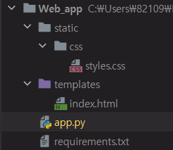
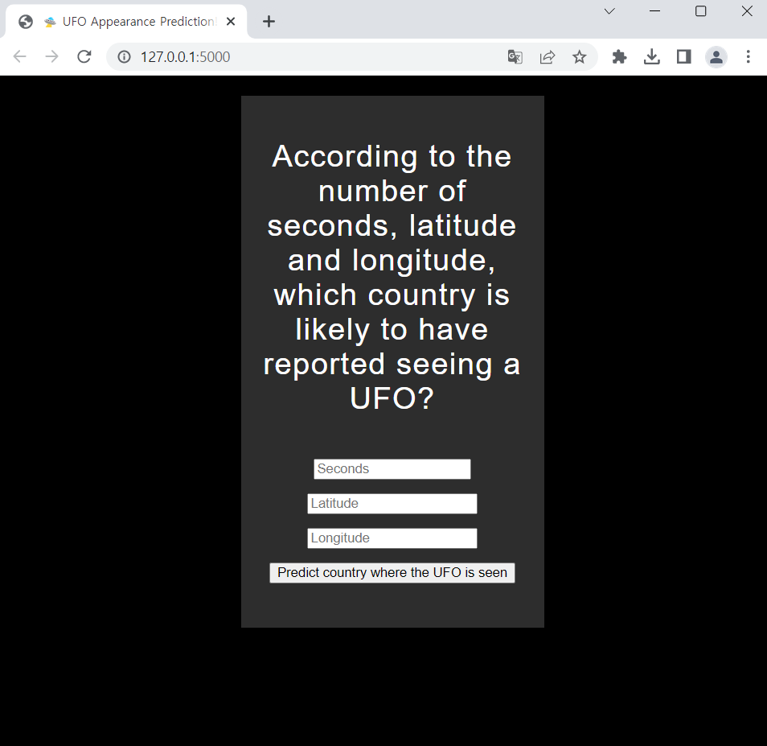

# 머신러닝 모델을 위한 웹 앱 구현 (using Flask)

---

해당 내용은 아래의 링크를 바탕으로 간단한 머신 러닝 모델을 웹앱에서 사용할 수 있도록 구현해놓은 예입니다.

* [ML-For-Beginners/README.md at main · microsoft/ML-For-Beginners](https://github.com/microsoft/ML-For-Beginners/blob/main/3-Web-App/1-Web-App/README.md)

기본적으로 구현한 웹앱은 로컬 컴퓨터 상에서만 사용 가능하므로, 해당 구현 및 실행 내용은 아래에 정리할 것입니다.

다만, 실제로 해당 웹앱을 배포하여 타 사용자들이 접속할 수 있는 환경을 만들고자 한다면, 최근에 많이 사용되는 배포 방식 중 하나인 클라우드 컴퓨터를 이용하여 Flask 앱을 배포하는 방식을 사용하는 것이 좋을 것이라고 생각합니다.

따라서, 해당 내용을 소개한 블로그의 링크를 아래에 남깁니다. (글쓴이의 경우, 이미 AWS를 사용한 적이 있어 프리티어가 만료되어 시험해보지는 못했습니다. 😟…)

* [Flask 웹 서버 AWS EC2에 배포하기](https://velog.io/@jaehyeong/Flask-웹-서버-AWS-EC2에-배포하기)

이어지는 내용은 구현 및 실행 과정을 순차적으로 설명한 것입니다.

## 1. 모델 훈련

기본적으로 모델을 웹앱에 올리기 위해서는 올릴 모델을 만들어야 합니다.

여기서 만들어질 모델은 위의에 언급되어 있는 [NUFORC](https://nuforc.org/) (The National UFO Reporting Center) 의 데이터를 활용하여 위도(`latitude`), 경도(`longitude`) 값 및 등장한 뒤 사라질 때까지의 시간(`Seconds`) 을 이용하여 UFO가 등장한 나라를 예측하는 모델입니다.

### 1-1. 모델을 위한 데이터 구축

아래는 해당 모델을 구현한 코드입니다. (**notebook.ipynb** 파일로 구현)

```python
import pandas as pd
import numpy as np

ufos = pd.read_csv('ufos.csv') # 데이터 셋 가져오기
ufos.head() # 데이터 셋 출력
```

<div>
<style scoped>
    .dataframetbody tr th:only-of-type {
        vertical-align: middle;
    }

    .dataframe tbody tr th {
        vertical-align: top;
    }

    .dataframe thead th {
        text-align: right;
    }
</style>
<table border="1" class="dataframe">
  <thead>
    <tr style="text-align: right;">
      <th></th>
      <th>datetime</th>
      <th>city</th>
      <th>state</th>
      <th>country</th>
      <th>shape</th>
      <th>duration (seconds)</th>
      <th>duration (hours/min)</th>
      <th>comments</th>
      <th>date posted</th>
      <th>latitude</th>
      <th>longitude</th>
    </tr>
  </thead>
  <tbody>
    <tr>
      <th>0</th>
      <td>10/10/1949 20:30</td>
      <td>san marcos</td>
      <td>tx</td>
      <td>us</td>
      <td>cylinder</td>
      <td>2700.0</td>
      <td>45 minutes</td>
      <td>This event took place in early fall around 194...</td>
      <td>4/27/2004</td>
      <td>29.883056</td>
      <td>-97.941111</td>
    </tr>
    <tr>
      <th>1</th>
      <td>10/10/1949 21:00</td>
      <td>lackland afb</td>
      <td>tx</td>
      <td>NaN</td>
      <td>light</td>
      <td>7200.0</td>
      <td>1-2 hrs</td>
      <td>1949 Lackland AFB&amp;#44 TX.  Lights racing acros...</td>
      <td>12/16/2005</td>
      <td>29.384210</td>
      <td>-98.581082</td>
    </tr>
    <tr>
      <th>2</th>
      <td>10/10/1955 17:00</td>
      <td>chester (uk/england)</td>
      <td>NaN</td>
      <td>gb</td>
      <td>circle</td>
      <td>20.0</td>
      <td>20 seconds</td>
      <td>Green/Orange circular disc over Chester&amp;#44 En...</td>
      <td>1/21/2008</td>
      <td>53.200000</td>
      <td>-2.916667</td>
    </tr>
    <tr>
      <th>3</th>
      <td>10/10/1956 21:00</td>
      <td>edna</td>
      <td>tx</td>
      <td>us</td>
      <td>circle</td>
      <td>20.0</td>
      <td>1/2 hour</td>
      <td>My older brother and twin sister were leaving ...</td>
      <td>1/17/2004</td>
      <td>28.978333</td>
      <td>-96.645833</td>
    </tr>
    <tr>
      <th>4</th>
      <td>10/10/1960 20:00</td>
      <td>kaneohe</td>
      <td>hi</td>
      <td>us</td>
      <td>light</td>
      <td>900.0</td>
      <td>15 minutes</td>
      <td>AS a Marine 1st Lt. flying an FJ4B fighter/att...</td>
      <td>1/22/2004</td>
      <td>21.418056</td>
      <td>-157.803611</td>
    </tr>
  </tbody>
</table>
</div>

해당 결과는 여러가지 특성를 갖습니다.

- `datetime` : 등장한 시간
- `city` : 등장한 도시
- `state` : 등장한 주[미국의 주(州, states)를 의미]
- `country` : 등장한 나라
- `shape` : 등장한 UFO의 생김새
- `duration(seconds)` : 등장하고 사라질 때까지의 시간(초 단위)
- `duration(hours/min)` : 등장하고 사라질 때까지의 시간(시간/분 단위)
- `comments` : UFO 등장에 대한 각종 설명
- `date posted` : post 된 날짜
- `latitude` : 위도
- `longitude` : 경도

해당 모델은 이 중 위에서 언급했던 `latitude` , `longitude` , `duration(seconds)` 만을 사용합니다.

```python
ufos = pd.DataFrame({'Seconds': ufos['duration (seconds)'], 'Country': ufos['country'],'Latitude': ufos['latitude'],'Longitude': ufos['longitude']}) 
# 기존의 데이터를 바탕으로 latitude , longitude , duration(seconds), country(label)만으로 이루어진 데이터 프레임 생성

ufos.Country.unique() # 해당 데이터 셋의 레이블이 가지는 값 확인
```

```python
array(['us', nan, 'gb', 'ca', 'au', 'de'], dtype=object)
```

결과를 확인해보면, 위도, 경도, 시간에 따라 `us` (미국), `nan` (나라 없음), `gb` (독일), `au` (오스트레일리아), `de` (영국?) 의 나라로만 구성되어 있음을 확인할 수 있습니다.

이 중, 모델을 보다 적합하게 만들기 위해 `nan` 이 포함된 데이터는 제거하고, 편의성을 위해 1-60초 사이 목격만 가져와서 처리할 데이터의 수량을 줄입니다. (해당 모델은 웹앱을 구현하기 위한 모델이므로 간단하게 만듭니다.)

```python
ufos.dropna(inplace=True) #nan이 포함된 데이터 제거

ufos = ufos[(ufos['Seconds'] >= 1) & (ufos['Seconds'] <= 60)]
# 1초 부터 60초 사이에 존재하는 데이터만을 사용

ufos.info() #데이터 프레임 정보 출력
```

```python
<class 'pandas.core.frame.DataFrame'>
Index: 25863 entries, 2 to 80330
Data columns (total 4 columns):
 #   Column     Non-Null Count  Dtype
---  ------     --------------  -----
 0   Seconds    25863 non-null  float64
 1   Country    25863 non-null  object
 2   Latitude   25863 non-null  float64
 3   Longitude  25863 non-null  float64
dtypes: float64(3), object(1)
memory usage: 1010.3+ KB
```

결과를 통해 25863개의 데이터에 대해 `Null` 값이 존재하지 않는 테이블이 생성되었음을 확인할 수 있습니다.

생성된 데이터중 `Country` 특성의 문자들을 숫자값으로 변환합니다. (`Scikit-Learn` 의 `LabelEncoder` 사용)

- `LabelEncoder` : 데이터를 알파벳 순서로 인코딩.

```python
from sklearn.preprocessing import LabelEncoder

ufos['Country'] = LabelEncoder().fit_transform(ufos['Country'])
# LabelEncoder를 이용하여 국가명 숫자로 치환

ufos.head() # 데이터 상위 5개 보이기
```

<div>
<style scoped>
    .dataframetbody tr th:only-of-type {
        vertical-align: middle;
    }

    .dataframe tbody tr th {
        vertical-align: top;
    }

    .dataframe thead th {
        text-align: right;
    }
</style>
<table border="1" class="dataframe">
  <thead>
    <tr style="text-align: right;">
      <th></th>
      <th>Seconds</th>
      <th>Country</th>
      <th>Latitude</th>
      <th>Longitude</th>
    </tr>
  </thead>
  <tbody>
    <tr>
      <th>2</th>
      <td>20.0</td>
      <td>3</td>
      <td>53.200000</td>
      <td>-2.916667</td>
    </tr>
    <tr>
      <th>3</th>
      <td>20.0</td>
      <td>4</td>
      <td>28.978333</td>
      <td>-96.645833</td>
    </tr>
    <tr>
      <th>14</th>
      <td>30.0</td>
      <td>4</td>
      <td>35.823889</td>
      <td>-80.253611</td>
    </tr>
    <tr>
      <th>23</th>
      <td>60.0</td>
      <td>4</td>
      <td>45.582778</td>
      <td>-122.352222</td>
    </tr>
    <tr>
      <th>24</th>
      <td>3.0</td>
      <td>3</td>
      <td>51.783333</td>
      <td>-0.783333</td>
    </tr>
  </tbody>
</table>
</div>

국가 데이터가 숫자로 변환되었음을 확인할 수 있습니다.

이것을 데이터 전처리를 마치고, 훈련을 위해 데이터를 훈련 셋, 테스트 셋으로 구분합니다. (여기서 레이블은 국가 명으로 분리됩니다.)

```python
from sklearn.model_selection import train_test_split

Selected_features = ['Seconds','Latitude','Longitude']

X = ufos[Selected_features] # 데이터 셋
y = ufos['Country'] # 레이블

X_train, X_test, y_train, y_test = train_test_split(X, y,test_size=0.2,random_state=0)
# 훈련 셋과 테스트 셋 분리 (20% 의 테스트 셋)
```

---

### 1-2. 모델 훈련

위의 과정을 통해 완성된 데이터 집합을 모델을 통해 훈련합니다.

훈련은 `LogisticRegression` 모델을 사용하며, 결과에 대한 정확도를 측정합니다.

```python
from sklearn.metrics import accuracy_score, classification_report
from sklearn.linear_model import LogisticRegression

#모델 훈련
model = LogisticRegression()
model.fit(X_train, y_train)
predictions = model.predict(X_test)

# 모델의 성능 평가 지표 출력
print(classification_report(y_test, predictions))
print('Predicted labels: ', predictions)
print('Accuracy: ', accuracy_score(y_test, predictions))
```

```python
              precision    recall  f1-score   support

           0       1.00      1.00      1.00        41
           1       0.83      0.21      0.34       250
           2       1.00      1.00      1.00         8
           3       1.00      1.00      1.00       131
           4       0.96      1.00      0.98      4743

    accuracy                           0.96      5173
   macro avg       0.96      0.84      0.86      5173
weighted avg       0.96      0.96      0.95      5173

Predicted labels:  [4 4 4 ... 3 4 4]
Accuracy:  0.9597912236613184
```

결과를 살펴보면 모델은 대략 95%의 정확도를 가짐을 볼 수 있습니다.

---

### 1-3. 모델 ‘Pickle’ 하기

모델 훈련까지의 과정이 모두 완료되었습니다. 이제는 해당 모델을 웹앱에 올리기 위해 **pickle** 하고, 해당 모델에 대해 모델이 잘 작동하는지를 확인할 것입니다.

```python
import pickle

#만든 모델을 .pkl format으로 만들기
model_filename = 'ufo-model.pkl'
pickle.dump(model, open(model_filename,'wb')) 

#만든 모델의 .pkl format 파일을 읽고, 모델을 통해 예측해보기
model = pickle.load(open('ufo-model.pkl','rb')) 
print(model.predict([[50,44,-12]]))
```

예측 결과를 살펴보면 `[1]` 이 출력됨을 확인할 수 있습니다.
이를 통해 파일로 저장한 모델이 잘 작동하고 있음을 확인할 수 있습니다.

---

## 2. 웹앱 만들기

위의 과정을 통해 만들어진 모델을 웹에 올리기 위한 애플리케이션을 Flask 를 통해 만들 것입니다

해당 만들어진 웹 애플리케이션은 다음과 같은 디렉터리 구조를 가집니다.



아래의 내용은 각 파일별 작성된 코드 및 설명입니다.

- **requirements.txt**
    
    **requriements.txt** 파일은 해당 **Flask**  앱을 구성함에 있어서 필요한 의존성을 주입하기 위한 파일입니다. 아래에 나타난 내용이 이 앱이 필요한 의존성입니다.
    
    ```python
    scikit-learn
    pandas
    numpy
    flask
    ```
    
    해당 의존성은 사실 **IDE** 를 사용한다면, IDE의 경고 등을 통해  쉽게 주입할 수 있습니다.
    다만, 위의 [링크](https://github.com/microsoft/ML-For-Beginners/blob/main/3-Web-App/1-Web-App/README.md)처럼 진행하기 위해서는 Commend 창을 이용하여 주입합니다. 아래의 내용이 바로 Comment를 이용한 방식입니다.
    
    1. Cmd 실행 (windows 기준)
    2. `cd web-app` (경우에 따라서는 `web-app` 디렉토리에서 cmd를 열면, 자동으로 해당 디렉토리에 위치한 상태로 cmd가 열린다.) 로 디렉토리 이동.
    3. `pip install -r requirements.txt` 를 입력하여 해당 파일의 라이브러리 설치 (보통 IDE를 사용하면 `requirements.txt` 를 사용하지 않아도, 필요하다면 자동적으로 주입가능하다.)

---

위의 단계가 완료 되면 다음과 같은 파일을 만들게 됩니다. (`app.py`, `index.html`, `styles.css`) - 만들어질 파일의 위치는 위의 그림에 소개된 구조를 따른다. 

- **styles.css**
    
    `.css` 파일은 기본적으로 `html` 파일의 디자인을 위한 요소들을 기입하는 파일입니다. (자세한 내용은 생략한다. CSS의 정의 참고 - 아래의 링크)
    
    [CSS](https://ko.wikipedia.org/wiki/CSS)
    
    ```css
    body {
    	width: 100%;
    	height: 100%;
    	font-family: 'Helvetica';
    	background: black;
    	color: #fff;
    	text-align: center;
    	letter-spacing: 1.4px;
    	font-size: 30px;
    }
    
    input {
    	min-width: 150px;
    }
    
    .grid {
    	width: 300px;
    	border: 1px solid #2d2d2d;
    	display: grid;
    	justify-content: center;
    	margin: 20px auto;
    }
    
    .box {
    	color: #fff;
    	background: #2d2d2d;
    	padding: 12px;
    	display: inline-block;
    }
    ```
    

---

- **index.html**
    
    해당 `html` 파일은 웹을 실행했을 때 처음 나오는 페이지이자, 모델 훈련의 결과를 도출하는 정적 페이지입니다.
    
    해당 `html`의 경우, `Flask` 를 이용하므로 `Jinja2` 템플릿 엔진을 사용하여 구성되었습니다. (아래의 코드에 `{{}}` 로 표현된 부분들이 해당 템플릿 엔진이 사용된 구간들이다.)
    
    ```html
    <!DOCTYPE html>
    <html>
    <head>
      <meta charset="UTF-8">
      <title>🛸 UFO Appearance Prediction! 👽</title>
      <link rel="stylesheet" href="{{ url_for('static', filename='css/styles.css') }}"> 
    	<!-- 템플릿 엔진을 사용하여 static/css/styles.css를 호출하고 있다. -->
    </head>
    
    <body>
     <div class="grid">
    
      <div class="box">
    
      <p>According to the number of seconds, latitude and longitude, which country is likely to have reported seeing a UFO?</p>
    
        <form action="{{ url_for('predict')}}" method="post"> <!--/predict 라는 Url 형식으로 Post -->
        	<input type="number" name="seconds" placeholder="Seconds" required="required" min="0" max="60" />
          <input type="text" name="latitude" placeholder="Latitude" required="required" />
    		  <input type="text" name="longitude" placeholder="Longitude" required="required" />
          <button type="submit" class="btn">Predict country where the UFO is seen</button>
        </form>
    
      
       <p>{{ prediction_text }}</p>
    	 <!--초기값은 없음, Post 후 결과가 반환되면 해당 변수에 주입(app.py 참고)-->
    
     </div>
    </div>
    
    </body>
    </html>
    ```
    

---

- **app.py**
    
    `Flask` 앱의 `main` 함수 역할을 하는 파일로서, `Flask` 앱을 작동에 있어서, 중추적인 역할을 담당합니다. (`Controller` 역할을 주로 한다.)
    
    ```python
    import numpy as np
    from flask import Flask, request, render_template
    import pickle
    
    app = Flask(__name__) #Flask 객체 생성
    
    # 만들어 높은 ufo 예측 모델 가져오기
    model = pickle.load(open("../ufo-model.pkl", "rb"))
    
    # 애플리케이션이 실행되었을 때 처음으로 routing 되는 controller
    @app.route("/")
    def home():
        return render_template("index.html") 
    		# 처음 실행되면 index.html을 실행한다.
    
    # html 문서에서 Post 한 내용을 바탕으로 실행되는 controller
    @app.route("/predict", methods=["POST"])
    def predict():
    		# request 된 데이터에 대해 value 값들을 리스트화 (데이터 처리를 위한 casting)
        int_features = [int(x) for x in request.form.values()]
        final_features = [np.array(int_features)]
    		
    		# request된 데이터를 통해 모델을 이용하여 값 예측
        prediction = model.predict(final_features)
    		
        output = prediction[0] # 예측된 값 (숫자)
    
        countries = ["Australia", "Canada", "Germany", "UK", "US"]
    
        return render_template(
            "index.html", prediction_text="Likely country: {}".format(countries[output])
        ) # index.html 파일에 예측된 결과를 prediction_text의 형태로 response
    
    if __name__ == "__main__":
        app.run(debug=True)
    ```
    
    해당 코드를 살펴보면 `[app.py](http://app.py)` 의 실행으로, `index.html` 을 호출하여 보이고, 만약 `index.html` 파일에서 데이터를 post하면 해당 내용을 바탕으로 모델을 돌려 그 결과를 반환하는 형태의 웹앱임을 확인할 수 있습니다.
    

---

## 3. 웹앱 실행

웹앱 실행은 간단합니다. IDE를 사용한 경우, IDE를 통해 쉽게 실행할 수 있으므로 생략합니다. 그냥 `python`을 통해 실행하고자 하는 경우에는 `app.py` 가 존재하는 디렉터리에서 cmd를 다음과 같이 실행할 수 있습니다.

```html
python app.py 또는 python3 app.py
```

해당 명령을 실행하면 Flask 웹 서버가 로컬에서 작동하고 다음과 같은 페이지를 보임을 확인할 수 있습니다.

**결과 페이지**



**초기 Flask 웹을 실행하면 나오는 index.html 페이지**

해당 페이지에 특정 시간, 위도, 경도 값을 입력하여 `predict country where the UFO is seen` 버튼을 클릭하면 모델이 예측한 결과를 반환하여 보여줍니다.


**Seconds : 10, Latitude : -50, Longitude : 45 의 모델 예측 결과 - Australia.**

---

## 정리

위의 3가지 과정을 통해 우리가 학습시키고, 개발한 모델을 어떻게 웹 페이지에 적용하여 구성하는지에 대해서 배울 수 있었습니다.

1. 모델 구축 (모델의 데이터를 전처리하고, 모델을 훈련하는 과정)
2. 웹앱 만들기 (사실 이미 존재하는 웹에는 해당하지는 않음)
    1. 이미 존재하는 웹에 대해서는 모델을 해당 웹에 올려서 호출하는 구조로 변형하는 것이 될 것.
3. 해당 웹의 작동 테스트 (우리의 경우는 웹앱 실행)

**추가**

사실 한국에서는 일반적으로 대규모 트래픽을 처리하는 대형 웹 페이지의 경우에는 `java` 언어를 이용한 `Spring Framework` 사용합니다. 따라서 웹 페이지에서 모델을 호출하는 방법에 대해서 `java` 로 하는 방법을 찾아보거나, 해당 `Flask` 로 구현한 모델과 우리의 `Spring` 으로 구현한 웹 페이지가 어떻게 소통하도록 할 것인지에 대한 방법을 생각해 볼 필요가 있어 보입니다.

탐색해 본 결과, 기본적으로 `Spring` 서버와 `Flask` 로 구현한 서버가 서로 통신하는 방법으로 많이 구현되어 있다고 합니다. (`Spring` 서버에서 `Flask` 서버로 API 통신을 통해 수행.)
